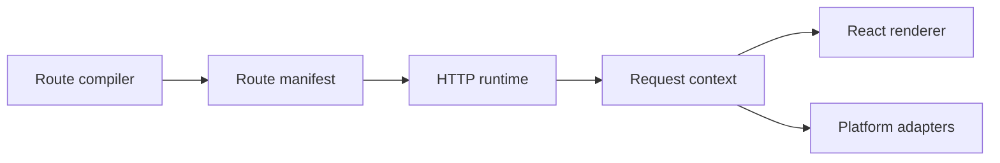

# Architecture

---

## Core · Architecture

> **Core principle** — See Jeston as a set of lifecycle contracts with replaceable platform edges.

A clear ownership map for compiler, router, request context, renderer, and adapters.

### Key concepts

<Columns cols={3}>
  <Card title="Lifecycle" icon="sparkles">
    Framework
  </Card>
  <Card title="Policy" icon="shield-check">
    Application
  </Card>
  <Card title="Protocol" icon="gauge-high">
    Adapter
  </Card>
</Columns>

### Boundary model

### Ownership matrix

| Concern | Jeston/application boundary | Review signal |
| --- | --- | --- |
| Lifecycle | Framework | Stable and portable. |
| Policy | Application | Business-specific and testable. |
| Protocol | Adapter | Replaceable and provider-aware. |

### Engineering considerations

Architectural boundaries determine whether a heavy workload can be cancelled, measured, moved, or scaled.

> **Design constraint**
>
> Portability is achieved by making ownership explicit, not by removing all abstractions.

### Implementation notes

| Engineering move | Guidance |
| --- | --- |
| **Map the lifecycle** | Trace a request from route discovery to response completion. |
| **Mark ownership** | Separate framework lifecycle from application policy and provider mechanics. |
| **Propagate context** | Carry request ID, deadline, and AbortSignal into expensive work. |
| **Test seams** | Replace adapters in tests and exercise lifecycle failures directly. |

### Decision lens

| Mode | Practical emphasis |
| --- | --- |
| **Framework** | Own contracts, lifecycle, and transport semantics. |
| **Application** | Own domain rules, authorization, and composition. |
| **Adapter** | Own provider protocol, credentials, and resource cleanup. |

## References

[1]: https://github.com/jeffersoncampos12p-dev/jeston "Jeston source repository"
[2]: https://www.npmjs.com/package/@kvantjs/jeston "Jeston package on npm"
[3]: https://nodejs.org/api/http.html "Node.js HTTP API"
[4]: https://developer.mozilla.org/en-US/docs/Web/API/AbortSignal "AbortSignal Web API"
[5]: https://react.dev/reference/react-dom/server "React server rendering APIs"
[6]: https://www.typescriptlang.org/docs/handbook/intro.html "TypeScript handbook"
