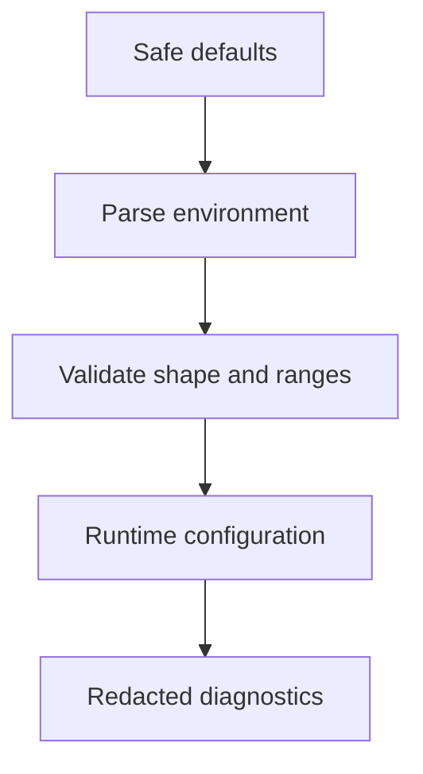

# Configuration

---

## Core · Configuration

> **Core principle** — Make runtime choices visible, typed, and safe to override across development, CI, and production.

A configuration model that fails early and does not hide environment-specific behavior.

### Key concepts

<Columns cols={3}>
  <Card title="Timeout" icon="sparkles">
    Typed duration
  </Card>
  <Card title="Limit" icon="shield-check">
    Positive integer
  </Card>
  <Card title="Secret" icon="gauge-high">
    Opaque value
  </Card>
</Columns>

### Boundary model

### Ownership matrix

| Concern | Jeston/application boundary | Review signal |
| --- | --- | --- |
| Timeout | Typed duration | Bound expensive work. |
| Limit | Positive integer | Protect memory and concurrency. |
| Secret | Opaque value | Never include in logs or artifacts. |

### Engineering considerations

Configuration is executable policy: timeouts, limits, origins, credentials, and adapters change the system’s risk profile.

> **Design constraint**
>
> Configuration should explain why the process behaves differently, not conceal that difference.

### Implementation notes

| Engineering move | Guidance |
| --- | --- |
| **Separate environments** | Name which values are local conveniences and which are production requirements. |
| **Parse once** | Convert strings to typed values at startup, not deep inside handlers. |
| **Validate ranges** | Reject invalid timeouts, ports, limits, and origins before serving. |
| **Redact diagnostics** | Make configuration debuggable without logging secrets. |

### Decision lens

| Mode | Practical emphasis |
| --- | --- |
| **Local** | Fast feedback with safe development defaults. |
| **CI** | Deterministic values and no hidden credentials. |
| **Production** | Secret-manager injection, strict validation, and auditability. |

## Related topics

<Columns cols={3}>
- [diagram-project · **Understand ownership**](/core/architecture) — Read the focused guide for this boundary.
- [shield-halved · **Protect secrets**](/platform/security) — Read the focused guide for this boundary.
- [cloud-arrow-up · **Inject at deploy time**](/operations/deployment) — Read the focused guide for this boundary.
</Columns>

## References

[1]: https://github.com/jeffersoncampos12p-dev/jeston "Jeston source repository"

[2]: https://www.npmjs.com/package/@kvantjs/jeston "Jeston package on npm"

[3]: https://nodejs.org/api/http.html "Node.js HTTP API"

[4]: https://developer.mozilla.org/en-US/docs/Web/API/AbortSignal "AbortSignal Web API"

[5]: https://react.dev/reference/react-dom/server "React server rendering APIs"

[6]: https://www.typescriptlang.org/docs/handbook/intro.html "TypeScript handbook"
