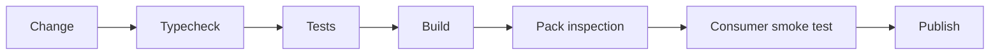

# Release checks

---

## Operations · Release checks

> **Operational objective** — Turn a source change into a release only after code, artifacts, compatibility, and provenance agree.

A release gate that protects users from broken types, missing files, and unsupported runtime behavior.

### Key concepts

<Columns cols={3}>
  <Card title="Source" icon="sparkles">
    Tests green
  </Card>
  <Card title="Artifact" icon="shield-check">
    Files present
  </Card>
  <Card title="Consumer" icon="gauge-high">
    Import works
  </Card>
</Columns>

### Operational surface

### Evidence over assumption

| Signal | Healthy interpretation | Action when it degrades |
| --- | --- | --- |
| Source | Tests green | Behavior is acceptable. |
| Artifact | Files present | Package is usable. |
| Consumer | Import works | Public surface is real. |
| Publish | Trusted workflow | Provenance is controlled. |

### Operational context

Publishing is the last step of a chain; it should not be the first place a package is tested as a consumer would use it.

> **Operator's principle**
>
> A release is ready when a clean consumer can use the artifact, not when the repository can build itself.

### Implementation notes

| Engineering move | Guidance |
| --- | --- |
| **Check source** | Run formatting, typecheck, tests, and security checks. |
| **Check artifact** | Inspect files, exports, declarations, and package metadata. |
| **Check consumer use** | Install the tarball into a clean project and import public APIs. |
| **Check provenance** | Use the intended Node version, OIDC workflow, and release tag or trigger. |

### Decision lens

| Mode | Practical emphasis |
| --- | --- |
| **Pull request** | Fast feedback and no publication. |
| **Release candidate** | Full matrix and package consumer test. |
| **Production publish** | Protected environment and auditable workflow. |

## References

[1]: https://github.com/kvantjs/ryvax.js "Ryvax source repository"
[2]: https://www.npmjs.com/package/@kvantjs/ryvax.js "Ryvax package on npm"
[3]: https://nodejs.org/api/http.html "Node.js HTTP API"
[4]: https://developer.mozilla.org/en-US/docs/Web/API/AbortSignal "AbortSignal Web API"
[5]: https://react.dev/reference/react-dom/server "React server rendering APIs"
[6]: https://www.typescriptlang.org/docs/handbook/intro.html "TypeScript handbook"
