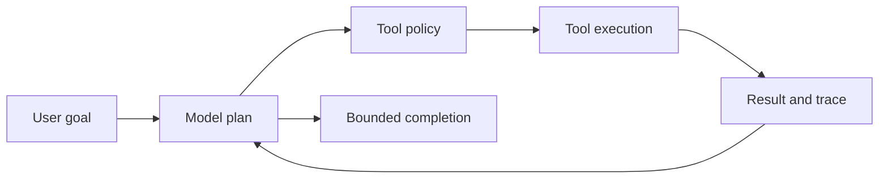

# AI agents and model integrations

---

## Platform · AI agents

> **Platform concern** — Build agent execution as a controlled workflow with tools, budgets, traces, and evaluation—not as an unbounded chat loop.

Model adapters, permissioned tools, durable state, streaming, and measurable quality.

### Key concepts

<Columns cols={3}>
  <Card title="Model" icon="sparkles">
    Probabilistic
  </Card>
  <Card title="Tool" icon="shield-check">
    Deterministic effect
  </Card>
  <Card title="Evaluation" icon="gauge-high">
    Quality signal
  </Card>
</Columns>

### Operating model

### Decisions to make before production

| Decision | Recommended posture | Failure it prevents |
| --- | --- | --- |
| Model | Probabilistic | Treat output as untrusted input. |
| Tool | Deterministic effect | Validate and authorize every call. |
| Evaluation | Quality signal | Keep a regression set and trace failures. |

<Note>
Never let model text directly become a database query, shell command, permission decision, or external message.
</Note>

### Boundary and failure behavior

Agent workloads combine nondeterministic model output with deterministic application side effects.

### Questions for review

| Question | Answer to document |
| --- | --- |
| What belongs in memory? | Only information with a retention, tenant, privacy, and deletion policy. |
| What should be traced? | Prompt version, model, tool calls, latency, token usage, outcomes, and safe error categories. |
| When use a queue? | When agent work must survive disconnects or may exceed request deadlines. |

### Implementation notes

| Engineering move | Guidance |
| --- | --- |
| **Define the capability** | State what the agent may decide and what it may never do. |
| **Permission every tool** | Validate arguments, identity, tenant scope, and side effects. |
| **Bound the loop** | Set token, time, tool-call, and spend budgets. |
| **Evaluate behavior** | Test groundedness, tool correctness, refusal, latency, and cost. |

### Decision lens

| Mode | Practical emphasis |
| --- | --- |
| **Interactive** | Stream plan and progress while keeping side effects explicit. |
| **Background** | Persist intent and status so work survives disconnects. |
| **Training** | Version datasets, prompts, evaluators, and model settings. |

## References

[1]: https://github.com/kvantjs/ryvax.js "Ryvax source repository"
[2]: https://www.npmjs.com/package/@kvantjs/ryvax.js "Ryvax package on npm"
[3]: https://nodejs.org/api/http.html "Node.js HTTP API"
[4]: https://developer.mozilla.org/en-US/docs/Web/API/AbortSignal "AbortSignal Web API"
[5]: https://react.dev/reference/react-dom/server "React server rendering APIs"
[6]: https://www.typescriptlang.org/docs/handbook/intro.html "TypeScript handbook"
