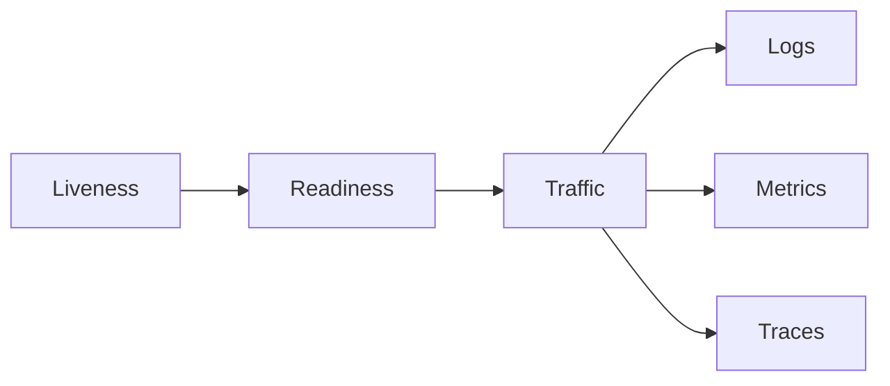

# Health and observability

---

## Platform · Health and observability

> **Platform concern** — Give operators enough signal to distinguish a healthy process from a useful service.

Liveness, readiness, structured logs, metrics, traces, and alertable dependency state.

### Key concepts

<Columns cols={3}>
  <Card title="Liveness" icon="sparkles">
    Process state
  </Card>
  <Card title="Readiness" icon="shield-check">
    Dependency state
  </Card>
  <Card title="Saturation" icon="gauge-high">
    Capacity state
  </Card>
</Columns>

### Operating model

### Decisions to make before production

| Decision | Recommended posture | Failure it prevents |
| --- | --- | --- |
| Liveness | Process state | Should restart if broken. |
| Readiness | Dependency state | Should stop receiving traffic if unsafe. |
| Saturation | Capacity state | Predicts failure before error rate rises. |

### Boundary and failure behavior

Without health semantics, an overloaded or disconnected service can look alive while causing user-visible failure.

### Questions for review

| Question | Answer to document |
| --- | --- |
| What belongs in readiness? | Dependencies required for safe traffic, not every optional integration. |
| Which percentile matters? | p95 and p99 expose tail behavior hidden by averages. |
| What makes an alert useful? | A threshold, an owner, a runbook, and a reason the user is affected. |

### Implementation notes

| Engineering move | Guidance |
| --- | --- |
| **Define liveness** | Answer whether the process can continue or should be restarted. |
| **Define readiness** | Answer whether required dependencies and capacity permit traffic. |
| **Correlate work** | Carry request IDs, job IDs, provider labels, and tenant-safe context. |
| **Alert on symptoms** | Use latency, errors, saturation, and freshness rather than log volume alone. |

### Decision lens

| Mode | Practical emphasis |
| --- | --- |
| **Logs** | Explain one event with structured fields. |
| **Metrics** | Show rates, errors, duration, and saturation over time. |
| **Traces** | Follow a request across database, network, model, and queue boundaries. |

## Built-in contracts

`createMetricsRegistry` provides a small provider-neutral counter and histogram surface for tests and local operation. `TraceAdapter` and `withSpan` provide a safe integration boundary for OpenTelemetry or another tracing provider without bundling a vendor SDK into the framework.

Use `withRetry` only for operations that are safe to retry, and combine it with `createCircuitBreaker` for dependencies that remain unavailable. Configure explicit upstream timeouts with `fetchWithPolicy`; do not allow user-controlled upstream URLs without `assertSafeUrl` and an allowlist.

## Related topics

<Columns cols={3}>
- [server-stack · **Build runbooks**](/operations/production) — Read the focused guide for this boundary.
- [gauge-high · **Measure saturation**](/operations/benchmark) — Read the focused guide for this boundary.
- [stream · **Observe streams**](/core/execution-and-streaming) — Read the focused guide for this boundary.
</Columns>

## References

[1]: https://github.com/jeffersoncampos12p-dev/jeston "Jeston source repository"
[2]: https://www.npmjs.com/package/@kvantjs/jeston "Jeston package on npm"
[3]: https://nodejs.org/api/http.html "Node.js HTTP API"
[4]: https://developer.mozilla.org/en-US/docs/Web/API/AbortSignal "AbortSignal Web API"
[5]: https://react.dev/reference/react-dom/server "React server rendering APIs"
[6]: https://www.typescriptlang.org/docs/handbook/intro.html "TypeScript handbook"
