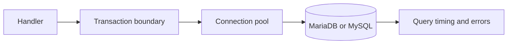

# SQL and databases

---

## Platform · SQL

> **Platform concern** — Make persistence predictable under concurrency, retries, migrations, and partial failure.

A query boundary with transaction ownership, pool limits, migration discipline, and safe errors.

### Key concepts

<Columns cols={3}>
  <Card title="Pool" icon="sparkles">
    Finite connections
  </Card>
  <Card title="Transaction" icon="shield-check">
    Atomic unit
  </Card>
  <Card title="Migration" icon="gauge-high">
    Compatible step
  </Card>
</Columns>

### Operating model

### Decisions to make before production

| Decision | Recommended posture | Failure it prevents |
| --- | --- | --- |
| Pool | Finite connections | Protect the database from application concurrency. |
| Transaction | Atomic unit | Make partial writes impossible where required. |
| Migration | Compatible step | Allow old and new versions to coexist. |

### Boundary and failure behavior

Database behavior dominates many heavy workloads; correctness and saturation matter before query micro-optimizations.

### Questions for review

| Question | Answer to document |
| --- | --- |
| What belongs in a transaction? | State changes that must share one commit decision. |
| What should be retried? | Transient, idempotent operations with clear transaction semantics. |
| How should pool pressure appear? | As a metric and alert before requests fail en masse. |

### Implementation notes

| Engineering move | Guidance |
| --- | --- |
| **Define the unit of work** | Decide which writes commit together and which can be asynchronous. |
| **Parameterize queries** | Keep values separate from SQL text and validate sort or filter choices. |
| **Bound the pool** | Match concurrency to database capacity, not to request volume. |
| **Plan migrations** | Use expand, migrate, contract when old and new code overlap. |

### Decision lens

| Mode | Practical emphasis |
| --- | --- |
| **Read path** | Index for real predicates and measure result size. |
| **Write path** | Use transactions and idempotency for repeated delivery. |
| **Migration** | Keep compatibility during rolling deploys and backfills. |

## References

[1]: https://github.com/jeffersoncampos12p-dev/jeston "Jeston source repository"
[2]: https://www.npmjs.com/package/@kvantjs/jeston "Jeston package on npm"
[3]: https://nodejs.org/api/http.html "Node.js HTTP API"
[4]: https://developer.mozilla.org/en-US/docs/Web/API/AbortSignal "AbortSignal Web API"
[5]: https://react.dev/reference/react-dom/server "React server rendering APIs"
[6]: https://www.typescriptlang.org/docs/handbook/intro.html "TypeScript handbook"
