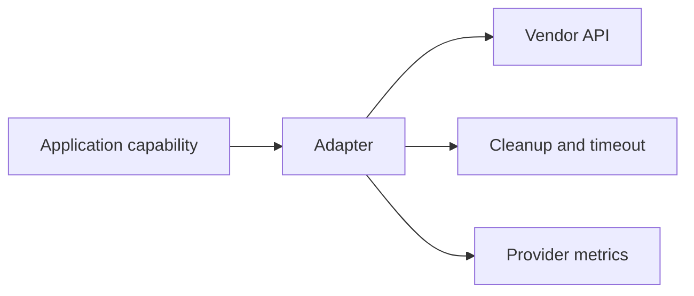

# Adapters

---

## Reference · Adapters

> **Reference purpose** — Create provider seams that preserve framework lifecycle while isolating vendor protocol and credentials.

Adapters with narrow capabilities, explicit cleanup, and replaceable test doubles.

### Key concepts

<Columns cols={3}>
  <Card title="Capability" icon="sparkles">
    Small interface
  </Card>
  <Card title="Lifecycle" icon="shield-check">
    Open and close
  </Card>
  <Card title="Failure" icon="gauge-high">
    Translated category
  </Card>
</Columns>

### Reference model

### Contract summary

| Property | Definition | Review question |
| --- | --- | --- |
| Capability | Small interface | Avoid vendor-shaped application code. |
| Lifecycle | Open and close | Prevent leaked handles. |
| Failure | Translated category | Keep provider detail observable but not contagious. |

### Interpretation

An adapter is valuable when it makes provider choice reversible without weakening the application contract.

> **Reference note**
>
> The best adapter is boring at the call site and precise at the boundary.

### Implementation notes

| Engineering move | Guidance |
| --- | --- |
| **Name the capability** | Describe what the application needs, not what one vendor happens to call it. |
| **Define lifecycle** | Specify initialization, timeout, cancellation, close, and health behavior. |
| **Map errors** | Translate provider failures into stable application categories. |
| **Prove replacement** | Use a fake or second implementation to test the seam. |

### Decision lens

| Mode | Practical emphasis |
| --- | --- |
| **Database** | Queries, transactions, pool, and migration ownership. |
| **Model** | Generation, streaming, usage, and safety policy. |
| **Storage** | Upload, read, retention, authorization, and deletion. |

## References

[1]: https://github.com/jeffersoncampos12p-dev/jeston "Jeston source repository"
[2]: https://www.npmjs.com/package/@kvantjs/jeston "Jeston package on npm"
[3]: https://nodejs.org/api/http.html "Node.js HTTP API"
[4]: https://developer.mozilla.org/en-US/docs/Web/API/AbortSignal "AbortSignal Web API"
[5]: https://react.dev/reference/react-dom/server "React server rendering APIs"
[6]: https://www.typescriptlang.org/docs/handbook/intro.html "TypeScript handbook"
