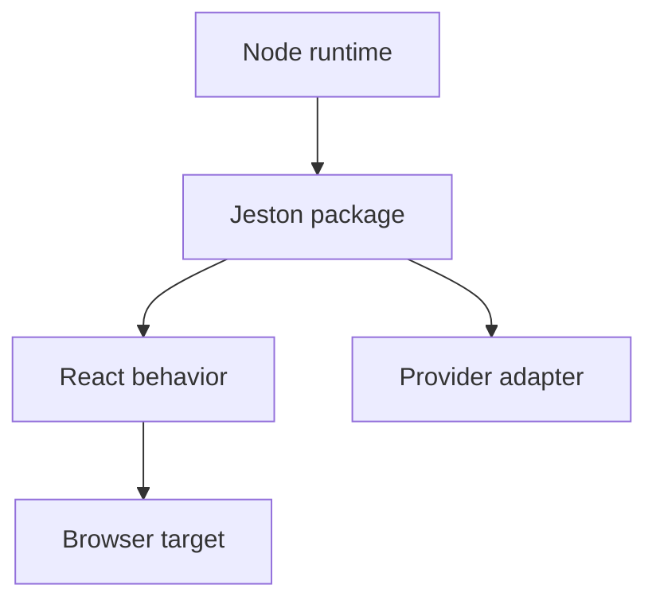

# Compatibility

---

## Reference · Compatibility

> **Reference purpose** — Make support claims precise enough that teams can plan upgrades and deployments without guesswork.

A compatibility envelope for Node, React, browsers, package exports, and known limitations.

### Key concepts

<Columns cols={3}>
  <Card title="Runtime" icon="sparkles">
    Node 20, 22, 24
  </Card>
  <Card title="Package" icon="shield-check">
    Exports and types
  </Card>
  <Card title="Feature" icon="gauge-high">
    Maturity label
  </Card>
</Columns>

### Reference model

### Contract summary

| Property | Definition | Review question |
| --- | --- | --- |
| Runtime | Node 20, 22, 24 | CI evidence required. |
| Package | Exports and types | Smoke import from a consumer. |
| Feature | Maturity label | Do not overpromise roadmap behavior. |

### Interpretation

Compatibility is a product feature: confidence depends on what is supported, tested, experimental, or explicitly out of scope.

> **Reference note**
>
> A compatibility statement is useful only when it can be checked.

### Implementation notes

| Engineering move | Guidance |
| --- | --- |
| **Declare the matrix** | List supported Node versions, package managers, React versions, and deployment assumptions. |
| **Test the matrix** | Run typecheck, tests, build, and package smoke import on every supported runtime. |
| **Label maturity** | Separate stable, experimental, roadmap, and unsupported behavior. |
| **Plan migration** | Document breaking changes, deprecations, and rollback options. |

### Decision lens

| Mode | Practical emphasis |
| --- | --- |
| **Supported** | Covered by CI and release expectations. |
| **Experimental** | Usable with an explicit risk statement. |
| **Unsupported** | Do not infer behavior from a local success. |

## Related topics

<Columns cols={3}>
- [circle-check · **Verify releases**](/operations/release-checks) — Read the focused guide for this boundary.
- [code · **Read stable types**](/reference/types) — Read the focused guide for this boundary.
- [atom · **Review RSC maturity**](/core/react-server-components) — Read the focused guide for this boundary.
</Columns>

## References

[1]: https://github.com/jeffersoncampos12p-dev/jeston "Jeston source repository"
[2]: https://www.npmjs.com/package/@kvantjs/jeston "Jeston package on npm"
[3]: https://nodejs.org/api/http.html "Node.js HTTP API"
[4]: https://developer.mozilla.org/en-US/docs/Web/API/AbortSignal "AbortSignal Web API"
[5]: https://react.dev/reference/react-dom/server "React server rendering APIs"
[6]: https://www.typescriptlang.org/docs/handbook/intro.html "TypeScript handbook"
