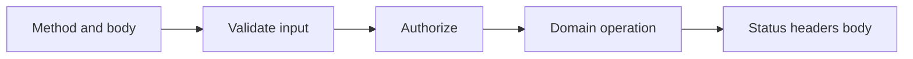

# API routes

<Accordion title="Detailed background for this page" icon="book-open">

Make every endpoint a small, observable protocol rather than an arbitrary function behind a URL.

**Expected outcome.** Stable methods, input validation, status codes, headers, errors, and cancellation.

**Why this boundary matters.** A clear HTTP contract lets clients, tests, proxies, and operators reason about behavior independently.

### Page-specific implementation notes

- **Choose the method:** Align semantics with read, create, replace, partial update, or delete behavior.
- **Validate before work:** Return a stable 400 shape for malformed JSON or invalid fields.
- **Set status intentionally:** Do not make clients infer success from a generic 200 response.
- **Bound the handler:** Use deadlines, signals, body limits, and idempotency where repetition is possible.

### Page-specific failure questions

- **What belongs in a 400?:** Actionable input errors that the caller can correct without server changes.
- **When should a write be retried?:** Only when the operation is idempotent or protected by an idempotency key.
- **What does HEAD require?:** The same metadata semantics as GET without a response body.

</Accordion>

---

## Core · API routes

> **Page focus** — Make every endpoint a small, observable protocol rather than an arbitrary function behind a URL.

### At a glance

| Scope | Practical result |
| --- | --- |
| **Focus** | Make every endpoint a small, observable protocol rather than an arbitrary function behind a URL. |
| **Deliverable** | Stable methods, input validation, status codes, headers, errors, and cancellation. |
| **Reason to care** | A clear HTTP contract lets clients, tests, proxies, and operators reason about behavior independently. |

<Info>
This page is intentionally focused on one boundary. Use the decision table and implementation sequence below as a working review sheet, not as a generic framework overview.
</Info>

### System view

<Info>
This guide has its own decision surface. Use the visual blocks for orientation, then open the detailed background above when you need the longer explanation.
</Info>

---

## Implementation sequence

<Steps titleSize="h3">
  <Step title="Choose the method" icon="crosshairs">
    Align semantics with read, create, replace, partial update, or delete behavior.
  </Step>
  <Step title="Validate before work" icon="layers-3">
    Return a stable 400 shape for malformed JSON or invalid fields.
  </Step>
  <Step title="Set status intentionally" icon="triangle-exclamation">
    Do not make clients infer success from a generic 200 response.
  </Step>
  <Step title="Bound the handler" icon="flask-conical">
    Use deadlines, signals, body limits, and idempotency where repetition is possible.
  </Step>
</Steps>

## Choose a working mode

<Tabs>
  <Tab title="Read" icon="book-open">
    Cache only when freshness and authorization semantics are clear.
  </Tab>
  <Tab title="Write" icon="hammer">
    Make retries safe with idempotency or explicit non-retry policy.
  </Tab>
  <Tab title="Stream" icon="chart-line">
    Define event framing, disconnect behavior, and terminal state.
  </Tab>
</Tabs>

---

## Decision table

| Concern | Default posture | Review question |
| --- | --- | --- |
| Malformed JSON | 400 | No domain side effect. |
| Unauthorized | 401 | Identity is absent or invalid. |
| Forbidden | 403 | Identity exists but policy denies. |
| Dependency failure | 5xx | Safe public body and correlated internal log. |

> **Design note**
>
> An API is a promise about failure as much as it is a promise about success.

<Note>
Document headers and response bodies as carefully as input fields; clients depend on both.
</Note>

## Questions worth answering

<AccordionGroup>
  <Accordion title="What belongs in a 400?" icon="circle-question">
    Actionable input errors that the caller can correct without server changes.
  </Accordion>
  <Accordion title="When should a write be retried?" icon="binoculars">
    Only when the operation is idempotent or protected by an idempotency key.
  </Accordion>
  <Accordion title="What does HEAD require?" icon="arrow-right">
    The same metadata semantics as GET without a response body.
  </Accordion>
</AccordionGroup>

---

## Continue with a related guide

<Columns cols={3}>
  <Card title="Read HTTP semantics" icon="globe" href="/reference/http-contracts" horizontal>Open the related guide when this page leaves a boundary unresolved.</Card>
  <Card title="Harden boundaries" icon="shield-halved" href="/platform/security" horizontal>Open the related guide when this page leaves a boundary unresolved.</Card>
  <Card title="Expose signals" icon="chart-line" href="/platform/health-observability" horizontal>Open the related guide when this page leaves a boundary unresolved.</Card>
</Columns>

<Check>
This page is complete when its specific decision is documented, its failure behavior is tested, and its operational signal has an owner.
</Check>

## References

[1]: https://github.com/jeffersoncampos12p-dev/jeston "Jeston source repository"
[2]: https://www.npmjs.com/package/@hedronjs/jeston "Jeston package on npm"
[3]: https://nodejs.org/api/http.html "Node.js HTTP API"
[4]: https://developer.mozilla.org/en-US/docs/Web/API/AbortSignal "AbortSignal Web API"
[5]: https://react.dev/reference/react-dom/server "React server rendering APIs"
[6]: https://www.typescriptlang.org/docs/handbook/intro.html "TypeScript handbook"
