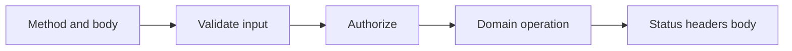

# API routes

---

## Core · API routes

> **Core principle** — Make every endpoint a small, observable protocol rather than an arbitrary function behind a URL.

Stable methods, input validation, status codes, headers, errors, and cancellation.

### Key concepts

<Columns cols={3}>
  <Card title="Malformed JSON" icon="sparkles">
    400
  </Card>
  <Card title="Unauthorized" icon="shield-check">
    401
  </Card>
  <Card title="Forbidden" icon="gauge-high">
    403
  </Card>
</Columns>

### Boundary model

### Ownership matrix

| Concern | Jeston/application boundary | Review signal |
| --- | --- | --- |
| Malformed JSON | 400 | No domain side effect. |
| Unauthorized | 401 | Identity is absent or invalid. |
| Forbidden | 403 | Identity exists but policy denies. |
| Dependency failure | 5xx | Safe public body and correlated internal log. |

### Engineering considerations

A clear HTTP contract lets clients, tests, proxies, and operators reason about behavior independently.

> **Design constraint**
>
> An API is a promise about failure as much as it is a promise about success.

### Implementation notes

| Engineering move | Guidance |
| --- | --- |
| **Choose the method** | Align semantics with read, create, replace, partial update, or delete behavior. |
| **Validate before work** | Return a stable 400 shape for malformed JSON or invalid fields. |
| **Set status intentionally** | Do not make clients infer success from a generic 200 response. |
| **Bound the handler** | Use deadlines, signals, body limits, and idempotency where repetition is possible. |

### Decision lens

| Mode | Practical emphasis |
| --- | --- |
| **Read** | Cache only when freshness and authorization semantics are clear. |
| **Write** | Make retries safe with idempotency or explicit non-retry policy. |
| **Stream** | Define event framing, disconnect behavior, and terminal state. |

## Related topics

<Columns cols={3}>
- [globe · **Read HTTP semantics**](/reference/http-contracts) — Read the focused guide for this boundary.
- [shield-halved · **Harden boundaries**](/platform/security) — Read the focused guide for this boundary.
- [chart-line · **Expose signals**](/platform/health-observability) — Read the focused guide for this boundary.
</Columns>

## References

[1]: https://github.com/jeffersoncampos12p-dev/jeston "Jeston source repository"
[2]: https://www.npmjs.com/package/@hedronjs/jeston "Jeston package on npm"
[3]: https://nodejs.org/api/http.html "Node.js HTTP API"
[4]: https://developer.mozilla.org/en-US/docs/Web/API/AbortSignal "AbortSignal Web API"
[5]: https://react.dev/reference/react-dom/server "React server rendering APIs"
[6]: https://www.typescriptlang.org/docs/handbook/intro.html "TypeScript handbook"
