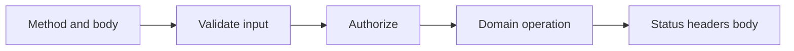

# API routes

---

## Core · API routes

> **Core principle** — Make every endpoint a small, observable protocol rather than an arbitrary function behind a URL.

Stable methods, input validation, status codes, headers, errors, and cancellation.

### Boundary model

### Ownership matrix

| Concern | Jeston/application boundary | Review signal |
| --- | --- | --- |
| Malformed JSON | 400 | No domain side effect. |
| Unauthorized | 401 | Identity is absent or invalid. |
| Forbidden | 403 | Identity exists but policy denies. |
| Dependency failure | 5xx | Safe public body and correlated internal log. |

### Engineering considerations

A clear HTTP contract lets clients, tests, proxies, and operators reason about behavior independently.

> **Design constraint**
>
> An API is a promise about failure as much as it is a promise about success.

## Related material

<Columns cols={3}>
  <Card title="Read HTTP semantics" icon="globe" href="/reference/http-contracts" horizontal>Read the focused guide for this boundary.</Card>
  <Card title="Harden boundaries" icon="shield-halved" href="/platform/security" horizontal>Read the focused guide for this boundary.</Card>
  <Card title="Expose signals" icon="chart-line" href="/platform/health-observability" horizontal>Read the focused guide for this boundary.</Card>
</Columns>

## References

[1]: https://github.com/jeffersoncampos12p-dev/jeston "Jeston source repository"
[2]: https://www.npmjs.com/package/@hedronjs/jeston "Jeston package on npm"
[3]: https://nodejs.org/api/http.html "Node.js HTTP API"
[4]: https://developer.mozilla.org/en-US/docs/Web/API/AbortSignal "AbortSignal Web API"
[5]: https://react.dev/reference/react-dom/server "React server rendering APIs"
[6]: https://www.typescriptlang.org/docs/handbook/intro.html "TypeScript handbook"
