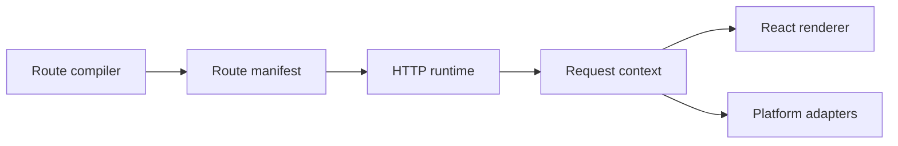

# Architecture

<Accordion title="Detailed background for this page" icon="book-open" defaultOpen={true}>

See Jeston as a set of lifecycle contracts with replaceable platform edges.

**Expected outcome.** A clear ownership map for compiler, router, request context, renderer, and adapters.

**Why this boundary matters.** Architectural boundaries determine whether a heavy workload can be cancelled, measured, moved, or scaled.

### Page-specific implementation notes

- **Map the lifecycle:** Trace a request from route discovery to response completion.
- **Mark ownership:** Separate framework lifecycle from application policy and provider mechanics.
- **Propagate context:** Carry request ID, deadline, and AbortSignal into expensive work.
- **Test seams:** Replace adapters in tests and exercise lifecycle failures directly.

### Page-specific failure questions

- **Where does cancellation begin?:** At the request boundary; every cancellable dependency should receive the signal.
- **What should not be global?:** Tenant policy, credentials, domain state, and provider-specific retry rules.
- **How should scaling be evaluated?:** Measure the full topology, including database, network, queue, and renderer.

</Accordion>

---

## Core · Architecture

> **Page focus** — See Jeston as a set of lifecycle contracts with replaceable platform edges.

<Columns cols={2}>
  <Card title="What you will leave with" icon="diagram-project" type="check">
    A clear ownership map for compiler, router, request context, renderer, and adapters.
  </Card>

  <Card title="Why this deserves its own page" icon="circle-question" type="note">
    Architectural boundaries determine whether a heavy workload can be cancelled, measured, moved, or scaled.
  </Card>
</Columns>

### System view

<Info>
This guide has its own decision surface. Use the visual blocks for orientation, then open the detailed background above when you need the longer explanation.
</Info>

---

## Implementation sequence

<Steps titleSize="h3">
  <Step title="Map the lifecycle" icon="crosshairs">
    Trace a request from route discovery to response completion.
  </Step>
  <Step title="Mark ownership" icon="layers-3">
    Separate framework lifecycle from application policy and provider mechanics.
  </Step>
  <Step title="Propagate context" icon="triangle-exclamation">
    Carry request ID, deadline, and AbortSignal into expensive work.
  </Step>
  <Step title="Test seams" icon="flask-conical">
    Replace adapters in tests and exercise lifecycle failures directly.
  </Step>
</Steps>

## Choose a working mode

<Tabs>
  <Tab title="Framework" icon="book-open">
    Own contracts, lifecycle, and transport semantics.
  </Tab>
  <Tab title="Application" icon="hammer">
    Own domain rules, authorization, and composition.
  </Tab>
  <Tab title="Adapter" icon="chart-line">
    Own provider protocol, credentials, and resource cleanup.
  </Tab>
</Tabs>

---

## Decision table

| Concern | Default posture | Review question |
| --- | --- | --- |
| Lifecycle | Framework | Stable and portable. |
| Policy | Application | Business-specific and testable. |
| Protocol | Adapter | Replaceable and provider-aware. |

> **Design note**
>
> Portability is achieved by making ownership explicit, not by removing all abstractions.

<Note>
Use architecture diagrams to review responsibility. If two layers both believe they own retries or shutdown, the boundary is incomplete.
</Note>

## Questions worth answering

<AccordionGroup>
  <Accordion title="Where does cancellation begin?" icon="circle-question">
    At the request boundary; every cancellable dependency should receive the signal.
  </Accordion>
  <Accordion title="What should not be global?" icon="binoculars">
    Tenant policy, credentials, domain state, and provider-specific retry rules.
  </Accordion>
  <Accordion title="How should scaling be evaluated?" icon="arrow-right">
    Measure the full topology, including database, network, queue, and renderer.
  </Accordion>
</AccordionGroup>

---

## Continue with a related guide

<Columns cols={3}>
  <Card title="Trace route selection" icon="route" href="/core/routing" horizontal>Open the related guide when this page leaves a boundary unresolved.</Card>
  <Card title="Trace execution" icon="stream" href="/core/execution-and-streaming" horizontal>Open the related guide when this page leaves a boundary unresolved.</Card>
  <Card title="Design adapters" icon="puzzle-piece" href="/reference/adapters" horizontal>Open the related guide when this page leaves a boundary unresolved.</Card>
</Columns>

<Check>
This page is complete when its specific decision is documented, its failure behavior is tested, and its operational signal has an owner.
</Check>

## References

[1]: https://github.com/jeffersoncampos12p-dev/jeston "Jeston source repository"
[2]: https://www.npmjs.com/package/@hedronjs/jeston "Jeston package on npm"
[3]: https://nodejs.org/api/http.html "Node.js HTTP API"
[4]: https://developer.mozilla.org/en-US/docs/Web/API/AbortSignal "AbortSignal Web API"
[5]: https://react.dev/reference/react-dom/server "React server rendering APIs"
[6]: https://www.typescriptlang.org/docs/handbook/intro.html "TypeScript handbook"
