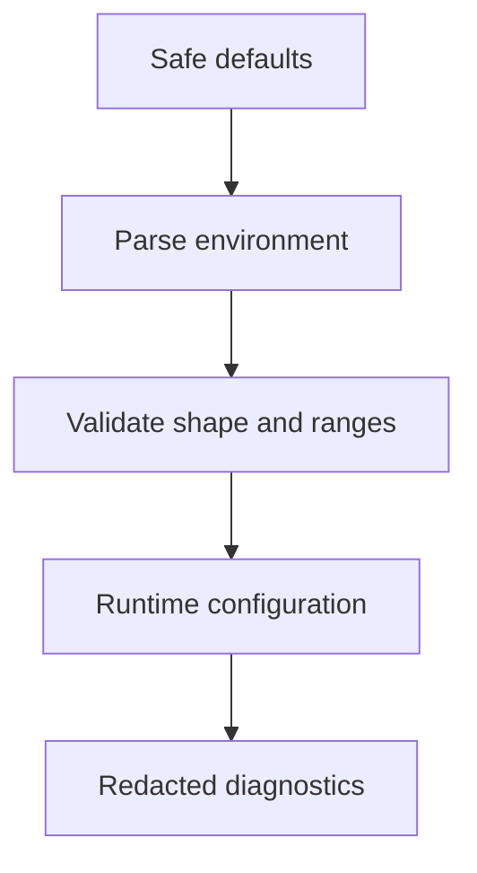

# Configuration

---

## Core · Configuration

> **Core principle** — Make runtime choices visible, typed, and safe to override across development, CI, and production.

A configuration model that fails early and does not hide environment-specific behavior.

### Boundary model

### Ownership matrix

| Concern | Jeston/application boundary | Review signal |
| --- | --- | --- |
| Timeout | Typed duration | Bound expensive work. |
| Limit | Positive integer | Protect memory and concurrency. |
| Secret | Opaque value | Never include in logs or artifacts. |

### Engineering considerations

Configuration is executable policy: timeouts, limits, origins, credentials, and adapters change the system’s risk profile.

> **Design constraint**
>
> Configuration should explain why the process behaves differently, not conceal that difference.

## Related material

<Columns cols={3}>
  <Card title="Understand ownership" icon="diagram-project" href="/core/architecture" horizontal>Read the focused guide for this boundary.</Card>
  <Card title="Protect secrets" icon="shield-halved" href="/platform/security" horizontal>Read the focused guide for this boundary.</Card>
  <Card title="Inject at deploy time" icon="cloud-arrow-up" href="/operations/deployment" horizontal>Read the focused guide for this boundary.</Card>
</Columns>

## References

[1]: https://github.com/jeffersoncampos12p-dev/jeston "Jeston source repository"
[2]: https://www.npmjs.com/package/@hedronjs/jeston "Jeston package on npm"
[3]: https://nodejs.org/api/http.html "Node.js HTTP API"
[4]: https://developer.mozilla.org/en-US/docs/Web/API/AbortSignal "AbortSignal Web API"
[5]: https://react.dev/reference/react-dom/server "React server rendering APIs"
[6]: https://www.typescriptlang.org/docs/handbook/intro.html "TypeScript handbook"

# Configuration

<Accordion title="Detailed background for this page" icon="book-open">
  Make runtime choices visible, typed, and safe to override across development, CI, and production.

  **Expected outcome.** A configuration model that fails early and does not hide environment-specific behavior.

  **Why this boundary matters.** Configuration is executable policy: timeouts, limits, origins, credentials, and adapters change the system’s risk profile.

  ### Page-specific implementation notes

  - **Separate environments:** Name which values are local conveniences and which are production requirements.
  - **Parse once:** Convert strings to typed values at startup, not deep inside handlers.
  - **Validate ranges:** Reject invalid timeouts, ports, limits, and origins before serving.
  - **Redact diagnostics:** Make configuration debuggable without logging secrets.

  ### Page-specific failure questions

  - **What should be a default?:** Only values that are safe across environments and easy to override.
  - **What should be required?:** Credentials, signing keys, and external endpoints needed by enabled capabilities.
  - **How should configuration be tested?:** Use fixtures for valid, missing, malformed, and out-of-range values.
</Accordion>

---

## Core · Configuration

> **Page focus** — Make runtime choices visible, typed, and safe to override across development, CI, and production.

### At a glance

| Scope | Practical result |
| --- | --- |
| **Focus** | Make runtime choices visible, typed, and safe to override across development, CI, and production. |
| **Deliverable** | A configuration model that fails early and does not hide environment-specific behavior. |
| **Reason to care** | Configuration is executable policy: timeouts, limits, origins, credentials, and adapters change the system’s risk profile. |

<Info>
  This page is intentionally focused on one boundary. Use the decision table and implementation sequence below as a working review sheet, not as a generic framework overview.
</Info>

### System view

<Info>
  This guide has its own decision surface. Use the visual blocks for orientation, then open the detailed background above when you need the longer explanation.
</Info>

---

## Implementation sequence

<Steps titleSize="h3">
  <Step title="Separate environments" icon="crosshairs">
    Name which values are local conveniences and which are production requirements.
  </Step>
  <Step title="Parse once" icon="layers-3">
    Convert strings to typed values at startup, not deep inside handlers.
  </Step>
  <Step title="Validate ranges" icon="triangle-exclamation">
    Reject invalid timeouts, ports, limits, and origins before serving.
  </Step>
  <Step title="Redact diagnostics" icon="flask-conical">
    Make configuration debuggable without logging secrets.
  </Step>
</Steps>

## Choose a working mode

<Tabs>
  <Tab title="Local" icon="book-open">
    Fast feedback with safe development defaults.
  </Tab>
  <Tab title="CI" icon="hammer">
    Deterministic values and no hidden credentials.
  </Tab>
  <Tab title="Production" icon="chart-line">
    Secret-manager injection, strict validation, and auditability.
  </Tab>
</Tabs>

---

## Decision table

| Concern | Default posture | Review question |
| --- | --- | --- |
| Timeout | Typed duration | Bound expensive work. |
| Limit | Positive integer | Protect memory and concurrency. |
| Secret | Opaque value | Never include in logs or artifacts. |

> **Design note**
>
> Configuration should explain why the process behaves differently, not conceal that difference.

<Note>
  Treat a missing production variable as a startup error, not as a request-time surprise.
</Note>

## Questions worth answering

<AccordionGroup>
  <Accordion title="What should be a default?" icon="circle-question">
    Only values that are safe across environments and easy to override.
  </Accordion>

  <Accordion title="What should be required?" icon="binoculars">
    Credentials, signing keys, and external endpoints needed by enabled capabilities.
  </Accordion>

  <Accordion title="How should configuration be tested?" icon="arrow-right">
    Use fixtures for valid, missing, malformed, and out-of-range values.
  </Accordion>
</AccordionGroup>

---

## Continue with a related guide

<Columns cols={3}>
  <Card title="Understand ownership" icon="diagram-project" horizontal href="/core/architecture">
    Open the related guide when this page leaves a boundary unresolved.
  </Card>

  <Card title="Protect secrets" icon="shield-halved" horizontal href="/platform/security">
    Open the related guide when this page leaves a boundary unresolved.
  </Card>

  <Card title="Inject at deploy time" icon="cloud-arrow-up" horizontal href="/operations/deployment">
    Open the related guide when this page leaves a boundary unresolved.
  </Card>
</Columns>

<Check>
  This page is complete when its specific decision is documented, its failure behavior is tested, and its operational signal has an owner.
</Check>

## References

[1]: https://github.com/jeffersoncampos12p-dev/jeston "Jeston source repository"

[2]: https://www.npmjs.com/package/@hedronjs/jeston "Jeston package on npm"

[3]: https://nodejs.org/api/http.html "Node.js HTTP API"

[4]: https://developer.mozilla.org/en-US/docs/Web/API/AbortSignal "AbortSignal Web API"

[5]: https://react.dev/reference/react-dom/server "React server rendering APIs"

[6]: https://www.typescriptlang.org/docs/handbook/intro.html "TypeScript handbook"
