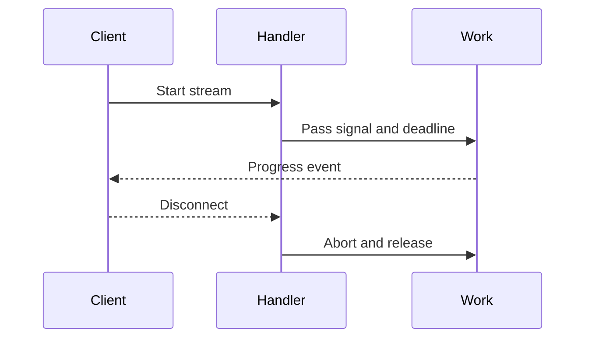

# Execution and streaming

---

## Core · Execution and streaming

> **Core principle** — Keep long work bounded while still delivering useful progress to the client.

Deadlines, cancellation, backpressure, SSE framing, and terminal states that behave under disconnects.

### Key concepts

<Columns cols={3}>
  <Card title="Backpressure" icon="sparkles">
    Bound buffers
  </Card>
  <Card title="Disconnect" icon="shield-check">
    Abort signal
  </Card>
  <Card title="Terminal" icon="gauge-high">
    Done or error event
  </Card>
</Columns>

### Boundary model

### Ownership matrix

| Concern | Jeston/application boundary | Review signal |
| --- | --- | --- |
| Backpressure | Bound buffers | Never let a slow client grow memory without limit. |
| Disconnect | Abort signal | Stop model, database, and network work. |
| Terminal | Done or error event | Let clients close cleanly. |

### Engineering considerations

Streaming increases responsiveness but also keeps resources open longer; its lifecycle must be more explicit than a normal response.

> **Design constraint**
>
> A stream is a resource lease, not an infinite response.

### Implementation notes

| Engineering move | Guidance |
| --- | --- |
| **Set a budget** | Give the overall request and each dependency a deadline. |
| **Define event shape** | Choose event names, payloads, heartbeats, and terminal messages. |
| **Propagate disconnect** | Abort work when the client leaves or the stream is no longer useful. |
| **Measure open work** | Track active streams, duration, bytes, and cancellation reasons. |

### Decision lens

| Mode | Practical emphasis |
| --- | --- |
| **SSE** | Use explicit event framing and a terminal state. |
| **Batch** | Prefer bounded chunks when clients do not need immediacy. |
| **Queue** | Move work beyond request lifetime into a durable job. |

## Related topics

<Columns cols={3}>
  <Card title="Drain long work" icon="power-off" href="/operations/jobs-and-shutdown" horizontal>Read the focused guide for this boundary.</Card>
  <Card title="Stream agent work" icon="brain" href="/platform/ai-agents" horizontal>Read the focused guide for this boundary.</Card>
  <Card title="Measure streams" icon="chart-line" href="/platform/health-observability" horizontal>Read the focused guide for this boundary.</Card>
</Columns>

## References

[1]: https://github.com/jeffersoncampos12p-dev/jeston "Jeston source repository"
[2]: https://www.npmjs.com/package/@hedronjs/jeston "Jeston package on npm"
[3]: https://nodejs.org/api/http.html "Node.js HTTP API"
[4]: https://developer.mozilla.org/en-US/docs/Web/API/AbortSignal "AbortSignal Web API"
[5]: https://react.dev/reference/react-dom/server "React server rendering APIs"
[6]: https://www.typescriptlang.org/docs/handbook/intro.html "TypeScript handbook"
