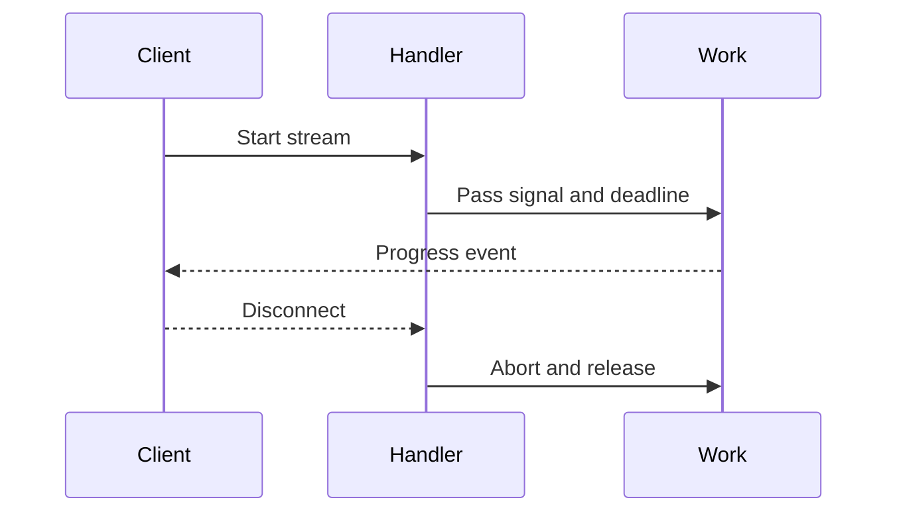

# Execution and streaming

<Accordion title="Detailed background for this page" icon="book-open">

Keep long work bounded while still delivering useful progress to the client.

**Expected outcome.** Deadlines, cancellation, backpressure, SSE framing, and terminal states that behave under disconnects.

**Why this boundary matters.** Streaming increases responsiveness but also keeps resources open longer; its lifecycle must be more explicit than a normal response.

### Page-specific implementation notes

- **Set a budget:** Give the overall request and each dependency a deadline.
- **Define event shape:** Choose event names, payloads, heartbeats, and terminal messages.
- **Propagate disconnect:** Abort work when the client leaves or the stream is no longer useful.
- **Measure open work:** Track active streams, duration, bytes, and cancellation reasons.

### Page-specific failure questions

- **What is a heartbeat for?:** It keeps intermediaries aware of a live connection; it is not a substitute for progress.
- **When should work move to a queue?:** When it must survive disconnects, restart, or a request deadline.
- **How do you test streaming?:** Test ordering, framing, slow consumers, cancellation, and terminal events.

</Accordion>

---

## Core · Execution and streaming

> **Page focus** — Keep long work bounded while still delivering useful progress to the client.

### At a glance

| Scope | Practical result |
| --- | --- |
| **Focus** | Keep long work bounded while still delivering useful progress to the client. |
| **Deliverable** | Deadlines, cancellation, backpressure, SSE framing, and terminal states that behave under disconnects. |
| **Reason to care** | Streaming increases responsiveness but also keeps resources open longer; its lifecycle must be more explicit than a normal response. |

<Info>
This page is intentionally focused on one boundary. Use the decision table and implementation sequence below as a working review sheet, not as a generic framework overview.
</Info>

### System view

<Info>
This guide has its own decision surface. Use the visual blocks for orientation, then open the detailed background above when you need the longer explanation.
</Info>

---

## Implementation sequence

<Steps titleSize="h3">
  <Step title="Set a budget" icon="crosshairs">
    Give the overall request and each dependency a deadline.
  </Step>
  <Step title="Define event shape" icon="layers-3">
    Choose event names, payloads, heartbeats, and terminal messages.
  </Step>
  <Step title="Propagate disconnect" icon="triangle-exclamation">
    Abort work when the client leaves or the stream is no longer useful.
  </Step>
  <Step title="Measure open work" icon="flask-conical">
    Track active streams, duration, bytes, and cancellation reasons.
  </Step>
</Steps>

## Choose a working mode

<Tabs>
  <Tab title="SSE" icon="book-open">
    Use explicit event framing and a terminal state.
  </Tab>
  <Tab title="Batch" icon="hammer">
    Prefer bounded chunks when clients do not need immediacy.
  </Tab>
  <Tab title="Queue" icon="chart-line">
    Move work beyond request lifetime into a durable job.
  </Tab>
</Tabs>

---

## Decision table

| Concern | Default posture | Review question |
| --- | --- | --- |
| Backpressure | Bound buffers | Never let a slow client grow memory without limit. |
| Disconnect | Abort signal | Stop model, database, and network work. |
| Terminal | Done or error event | Let clients close cleanly. |

> **Design note**
>
> A stream is a resource lease, not an infinite response.

<Note>
Do not keep a request open merely to hide a job. Persist status when work must survive the connection.
</Note>

## Questions worth answering

<AccordionGroup>
  <Accordion title="What is a heartbeat for?" icon="circle-question">
    It keeps intermediaries aware of a live connection; it is not a substitute for progress.
  </Accordion>
  <Accordion title="When should work move to a queue?" icon="binoculars">
    When it must survive disconnects, restart, or a request deadline.
  </Accordion>
  <Accordion title="How do you test streaming?" icon="arrow-right">
    Test ordering, framing, slow consumers, cancellation, and terminal events.
  </Accordion>
</AccordionGroup>

---

## Continue with a related guide

<Columns cols={3}>
  <Card title="Drain long work" icon="power-off" href="/operations/jobs-and-shutdown" horizontal>Open the related guide when this page leaves a boundary unresolved.</Card>
  <Card title="Stream agent work" icon="brain" href="/platform/ai-agents" horizontal>Open the related guide when this page leaves a boundary unresolved.</Card>
  <Card title="Measure streams" icon="chart-line" href="/platform/health-observability" horizontal>Open the related guide when this page leaves a boundary unresolved.</Card>
</Columns>

<Check>
This page is complete when its specific decision is documented, its failure behavior is tested, and its operational signal has an owner.
</Check>

## References

[1]: https://github.com/jeffersoncampos12p-dev/jeston "Jeston source repository"
[2]: https://www.npmjs.com/package/@hedronjs/jeston "Jeston package on npm"
[3]: https://nodejs.org/api/http.html "Node.js HTTP API"
[4]: https://developer.mozilla.org/en-US/docs/Web/API/AbortSignal "AbortSignal Web API"
[5]: https://react.dev/reference/react-dom/server "React server rendering APIs"
[6]: https://www.typescriptlang.org/docs/handbook/intro.html "TypeScript handbook"
