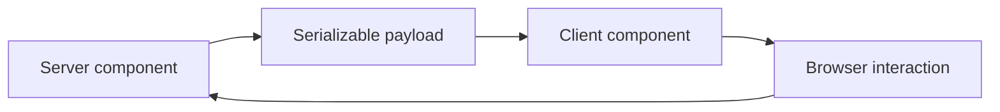

# React Server Components

---

## Core · React Server Components

> **Core principle** — Treat RSC as a boundary to evaluate deliberately, not a label to apply to every component.

A clear decision about server/client ownership, serialization, caching, and maturity risk.

### Boundary model

### Ownership matrix

| Concern | Jeston/application boundary | Review signal |
| --- | --- | --- |
| Server code | No browser APIs | Runs in the server runtime. |
| Client code | Interactive behavior | Ships to the browser. |
| Payload | Serializable data | Defines the crossing contract. |

### Engineering considerations

RSC changes where code executes and how data crosses the boundary; it affects tooling, debugging, and deployment assumptions.

> **Design constraint**
>
> A rendering model is mature when its boundaries are predictable under failure, not only when its demo is fast.

## Related material

<Columns cols={3}>
  <Card title="Compare SSR behavior" icon="server" href="/core/react-ssr" horizontal>Read the focused guide for this boundary.</Card>
  <Card title="Review runtime layers" icon="diagram-project" href="/core/architecture" horizontal>Read the focused guide for this boundary.</Card>
  <Card title="Check support envelope" icon="scale-balanced" href="/reference/compatibility" horizontal>Read the focused guide for this boundary.</Card>
</Columns>

## References

[1]: https://github.com/jeffersoncampos12p-dev/jeston "Jeston source repository"
[2]: https://www.npmjs.com/package/@hedronjs/jeston "Jeston package on npm"
[3]: https://nodejs.org/api/http.html "Node.js HTTP API"
[4]: https://developer.mozilla.org/en-US/docs/Web/API/AbortSignal "AbortSignal Web API"
[5]: https://react.dev/reference/react-dom/server "React server rendering APIs"
[6]: https://www.typescriptlang.org/docs/handbook/intro.html "TypeScript handbook"
