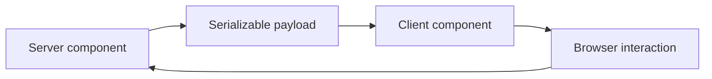

# React Server Components

<Accordion title="Detailed background for this page" icon="book-open">

Treat RSC as a boundary to evaluate deliberately, not a label to apply to every component.

**Expected outcome.** A clear decision about server/client ownership, serialization, caching, and maturity risk.

**Why this boundary matters.** RSC changes where code executes and how data crosses the boundary; it affects tooling, debugging, and deployment assumptions.

### Page-specific implementation notes

- **Classify execution:** Mark data access, secrets, browser APIs, and event handlers.
- **Define serialization:** Keep the crossing payload explicit and stable.
- **Choose cache ownership:** Decide whether freshness belongs to request, server, or client.
- **Record maturity:** Separate supported behavior from an experimental or roadmap track.

### Page-specific failure questions

- **What should not cross?:** Secrets, open handles, provider clients, and non-serializable runtime state.
- **What is a cache question?:** Who owns freshness, invalidation, and authorization for the rendered data?
- **What should be measured?:** Payload size, server time, hydration work, and failure recovery.

</Accordion>

---

## Core · React Server Components

> **Page focus** — Treat RSC as a boundary to evaluate deliberately, not a label to apply to every component.

### At a glance

| Scope | Practical result |
| --- | --- |
| **Focus** | Treat RSC as a boundary to evaluate deliberately, not a label to apply to every component. |
| **Deliverable** | A clear decision about server/client ownership, serialization, caching, and maturity risk. |
| **Reason to care** | RSC changes where code executes and how data crosses the boundary; it affects tooling, debugging, and deployment assumptions. |

<Info>
This page is intentionally focused on one boundary. Use the decision table and implementation sequence below as a working review sheet, not as a generic framework overview.
</Info>

### System view

<Info>
This guide has its own decision surface. Use the visual blocks for orientation, then open the detailed background above when you need the longer explanation.
</Info>

---

## Implementation sequence

<Steps titleSize="h3">
  <Step title="Classify execution" icon="crosshairs">
    Mark data access, secrets, browser APIs, and event handlers.
  </Step>
  <Step title="Define serialization" icon="layers-3">
    Keep the crossing payload explicit and stable.
  </Step>
  <Step title="Choose cache ownership" icon="triangle-exclamation">
    Decide whether freshness belongs to request, server, or client.
  </Step>
  <Step title="Record maturity" icon="flask-conical">
    Separate supported behavior from an experimental or roadmap track.
  </Step>
</Steps>

## Choose a working mode

<Tabs>
  <Tab title="Server boundary" icon="book-open">
    Use for secure data access and non-interactive composition.
  </Tab>
  <Tab title="Client boundary" icon="hammer">
    Use for browser state, events, and device capabilities.
  </Tab>
  <Tab title="Hybrid" icon="chart-line">
    Keep the crossing narrow and inspect the payload.
  </Tab>
</Tabs>

---

## Decision table

| Concern | Default posture | Review question |
| --- | --- | --- |
| Server code | No browser APIs | Runs in the server runtime. |
| Client code | Interactive behavior | Ships to the browser. |
| Payload | Serializable data | Defines the crossing contract. |

> **Design note**
>
> A rendering model is mature when its boundaries are predictable under failure, not only when its demo is fast.

<Note>
Document the current support envelope honestly; compatibility is part of the feature.
</Note>

## Questions worth answering

<AccordionGroup>
  <Accordion title="What should not cross?" icon="circle-question">
    Secrets, open handles, provider clients, and non-serializable runtime state.
  </Accordion>
  <Accordion title="What is a cache question?" icon="binoculars">
    Who owns freshness, invalidation, and authorization for the rendered data?
  </Accordion>
  <Accordion title="What should be measured?" icon="arrow-right">
    Payload size, server time, hydration work, and failure recovery.
  </Accordion>
</AccordionGroup>

---

## Continue with a related guide

<Columns cols={3}>
  <Card title="Compare SSR behavior" icon="server" href="/core/react-ssr" horizontal>Open the related guide when this page leaves a boundary unresolved.</Card>
  <Card title="Review runtime layers" icon="diagram-project" href="/core/architecture" horizontal>Open the related guide when this page leaves a boundary unresolved.</Card>
  <Card title="Check support envelope" icon="scale-balanced" href="/reference/compatibility" horizontal>Open the related guide when this page leaves a boundary unresolved.</Card>
</Columns>

<Check>
This page is complete when its specific decision is documented, its failure behavior is tested, and its operational signal has an owner.
</Check>

## References

[1]: https://github.com/jeffersoncampos12p-dev/jeston "Jeston source repository"
[2]: https://www.npmjs.com/package/@hedronjs/jeston "Jeston package on npm"
[3]: https://nodejs.org/api/http.html "Node.js HTTP API"
[4]: https://developer.mozilla.org/en-US/docs/Web/API/AbortSignal "AbortSignal Web API"
[5]: https://react.dev/reference/react-dom/server "React server rendering APIs"
[6]: https://www.typescriptlang.org/docs/handbook/intro.html "TypeScript handbook"
