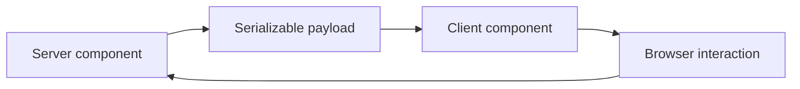

# React Server Components

---

## Core · React Server Components

> **Core principle** — Treat RSC as a boundary to evaluate deliberately, not a label to apply to every component.

A clear decision about server/client ownership, serialization, caching, and maturity risk.

### Key concepts

<Columns cols={3}>
  <Card title="Server code" icon="sparkles">
    No browser APIs
  </Card>
  <Card title="Client code" icon="shield-check">
    Interactive behavior
  </Card>
  <Card title="Payload" icon="gauge-high">
    Serializable data
  </Card>
</Columns>

### Boundary model

### Ownership matrix

| Concern | Ryvax/application boundary | Review signal |
| --- | --- | --- |
| Server code | No browser APIs | Runs in the server runtime. |
| Client code | Interactive behavior | Ships to the browser. |
| Payload | Serializable data | Defines the crossing contract. |

### Engineering considerations

RSC changes where code executes and how data crosses the boundary; it affects tooling, debugging, and deployment assumptions.

> **Design constraint**
>
> A rendering model is mature when its boundaries are predictable under failure, not only when its demo is fast.

### Implementation notes

| Engineering move | Guidance |
| --- | --- |
| **Classify execution** | Mark data access, secrets, browser APIs, and event handlers. |
| **Define serialization** | Keep the crossing payload explicit and stable. |
| **Choose cache ownership** | Decide whether freshness belongs to request, server, or client. |
| **Record maturity** | Separate supported behavior from an experimental or roadmap track. |

### Decision lens

| Mode | Practical emphasis |
| --- | --- |
| **Server boundary** | Use for secure data access and non-interactive composition. |
| **Client boundary** | Use for browser state, events, and device capabilities. |
| **Hybrid** | Keep the crossing narrow and inspect the payload. |

## Related topics

<Columns cols={3}>
- [server · **Compare SSR behavior**](/core/react-ssr) — Read the focused guide for this boundary.
- [diagram-project · **Review runtime layers**](/core/architecture) — Read the focused guide for this boundary.
- [scale-balanced · **Check support envelope**](/reference/compatibility) — Read the focused guide for this boundary.
</Columns>

### Why this matters

RSC changes where code executes and how data crosses the boundary; it affects tooling, debugging, and deployment assumptions.

## References

[1]: https://github.com/kvantjs/ryvax.js "Ryvax source repository"
[2]: https://www.npmjs.com/package/@kvantjs/ryvax.js "Ryvax package on npm"
[3]: https://nodejs.org/api/http.html "Node.js HTTP API"
[4]: https://developer.mozilla.org/en-US/docs/Web/API/AbortSignal "AbortSignal Web API"
[5]: https://react.dev/reference/react-dom/server "React server rendering APIs"
[6]: https://www.typescriptlang.org/docs/handbook/intro.html "TypeScript handbook"
