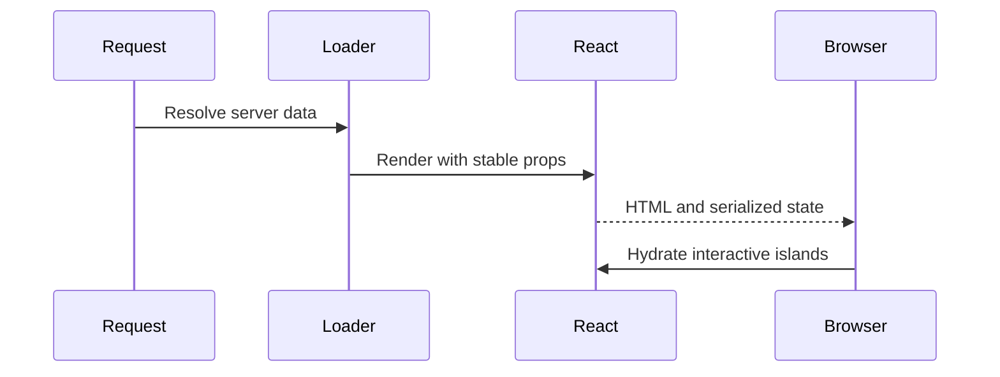

# React SSR and hydration

---

## Core · React SSR

> **Core principle** — Use server rendering to deliver useful HTML without turning hydration into an invisible second application.

A render path with explicit data ownership, hydration assumptions, and recovery behavior.

### Key concepts

<Columns cols={3}>
  <Card title="Server" icon="sparkles">
    HTML and initial data
  </Card>
  <Card title="Client" icon="shield-check">
    Events and local state
  </Card>
  <Card title="Failure" icon="gauge-high">
    Fallback and status
  </Card>
</Columns>

### Boundary model

### Ownership matrix

| Concern | Ryvax/application boundary | Review signal |
| --- | --- | --- |
| Server | HTML and initial data | Optimize time to useful content. |
| Client | Events and local state | Avoid duplicating server ownership. |
| Failure | Fallback and status | Do not render a misleading success shell. |

### Engineering considerations

SSR performance is determined by data dependencies, serialization, cache behavior, and client takeover—not only render speed.

> **Design constraint**
>
> SSR is a contract between two runtimes: server output and browser continuation.

### Implementation notes

| Engineering move | Guidance |
| --- | --- |
| **Classify the data** | Separate request-specific, cacheable, and client-only values. |
| **Render the useful shell** | Deliver meaningful structure before optional work. |
| **Keep props serializable** | Avoid hidden runtime objects crossing the server boundary. |
| **Test hydration failure** | Check mismatches, slow data, and server error rendering. |

### Decision lens

| Mode | Practical emphasis |
| --- | --- |
| **Fast page** | Prefer bounded data and a small initial tree. |
| **Streaming page** | Reveal independent sections progressively. |
| **Interactive page** | Keep client state narrow and deliberate. |

## Related topics

<Columns cols={3}>
  <Card title="Add streaming" icon="stream" horizontal href="/core/execution-and-streaming">
    Read the focused guide for this boundary.
  </Card>

  <Card title="Evaluate RSC" icon="atom" horizontal href="/core/react-server-components">
    Read the focused guide for this boundary.
  </Card>

  <Card title="Coordinate cache" icon="layer-group" horizontal href="/platform/cache-jobs-storage">
    Read the focused guide for this boundary.
  </Card>
</Columns>

<Columns cols={3}>
- [stream · **Add streaming**](/core/execution-and-streaming) — Read the focused guide for this boundary.
- [atom · **Evaluate RSC**](/core/react-server-components) — Read the focused guide for this boundary.
- [layer-group · **Coordinate cache**](/platform/cache-jobs-storage) — Read the focused guide for this boundary.
</Columns>

## References

[1]: https://github.com/kvantjs/ryvax.js "Ryvax source repository"
[2]: https://www.npmjs.com/package/@kvantjs/ryvax.js "Ryvax package on npm"
[3]: https://nodejs.org/api/http.html "Node.js HTTP API"
[4]: https://developer.mozilla.org/en-US/docs/Web/API/AbortSignal "AbortSignal Web API"
[5]: https://react.dev/reference/react-dom/server "React server rendering APIs"
[6]: https://www.typescriptlang.org/docs/handbook/intro.html "TypeScript handbook"
