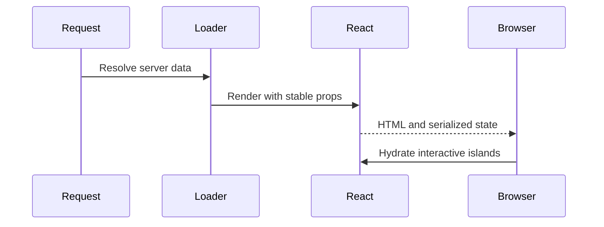

# React SSR and hydration

---

## Core · React SSR

> **Core principle** — Use server rendering to deliver useful HTML without turning hydration into an invisible second application.

A render path with explicit data ownership, hydration assumptions, and recovery behavior.

### Boundary model

### Ownership matrix

| Concern | Jeston/application boundary | Review signal |
| --- | --- | --- |
| Server | HTML and initial data | Optimize time to useful content. |
| Client | Events and local state | Avoid duplicating server ownership. |
| Failure | Fallback and status | Do not render a misleading success shell. |

### Engineering considerations

SSR performance is determined by data dependencies, serialization, cache behavior, and client takeover—not only render speed.

> **Design constraint**
>
> SSR is a contract between two runtimes: server output and browser continuation.

## Related material

<Columns cols={3}>
  <Card title="Add streaming" icon="stream" href="/core/execution-and-streaming" horizontal>Read the focused guide for this boundary.</Card>
  <Card title="Evaluate RSC" icon="atom" href="/core/react-server-components" horizontal>Read the focused guide for this boundary.</Card>
  <Card title="Coordinate cache" icon="layer-group" href="/platform/cache-jobs-storage" horizontal>Read the focused guide for this boundary.</Card>
</Columns>

## References

[1]: https://github.com/jeffersoncampos12p-dev/jeston "Jeston source repository"
[2]: https://www.npmjs.com/package/@hedronjs/jeston "Jeston package on npm"
[3]: https://nodejs.org/api/http.html "Node.js HTTP API"
[4]: https://developer.mozilla.org/en-US/docs/Web/API/AbortSignal "AbortSignal Web API"
[5]: https://react.dev/reference/react-dom/server "React server rendering APIs"
[6]: https://www.typescriptlang.org/docs/handbook/intro.html "TypeScript handbook"
