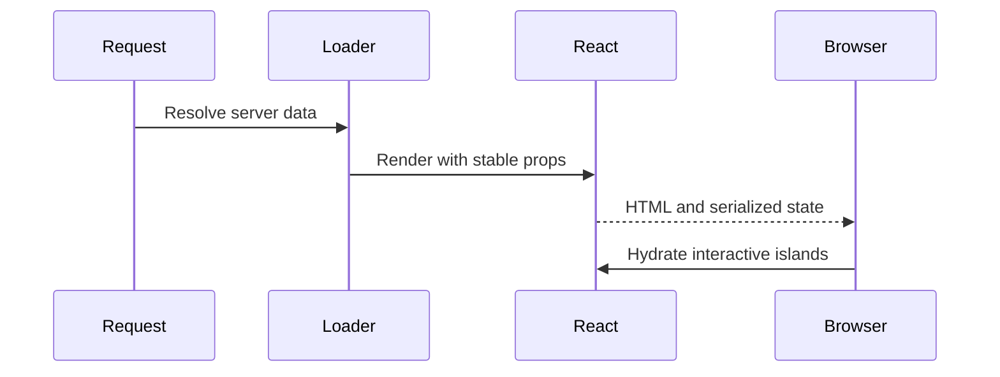

# React SSR and hydration

<Accordion title="Detailed background for this page" icon="book-open" defaultOpen={true}>

Use server rendering to deliver useful HTML without turning hydration into an invisible second application.

**Expected outcome.** A render path with explicit data ownership, hydration assumptions, and recovery behavior.

**Why this boundary matters.** SSR performance is determined by data dependencies, serialization, cache behavior, and client takeover—not only render speed.

### Page-specific implementation notes

- **Classify the data:** Separate request-specific, cacheable, and client-only values.
- **Render the useful shell:** Deliver meaningful structure before optional work.
- **Keep props serializable:** Avoid hidden runtime objects crossing the server boundary.
- **Test hydration failure:** Check mismatches, slow data, and server error rendering.

### Page-specific failure questions

- **What belongs on the server?:** Data access, secure decisions, and work that improves initial content.
- **What belongs in the browser?:** Ephemeral interaction state and capabilities unavailable to the server.
- **What is a hydration smell?:** A page that only works after client JavaScript runs or changes meaning during takeover.

</Accordion>

---

## Core · React SSR

> **Page focus** — Use server rendering to deliver useful HTML without turning hydration into an invisible second application.

<Columns cols={2}>
  <Card title="What you will leave with" icon="server" type="check">
    A render path with explicit data ownership, hydration assumptions, and recovery behavior.
  </Card>

  <Card title="Why this deserves its own page" icon="circle-question" type="note">
    SSR performance is determined by data dependencies, serialization, cache behavior, and client takeover—not only render speed.
  </Card>
</Columns>

### System view

<Info>
This guide has its own decision surface. Use the visual blocks for orientation, then open the detailed background above when you need the longer explanation.
</Info>

---

## Implementation sequence

<Steps titleSize="h3">
  <Step title="Classify the data" icon="crosshairs">
    Separate request-specific, cacheable, and client-only values.
  </Step>
  <Step title="Render the useful shell" icon="layers-3">
    Deliver meaningful structure before optional work.
  </Step>
  <Step title="Keep props serializable" icon="triangle-exclamation">
    Avoid hidden runtime objects crossing the server boundary.
  </Step>
  <Step title="Test hydration failure" icon="flask-conical">
    Check mismatches, slow data, and server error rendering.
  </Step>
</Steps>

## Choose a working mode

<Tabs>
  <Tab title="Fast page" icon="book-open">
    Prefer bounded data and a small initial tree.
  </Tab>
  <Tab title="Streaming page" icon="hammer">
    Reveal independent sections progressively.
  </Tab>
  <Tab title="Interactive page" icon="chart-line">
    Keep client state narrow and deliberate.
  </Tab>
</Tabs>

---

## Decision table

| Concern | Default posture | Review question |
| --- | --- | --- |
| Server | HTML and initial data | Optimize time to useful content. |
| Client | Events and local state | Avoid duplicating server ownership. |
| Failure | Fallback and status | Do not render a misleading success shell. |

> **Design note**
>
> SSR is a contract between two runtimes: server output and browser continuation.

<Note>
Do not call browser-only APIs during server rendering, and do not serialize secrets into the initial payload.
</Note>

## Questions worth answering

<AccordionGroup>
  <Accordion title="What belongs on the server?" icon="circle-question">
    Data access, secure decisions, and work that improves initial content.
  </Accordion>
  <Accordion title="What belongs in the browser?" icon="binoculars">
    Ephemeral interaction state and capabilities unavailable to the server.
  </Accordion>
  <Accordion title="What is a hydration smell?" icon="arrow-right">
    A page that only works after client JavaScript runs or changes meaning during takeover.
  </Accordion>
</AccordionGroup>

---

## Continue with a related guide

<Columns cols={3}>
  <Card title="Add streaming" icon="stream" href="/core/execution-and-streaming" horizontal>Open the related guide when this page leaves a boundary unresolved.</Card>
  <Card title="Evaluate RSC" icon="atom" href="/core/react-server-components" horizontal>Open the related guide when this page leaves a boundary unresolved.</Card>
  <Card title="Coordinate cache" icon="layer-group" href="/platform/cache-jobs-storage" horizontal>Open the related guide when this page leaves a boundary unresolved.</Card>
</Columns>

<Check>
This page is complete when its specific decision is documented, its failure behavior is tested, and its operational signal has an owner.
</Check>

## References

[1]: https://github.com/jeffersoncampos12p-dev/jeston "Jeston source repository"
[2]: https://www.npmjs.com/package/@hedronjs/jeston "Jeston package on npm"
[3]: https://nodejs.org/api/http.html "Node.js HTTP API"
[4]: https://developer.mozilla.org/en-US/docs/Web/API/AbortSignal "AbortSignal Web API"
[5]: https://react.dev/reference/react-dom/server "React server rendering APIs"
[6]: https://www.typescriptlang.org/docs/handbook/intro.html "TypeScript handbook"
