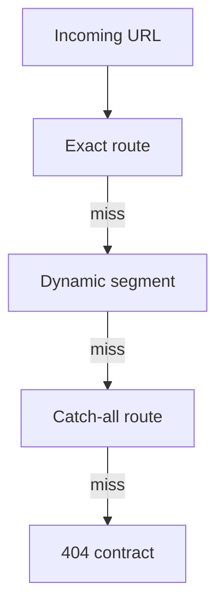

# Routing

---

## Core · Routing

> **Core principle** — Treat route selection as a deterministic contract, especially when dynamic and catch-all paths coexist.

# Routing

---

## Core · Routing

> **Core principle** — Treat route selection as a deterministic contract, especially when dynamic and catch-all paths coexist.

Predictable precedence, parameters, method boundaries, and 404 behaviorPredictable precedence, parameters, method boundaries, and 404 behavior.

### Key concepts

<Columns cols={3}>
  <Card title="Exact path" icon="sparkles">
    Highest certainty
  </Card>
  <Card title="Parameter" icon="shield-check">
    Validated value
  </Card>
  <Card title="Fallback" icon="gauge-high">
    Explicit 404
  </Card>
</Columns>

### Boundary model

### Ownership matrix

| Concern | Ryvax/application boundary | Review signal |
| --- | --- | --- |
| Exact path | Highest certainty | Test before dynamic matches. |
| Parameter | Validated value | Never treat URL text as trusted domain input. |
| Fallback | Explicit 404 | Avoid accidental broad handlers. |

### Engineering considerations

Routing bugs are often silent: a request reaches a valid handler that was not the intended handler.

> **Design constraint**
>
> A route tree is an executable product map; ambiguity is a defect.

### Implementation notes

| Engineering move | Guidance |
| --- | --- |
| **List the route tree** | Write static, dynamic, and catch-all paths before implementation. |
| **Define precedence** | Make the winner for overlapping paths obvious and tested. |
| **Name parameters** | Keep parameter names stable across pages and handlers. |
| **Test the negative space** | Exercise 404, malformed parameters, unsupported methods, and encoded paths. |

### Decision lens

| Mode | Practical emphasis |
| --- | --- |
| **Static** | Use for stable product surfaces and predictable caching. |
| **Dynamic** | Validate identifiers and scope them to authorization. |
| **Catch-all** | Use sparingly for controlled fallback or documentation surfaces. |

## Related topics

<Columns cols={3}>
- [brackets-curly · **Add method contracts**](/core/api-routes) — Read the focused guide for this boundary.
- [globe · **Define response**](/reference/http-contracts)**s** — Read the focused guide for this boundary.
- [sliders · **Configure runtime**](/core/configuration) — Read the focused guide for this boundary.
</Columns>

## References

[1]: https://github.com/kvantjs/ryvax.js "Ryvax source repository"
[2]: https://www.npmjs.com/package/@kvantjs/ryvax.js "Ryvax package on npm"
[3]: https://nodejs.org/api/http.html "Node.js HTTP API"
[4]: https://developer.mozilla.org/en-US/docs/Web/API/AbortSignal "AbortSignal Web API"
[5]: https://react.dev/reference/react-dom/server "React server rendering APIs"
[6]: https://www.typescriptlang.org/docs/handbook/intro.html "TypeScript handbook"

### Key concepts

<Columns cols={3}>
  <Card title="Exact path" icon="sparkles">
    Highest certainty
  </Card>

  <Card title="Parameter" icon="shield-check">
    Validated value
  </Card>

  <Card title="Fallback" icon="gauge-high">
    Explicit 404
  </Card>
</Columns>

### Boundary model

### Ownership matrix

| Concern | Ryvax/application boundary | Review signal |
| --- | --- | --- |
| Exact path | Highest certainty | Test before dynamic matches. |
| Parameter | Validated value | Never treat URL text as trusted domain input. |
| Fallback | Explicit 404 | Avoid accidental broad handlers. |

### Engineering considerations

Routing bugs are often silent: a request reaches a valid handler that was not the intended handler.

> **Design constraint**
>
> A route tree is an executable product map; ambiguity is a defect.

### Implementation notes

| Engineering move | Guidance |
| --- | --- |
| **List the route tree** | Write static, dynamic, and catch-all paths before implementation. |
| **Define precedence** | Make the winner for overlapping paths obvious and tested. |
| **Name parameters** | Keep parameter names stable across pages and handlers. |
| **Test the negative space** | Exercise 404, malformed parameters, unsupported methods, and encoded paths. |

### Decision lens

| Mode | Practical emphasis |
| --- | --- |
| **Static** | Use for stable product surfaces and predictable caching. |
| **Dynamic** | Validate identifiers and scope them to authorization. |
| **Catch-all** | Use sparingly for controlled fallback or documentation surfaces. |

## Related topics

<Columns cols={3}>
  - [brackets-curly · **Add method contracts**](/core/api-routes) — Read the focused guide for this boundary.
  - [globe · **Define responses**](/reference/http-contracts) — Read the focused guide for this boundary.
  - [sliders · **Configure runtime**](/core/configuration) — Read the focused guide for this boundary.
</Columns>

## References

[1]: https://github.com/kvantjs/ryvax.js "Ryvax source repository"

[2]: https://www.npmjs.com/package/@kvantjs/ryvax.js "Ryvax package on npm"

[3]: https://nodejs.org/api/http.html "Node.js HTTP API"

[4]: https://developer.mozilla.org/en-US/docs/Web/API/AbortSignal "AbortSignal Web API"

[5]: https://react.dev/reference/react-dom/server "React server rendering APIs"

[6]: https://www.typescriptlang.org/docs/handbook/intro.html "TypeScript handbook"
