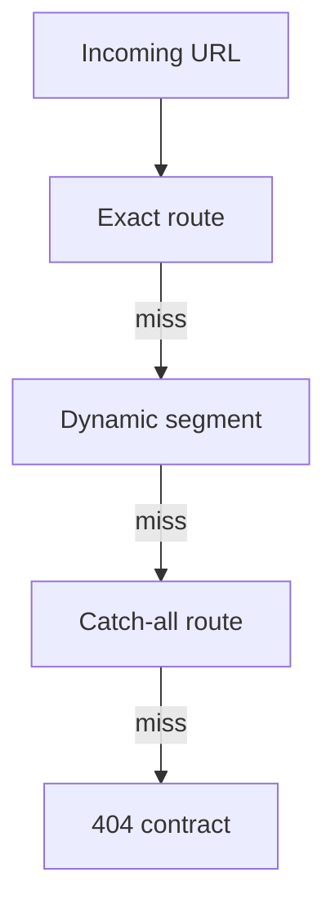

# Routing

<Accordion title="Detailed background for this page" icon="book-open" defaultOpen={true}>

Treat route selection as a deterministic contract, especially when dynamic and catch-all paths coexist.

**Expected outcome.** Predictable precedence, parameters, method boundaries, and 404 behavior.

**Why this boundary matters.** Routing bugs are often silent: a request reaches a valid handler that was not the intended handler.

### Page-specific implementation notes

- **List the route tree:** Write static, dynamic, and catch-all paths before implementation.
- **Define precedence:** Make the winner for overlapping paths obvious and tested.
- **Name parameters:** Keep parameter names stable across pages and handlers.
- **Test the negative space:** Exercise 404, malformed parameters, unsupported methods, and encoded paths.

### Page-specific failure questions

- **How should route precedence be documented?:** Show the competing paths and the expected winner for representative URLs.
- **What is a safe dynamic segment?:** A parsed, validated identifier with an authorization check.
- **When is catch-all appropriate?:** When the fallback behavior is intentional, bounded, and tested.

</Accordion>

---

## Core · Routing

> **Page focus** — Treat route selection as a deterministic contract, especially when dynamic and catch-all paths coexist.

<Columns cols={2}>
  <Card title="What you will leave with" icon="route" type="check">
    Predictable precedence, parameters, method boundaries, and 404 behavior.
  </Card>

  <Card title="Why this deserves its own page" icon="circle-question" type="note">
    Routing bugs are often silent: a request reaches a valid handler that was not the intended handler.
  </Card>
</Columns>

### System view

<Info>
This guide has its own decision surface. Use the visual blocks for orientation, then open the detailed background above when you need the longer explanation.
</Info>

---

## Implementation sequence

<Steps titleSize="h3">
  <Step title="List the route tree" icon="crosshairs">
    Write static, dynamic, and catch-all paths before implementation.
  </Step>
  <Step title="Define precedence" icon="layers-3">
    Make the winner for overlapping paths obvious and tested.
  </Step>
  <Step title="Name parameters" icon="triangle-exclamation">
    Keep parameter names stable across pages and handlers.
  </Step>
  <Step title="Test the negative space" icon="flask-conical">
    Exercise 404, malformed parameters, unsupported methods, and encoded paths.
  </Step>
</Steps>

## Choose a working mode

<Tabs>
  <Tab title="Static" icon="book-open">
    Use for stable product surfaces and predictable caching.
  </Tab>
  <Tab title="Dynamic" icon="hammer">
    Validate identifiers and scope them to authorization.
  </Tab>
  <Tab title="Catch-all" icon="chart-line">
    Use sparingly for controlled fallback or documentation surfaces.
  </Tab>
</Tabs>

---

## Decision table

| Concern | Default posture | Review question |
| --- | --- | --- |
| Exact path | Highest certainty | Test before dynamic matches. |
| Parameter | Validated value | Never treat URL text as trusted domain input. |
| Fallback | Explicit 404 | Avoid accidental broad handlers. |

> **Design note**
>
> A route tree is an executable product map; ambiguity is a defect.

<Note>
Keep route names and parameter semantics stable because clients, links, tests, and observability depend on them.
</Note>

## Questions worth answering

<AccordionGroup>
  <Accordion title="How should route precedence be documented?" icon="circle-question">
    Show the competing paths and the expected winner for representative URLs.
  </Accordion>
  <Accordion title="What is a safe dynamic segment?" icon="binoculars">
    A parsed, validated identifier with an authorization check.
  </Accordion>
  <Accordion title="When is catch-all appropriate?" icon="arrow-right">
    When the fallback behavior is intentional, bounded, and tested.
  </Accordion>
</AccordionGroup>

---

## Continue with a related guide

<Columns cols={3}>
  <Card title="Add method contracts" icon="brackets-curly" href="/core/api-routes" horizontal>Open the related guide when this page leaves a boundary unresolved.</Card>
  <Card title="Define responses" icon="globe" href="/reference/http-contracts" horizontal>Open the related guide when this page leaves a boundary unresolved.</Card>
  <Card title="Configure runtime" icon="sliders" href="/core/configuration" horizontal>Open the related guide when this page leaves a boundary unresolved.</Card>
</Columns>

<Check>
This page is complete when its specific decision is documented, its failure behavior is tested, and its operational signal has an owner.
</Check>

## References

[1]: https://github.com/jeffersoncampos12p-dev/jeston "Jeston source repository"
[2]: https://www.npmjs.com/package/@hedronjs/jeston "Jeston package on npm"
[3]: https://nodejs.org/api/http.html "Node.js HTTP API"
[4]: https://developer.mozilla.org/en-US/docs/Web/API/AbortSignal "AbortSignal Web API"
[5]: https://react.dev/reference/react-dom/server "React server rendering APIs"
[6]: https://www.typescriptlang.org/docs/handbook/intro.html "TypeScript handbook"
