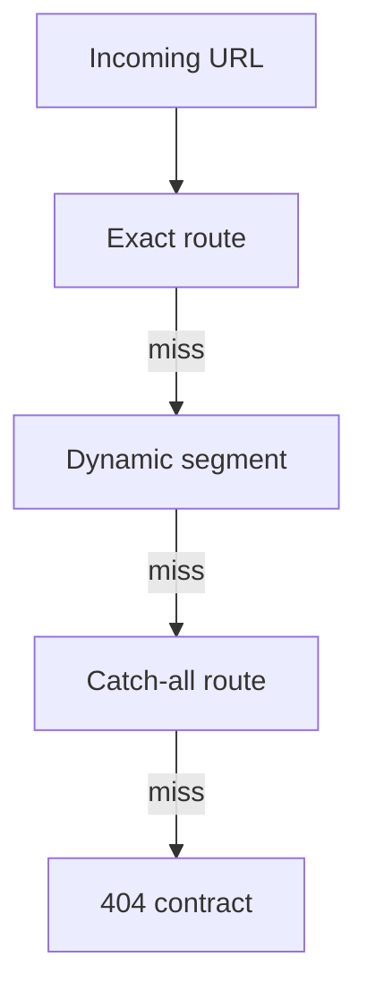

# Routing

---

## Core · Routing

> **Core principle** — Treat route selection as a deterministic contract, especially when dynamic and catch-all paths coexist.

Predictable precedence, parameters, method boundaries, and 404 behavior.

### Boundary model

### Ownership matrix

| Concern | Jeston/application boundary | Review signal |
| --- | --- | --- |
| Exact path | Highest certainty | Test before dynamic matches. |
| Parameter | Validated value | Never treat URL text as trusted domain input. |
| Fallback | Explicit 404 | Avoid accidental broad handlers. |

### Engineering considerations

Routing bugs are often silent: a request reaches a valid handler that was not the intended handler.

> **Design constraint**
>
> A route tree is an executable product map; ambiguity is a defect.

## Related material

<Columns cols={3}>
  <Card title="Add method contracts" icon="brackets-curly" href="/core/api-routes" horizontal>Read the focused guide for this boundary.</Card>
  <Card title="Define responses" icon="globe" href="/reference/http-contracts" horizontal>Read the focused guide for this boundary.</Card>
  <Card title="Configure runtime" icon="sliders" href="/core/configuration" horizontal>Read the focused guide for this boundary.</Card>
</Columns>

## References

[1]: https://github.com/jeffersoncampos12p-dev/jeston "Jeston source repository"
[2]: https://www.npmjs.com/package/@hedronjs/jeston "Jeston package on npm"
[3]: https://nodejs.org/api/http.html "Node.js HTTP API"
[4]: https://developer.mozilla.org/en-US/docs/Web/API/AbortSignal "AbortSignal Web API"
[5]: https://react.dev/reference/react-dom/server "React server rendering APIs"
[6]: https://www.typescriptlang.org/docs/handbook/intro.html "TypeScript handbook"
