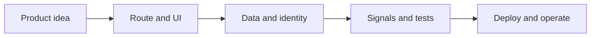

# Jeston Documentation

<Accordion title="Detailed background for this page" icon="book-open" defaultOpen={true}>

Choose a path through Jeston by the kind of system you are building, not by the order of the navigation.

**Expected outcome.** A mental map from first install to production operations.

**Why this boundary matters.** The framework is easier to evaluate when rendering, APIs, data, identity, and operations are treated as one request lifecycle.

### Page-specific implementation notes

- **Pick a slice:** Start with installation, first app, or the SaaS starter according to your goal.
- **Learn the runtime:** Read architecture, routing, and API contracts before adding providers.
- **Add platform weight:** Choose SQL, auth, cache, jobs, storage, or agents only when the slice needs them.
- **Close the loop:** Use benchmarks, release checks, and production guidance to prove the result.

### Page-specific failure questions

- **Which page should I open first?:** Installation for setup, first app for a vertical slice, architecture for the runtime model.
- **Where do AI workloads fit?:** AI agents belongs after request context, streaming, health, and adapter behavior are understood.
- **How should I compare results?:** Compare complete topologies, not isolated handler microbenchmarks.

</Accordion>

---

## Orientation

> **Page focus** — Choose a path through Jeston by the kind of system you are building, not by the order of the navigation.

<Columns cols={2}>
  <Card title="What you will leave with" icon="rocket" type="check">
    A mental map from first install to production operations.
  </Card>

  <Card title="Why this deserves its own page" icon="circle-question" type="note">
    The framework is easier to evaluate when rendering, APIs, data, identity, and operations are treated as one request lifecycle.
  </Card>
</Columns>

### System view

<Info>
This guide has its own decision surface. Use the visual blocks for orientation, then open the detailed background above when you need the longer explanation.
</Info>

---

## Implementation sequence

<Steps titleSize="h3">
  <Step title="Pick a slice" icon="crosshairs">
    Start with installation, first app, or the SaaS starter according to your goal.
  </Step>
  <Step title="Learn the runtime" icon="layers-3">
    Read architecture, routing, and API contracts before adding providers.
  </Step>
  <Step title="Add platform weight" icon="triangle-exclamation">
    Choose SQL, auth, cache, jobs, storage, or agents only when the slice needs them.
  </Step>
  <Step title="Close the loop" icon="flask-conical">
    Use benchmarks, release checks, and production guidance to prove the result.
  </Step>
</Steps>

## Choose a working mode

<Tabs>
  <Tab title="Build a UI" icon="book-open">
    Follow React SSR, routing, and API routes.
  </Tab>
  <Tab title="Build a platform" icon="hammer">
    Follow SQL, auth, cache, health, and deployment.
  </Tab>
  <Tab title="Build an agent" icon="chart-line">
    Follow AI agents, streaming, tools, and observability.
  </Tab>
</Tabs>

---

## Decision table

| Concern | Default posture | Review question |
| --- | --- | --- |
| First question | What is the smallest valuable request? | Start with one route and one response. |
| Second question | What must remain portable? | Keep providers behind adapters. |
| Third question | How will success be proven? | Write a contract test and an operational signal. |

> **Design note**
>
> A framework is a system boundary, not only a rendering shortcut.

<Note>
Use the navigation as a map. Each section answers a different ownership question; do not read every page linearly.
</Note>

## Questions worth answering

<AccordionGroup>
  <Accordion title="Which page should I open first?" icon="circle-question">
    Installation for setup, first app for a vertical slice, architecture for the runtime model.
  </Accordion>
  <Accordion title="Where do AI workloads fit?" icon="binoculars">
    AI agents belongs after request context, streaming, health, and adapter behavior are understood.
  </Accordion>
  <Accordion title="How should I compare results?" icon="arrow-right">
    Compare complete topologies, not isolated handler microbenchmarks.
  </Accordion>
</AccordionGroup>

---

## Continue with a related guide

<Columns cols={3}>
  <Card title="Start with installation" icon="download" href="/start/installation" horizontal>Open the related guide when this page leaves a boundary unresolved.</Card>
  <Card title="Understand architecture" icon="diagram-project" href="/core/architecture" horizontal>Open the related guide when this page leaves a boundary unresolved.</Card>
  <Card title="Prepare production" icon="server-stack" href="/operations/production" horizontal>Open the related guide when this page leaves a boundary unresolved.</Card>
</Columns>

<Check>
This page is complete when its specific decision is documented, its failure behavior is tested, and its operational signal has an owner.
</Check>

## References

[1]: https://github.com/jeffersoncampos12p-dev/jeston "Jeston source repository"
[2]: https://www.npmjs.com/package/@hedronjs/jeston "Jeston package on npm"
[3]: https://nodejs.org/api/http.html "Node.js HTTP API"
[4]: https://developer.mozilla.org/en-US/docs/Web/API/AbortSignal "AbortSignal Web API"
[5]: https://react.dev/reference/react-dom/server "React server rendering APIs"
[6]: https://www.typescriptlang.org/docs/handbook/intro.html "TypeScript handbook"
