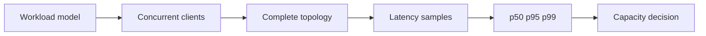

# Benchmarking

<Accordion title="Detailed background for this page" icon="book-open">

Measure the complete workload honestly, including concurrency, dependencies, memory, and tail behavior.

**Expected outcome.** A benchmark that explains saturation and can be repeated across changes.

**Why this boundary matters.** A fast isolated handler can still produce a slow product when database, network, serialization, or queue behavior dominates.

### Page-specific implementation notes

- **Model real work:** Choose payloads, reads, writes, streams, tools, and dependency behavior.
- **Warm and cold run:** Separate startup, cache, connection, and steady-state effects.
- **Increase pressure:** Find the point where latency, errors, memory, or queues change slope.
- **Record context:** Keep runtime, hardware, version, topology, and command with the result.

### Page-specific failure questions

- **What invalidates a result?:** Unreported warmup, hidden cache, different topology, insufficient samples, or no error count.
- **Why track p99?:** Tail latency often reveals queueing and dependency contention first.
- **What should a benchmark output?:** Throughput, percentiles, errors, resource usage, and the tested configuration.

</Accordion>

---

## Operations · Benchmark

> **Page focus** — Measure the complete workload honestly, including concurrency, dependencies, memory, and tail behavior.

### At a glance

| Scope | Practical result |
| --- | --- |
| **Focus** | Measure the complete workload honestly, including concurrency, dependencies, memory, and tail behavior. |
| **Deliverable** | A benchmark that explains saturation and can be repeated across changes. |
| **Reason to care** | A fast isolated handler can still produce a slow product when database, network, serialization, or queue behavior dominates. |

<Info>
This page is intentionally focused on one boundary. Use the decision table and implementation sequence below as a working review sheet, not as a generic framework overview.
</Info>

### System view

<Info>
This guide has its own decision surface. Use the visual blocks for orientation, then open the detailed background above when you need the longer explanation.
</Info>

---

## Implementation sequence

<Steps titleSize="h3">
  <Step title="Model real work" icon="crosshairs">
    Choose payloads, reads, writes, streams, tools, and dependency behavior.
  </Step>
  <Step title="Warm and cold run" icon="layers-3">
    Separate startup, cache, connection, and steady-state effects.
  </Step>
  <Step title="Increase pressure" icon="triangle-exclamation">
    Find the point where latency, errors, memory, or queues change slope.
  </Step>
  <Step title="Record context" icon="flask-conical">
    Keep runtime, hardware, version, topology, and command with the result.
  </Step>
</Steps>

## Choose a working mode

<Tabs>
  <Tab title="Micro" icon="book-open">
    Locate a function or serialization cost.
  </Tab>
  <Tab title="Load" icon="hammer">
    Understand concurrent request behavior.
  </Tab>
  <Tab title="Soak" icon="chart-line">
    Find leaks, queue growth, and slow degradation.
  </Tab>
</Tabs>

---

## Decision table

| Concern | Default posture | Review question |
| --- | --- | --- |
| p50 | Typical request | Useful for baseline. |
| p95 | Slow tail | Useful for user experience. |
| p99 | Extreme tail | Useful for saturation and incidents. |
| RSS/heap | Memory behavior | Useful for leak and pressure detection. |

> **Design note**
>
> A benchmark is a decision instrument, not a victory number.

<Note>
Do not compare frameworks using different workloads, caches, connection pools, or failure policies.
</Note>

## Questions worth answering

<AccordionGroup>
  <Accordion title="What invalidates a result?" icon="circle-question">
    Unreported warmup, hidden cache, different topology, insufficient samples, or no error count.
  </Accordion>
  <Accordion title="Why track p99?" icon="binoculars">
    Tail latency often reveals queueing and dependency contention first.
  </Accordion>
  <Accordion title="What should a benchmark output?" icon="arrow-right">
    Throughput, percentiles, errors, resource usage, and the tested configuration.
  </Accordion>
</AccordionGroup>

---

## Continue with a related guide

<Columns cols={3}>
  <Card title="Apply capacity findings" icon="server-stack" href="/operations/production" horizontal>Open the related guide when this page leaves a boundary unresolved.</Card>
  <Card title="Instrument load" icon="chart-line" href="/platform/health-observability" horizontal>Open the related guide when this page leaves a boundary unresolved.</Card>
  <Card title="Test database pressure" icon="database" href="/platform/sql" horizontal>Open the related guide when this page leaves a boundary unresolved.</Card>
</Columns>

<Check>
This page is complete when its specific decision is documented, its failure behavior is tested, and its operational signal has an owner.
</Check>

## References

[1]: https://github.com/jeffersoncampos12p-dev/jeston "Jeston source repository"
[2]: https://www.npmjs.com/package/@hedronjs/jeston "Jeston package on npm"
[3]: https://nodejs.org/api/http.html "Node.js HTTP API"
[4]: https://developer.mozilla.org/en-US/docs/Web/API/AbortSignal "AbortSignal Web API"
[5]: https://react.dev/reference/react-dom/server "React server rendering APIs"
[6]: https://www.typescriptlang.org/docs/handbook/intro.html "TypeScript handbook"
