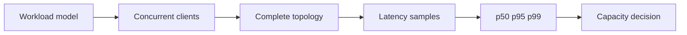

# Benchmarking

---

## Operations · Benchmark

> **Operational objective** — Measure the complete workload honestly, including concurrency, dependencies, memory, and tail behavior.

A benchmark that explains saturation and can be repeated across changes.

### Key concepts

<Columns cols={3}>
  <Card title="p50" icon="sparkles">
    Typical request
  </Card>
  <Card title="p95" icon="shield-check">
    Slow tail
  </Card>
  <Card title="p99" icon="gauge-high">
    Extreme tail
  </Card>
</Columns>

### Evidence model

### Evidence over assumption

| Signal | Healthy interpretation | Action when it degrades |
| --- | --- | --- |
| p50 | Typical request | Useful for baseline. |
| p95 | Slow tail | Useful for user experience. |
| p99 | Extreme tail | Useful for saturation and incidents. |
| RSS/heap | Memory behavior | Useful for leak and pressure detection. |

<Warning>
Do not compare frameworks using different workloads, caches, connection pools, or failure policies.
</Warning>

### Operational context

A fast isolated handler can still produce a slow product when database, network, serialization, or queue behavior dominates.

> **Operator's principle**
>
> A benchmark is a decision instrument, not a victory number.

### Implementation notes

| Engineering move | Guidance |
| --- | --- |
| **Model real work** | Choose payloads, reads, writes, streams, tools, and dependency behavior. |
| **Warm and cold run** | Separate startup, cache, connection, and steady-state effects. |
| **Increase pressure** | Find the point where latency, errors, memory, or queues change slope. |
| **Record context** | Keep runtime, hardware, version, topology, and command with the result. |

### Decision lens

| Mode | Practical emphasis |
| --- | --- |
| **Micro** | Locate a function or serialization cost. |
| **Load** | Understand concurrent request behavior. |
| **Soak** | Find leaks, queue growth, and slow degradation. |

## Related topics

<Columns cols={3}>
- [server-stack · **Apply capacity findings**](/operations/production) — Read the focused guide for this boundary.
- [chart-line · **Instrument load**](/platform/health-observability) — Read the focused guide for this boundary.
- [database · **Test database pressure**](/platform/sql) — Read the focused guide for this boundary.
</Columns>

## References

[1]: https://github.com/kvantjs/ryvax.js "Ryvax source repository"
[2]: https://www.npmjs.com/package/@kvantjs/ryvax.js "Ryvax package on npm"
[3]: https://nodejs.org/api/http.html "Node.js HTTP API"
[4]: https://developer.mozilla.org/en-US/docs/Web/API/AbortSignal "AbortSignal Web API"
[5]: https://react.dev/reference/react-dom/server "React server rendering APIs"
[6]: https://www.typescriptlang.org/docs/handbook/intro.html "TypeScript handbook"
