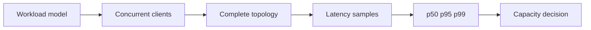

# Benchmarking

---

## Operations · Benchmark

> **Operational objective** — Measure the complete workload honestly, including concurrency, dependencies, memory, and tail behavior.

A benchmark that explains saturation and can be repeated across changes.

### Runbook view

### Evidence over assumption

| Signal | Healthy interpretation | Action when it degrades |
| --- | --- | --- |
| p50 | Typical request | Useful for baseline. |
| p95 | Slow tail | Useful for user experience. |
| p99 | Extreme tail | Useful for saturation and incidents. |
| RSS/heap | Memory behavior | Useful for leak and pressure detection. |

<Warning>
Do not compare frameworks using different workloads, caches, connection pools, or failure policies.
</Warning>

### Operational context

A fast isolated handler can still produce a slow product when database, network, serialization, or queue behavior dominates.

> **Operator's principle**
>
> A benchmark is a decision instrument, not a victory number.

## Related material

<Columns cols={3}>
  <Card title="Apply capacity findings" icon="server-stack" href="/operations/production" horizontal>Read the focused guide for this boundary.</Card>
  <Card title="Instrument load" icon="chart-line" href="/platform/health-observability" horizontal>Read the focused guide for this boundary.</Card>
  <Card title="Test database pressure" icon="database" href="/platform/sql" horizontal>Read the focused guide for this boundary.</Card>
</Columns>

## References

[1]: https://github.com/jeffersoncampos12p-dev/jeston "Jeston source repository"
[2]: https://www.npmjs.com/package/@hedronjs/jeston "Jeston package on npm"
[3]: https://nodejs.org/api/http.html "Node.js HTTP API"
[4]: https://developer.mozilla.org/en-US/docs/Web/API/AbortSignal "AbortSignal Web API"
[5]: https://react.dev/reference/react-dom/server "React server rendering APIs"
[6]: https://www.typescriptlang.org/docs/handbook/intro.html "TypeScript handbook"
