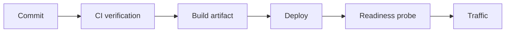

# Deployment

---

## Operations · Deployment

> **Operational objective** — Move the same verified artifact through environments with explicit configuration and reversible topology.

A deployment sequence with probes, process ownership, secret injection, and rollback.

### Key concepts

<Columns cols={3}>
  <Card title="Artifact" icon="sparkles">
    Immutable
  </Card>
  <Card title="Probe" icon="shield-check">
    Actionable
  </Card>
  <Card title="Rollback" icon="gauge-high">
    Available
  </Card>
</Columns>

### Operational surface

### Evidence over assumption

| Signal | Healthy interpretation | Action when it degrades |
| --- | --- | --- |
| Artifact | Immutable | Same bits across environments. |
| Probe | Actionable | Traffic only when safe. |
| Rollback | Available | Recovery without improvisation. |

### Operational context

Deployment is a controlled change to runtime behavior, not simply a command that starts Node.

> **Operator's principle**
>
> A deployment is successful when the operator can explain both how it starts and how it stops.

### Implementation notes

| Engineering move | Guidance |
| --- | --- |
| **Build once** | Create an artifact that does not change between verification and deployment. |
| **Inject configuration** | Use the environment or secret manager at runtime, not source control. |
| **Probe before traffic** | Check liveness, readiness, and critical dependency behavior. |
| **Release gradually** | Keep rollback, drain, and previous artifact access available. |

### Decision lens

| Mode | Practical emphasis |
| --- | --- |
| **Single process** | Simple topology with clear limits and restart behavior. |
| **Multiple workers** | Coordinate ports, signals, shared state, and connection pools. |
| **Distributed** | Add network, queue, storage, and deployment health contracts. |

## Related topics

<Columns cols={3}>
- [server-stack · **Run the service**](/operations/production) — Read the focused guide for this boundary.
- [arrows-rotate · **Change schemas**](/operations/migrations) — Read the focused guide for this boundary.
- [circle-check · **Verify artifacts**](/operations/release-checks) — Read the focused guide for this boundary.
</Columns>

## References

[1]: https://github.com/jeffersoncampos12p-dev/jeston "Jeston source repository"
[2]: https://www.npmjs.com/package/@hedronjs/jeston "Jeston package on npm"
[3]: https://nodejs.org/api/http.html "Node.js HTTP API"
[4]: https://developer.mozilla.org/en-US/docs/Web/API/AbortSignal "AbortSignal Web API"
[5]: https://react.dev/reference/react-dom/server "React server rendering APIs"
[6]: https://www.typescriptlang.org/docs/handbook/intro.html "TypeScript handbook"
