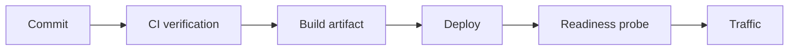

# Deployment

<Accordion title="Detailed background for this page" icon="book-open" defaultOpen={true}>

Move the same verified artifact through environments with explicit configuration and reversible topology.

**Expected outcome.** A deployment sequence with probes, process ownership, secret injection, and rollback.

**Why this boundary matters.** Deployment is a controlled change to runtime behavior, not simply a command that starts Node.

### Page-specific implementation notes

- **Build once:** Create an artifact that does not change between verification and deployment.
- **Inject configuration:** Use the environment or secret manager at runtime, not source control.
- **Probe before traffic:** Check liveness, readiness, and critical dependency behavior.
- **Release gradually:** Keep rollback, drain, and previous artifact access available.

### Page-specific failure questions

- **What should readiness check?:** Dependencies required to serve the advertised workload.
- **When can rollback fail?:** After irreversible migrations, destructive jobs, or incompatible state changes.
- **What should logs include?:** Version, environment, process phase, and correlation metadata without secrets.

</Accordion>

---

## Operations · Deployment

> **Page focus** — Move the same verified artifact through environments with explicit configuration and reversible topology.

<Columns cols={2}>
  <Card title="What you will leave with" icon="cloud-arrow-up" type="check">
    A deployment sequence with probes, process ownership, secret injection, and rollback.
  </Card>

  <Card title="Why this deserves its own page" icon="circle-question" type="note">
    Deployment is a controlled change to runtime behavior, not simply a command that starts Node.
  </Card>
</Columns>

### System view

<Info>
This guide has its own decision surface. Use the visual blocks for orientation, then open the detailed background above when you need the longer explanation.
</Info>

---

## Implementation sequence

<Steps titleSize="h3">
  <Step title="Build once" icon="crosshairs">
    Create an artifact that does not change between verification and deployment.
  </Step>
  <Step title="Inject configuration" icon="layers-3">
    Use the environment or secret manager at runtime, not source control.
  </Step>
  <Step title="Probe before traffic" icon="triangle-exclamation">
    Check liveness, readiness, and critical dependency behavior.
  </Step>
  <Step title="Release gradually" icon="flask-conical">
    Keep rollback, drain, and previous artifact access available.
  </Step>
</Steps>

## Choose a working mode

<Tabs>
  <Tab title="Single process" icon="book-open">
    Simple topology with clear limits and restart behavior.
  </Tab>
  <Tab title="Multiple workers" icon="hammer">
    Coordinate ports, signals, shared state, and connection pools.
  </Tab>
  <Tab title="Distributed" icon="chart-line">
    Add network, queue, storage, and deployment health contracts.
  </Tab>
</Tabs>

---

## Decision table

| Concern | Default posture | Review question |
| --- | --- | --- |
| Artifact | Immutable | Same bits across environments. |
| Probe | Actionable | Traffic only when safe. |
| Rollback | Available | Recovery without improvisation. |

> **Design note**
>
> A deployment is successful when the operator can explain both how it starts and how it stops.

<Note>
Do not treat a green build as proof that secrets, probes, database migrations, and traffic policy are correct.
</Note>

## Questions worth answering

<AccordionGroup>
  <Accordion title="What should readiness check?" icon="circle-question">
    Dependencies required to serve the advertised workload.
  </Accordion>
  <Accordion title="When can rollback fail?" icon="binoculars">
    After irreversible migrations, destructive jobs, or incompatible state changes.
  </Accordion>
  <Accordion title="What should logs include?" icon="arrow-right">
    Version, environment, process phase, and correlation metadata without secrets.
  </Accordion>
</AccordionGroup>

---

## Continue with a related guide

<Columns cols={3}>
  <Card title="Run the service" icon="server-stack" href="/operations/production" horizontal>Open the related guide when this page leaves a boundary unresolved.</Card>
  <Card title="Change schemas" icon="arrows-rotate" href="/operations/migrations" horizontal>Open the related guide when this page leaves a boundary unresolved.</Card>
  <Card title="Verify artifacts" icon="circle-check" href="/operations/release-checks" horizontal>Open the related guide when this page leaves a boundary unresolved.</Card>
</Columns>

<Check>
This page is complete when its specific decision is documented, its failure behavior is tested, and its operational signal has an owner.
</Check>

## References

[1]: https://github.com/jeffersoncampos12p-dev/jeston "Jeston source repository"
[2]: https://www.npmjs.com/package/@hedronjs/jeston "Jeston package on npm"
[3]: https://nodejs.org/api/http.html "Node.js HTTP API"
[4]: https://developer.mozilla.org/en-US/docs/Web/API/AbortSignal "AbortSignal Web API"
[5]: https://react.dev/reference/react-dom/server "React server rendering APIs"
[6]: https://www.typescriptlang.org/docs/handbook/intro.html "TypeScript handbook"
