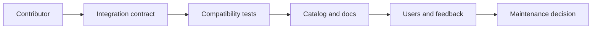

# Ecosystem and operational support

---

## Operations · Ecosystem

> **Operational objective** — Scale adoption through quality, discoverability, compatibility policy, and maintainership—not through a long provider list.

A sustainable ecosystem contract for contributors, integration authors, and operators.

### Runbook view

### Evidence over assumption

| Signal | Healthy interpretation | Action when it degrades |
| --- | --- | --- |
| Discovery | Clear metadata | Users find the right provider. |
| Quality | Tests and examples | Users can trust the integration. |
| Governance | Owner and lifecycle | The ecosystem can evolve. |

### Operational context

Every integration creates support surface; quality metadata lets users choose safely and maintainers prioritize responsibly.

> **Operator's principle**
>
> An ecosystem is infrastructure for other developers; its documentation is part of its API.

## Related material

<Columns cols={3}>
  <Card title="Register capabilities" icon="plug" href="/reference/integrations" horizontal>Read the focused guide for this boundary.</Card>
  <Card title="Implement boundaries" icon="puzzle-piece" href="/reference/adapters" horizontal>Read the focused guide for this boundary.</Card>
  <Card title="Protect releases" icon="circle-check" href="/operations/release-checks" horizontal>Read the focused guide for this boundary.</Card>
</Columns>

## References

[1]: https://github.com/jeffersoncampos12p-dev/jeston "Jeston source repository"
[2]: https://www.npmjs.com/package/@hedronjs/jeston "Jeston package on npm"
[3]: https://nodejs.org/api/http.html "Node.js HTTP API"
[4]: https://developer.mozilla.org/en-US/docs/Web/API/AbortSignal "AbortSignal Web API"
[5]: https://react.dev/reference/react-dom/server "React server rendering APIs"
[6]: https://www.typescriptlang.org/docs/handbook/intro.html "TypeScript handbook"
