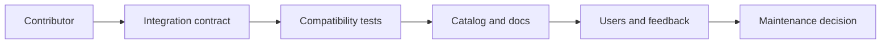

# Ecosystem and operational support

<Accordion title="Detailed background for this page" icon="book-open">

Scale adoption through quality, discoverability, compatibility policy, and maintainership—not through a long provider list.

**Expected outcome.** A sustainable ecosystem contract for contributors, integration authors, and operators.

**Why this boundary matters.** Every integration creates support surface; quality metadata lets users choose safely and maintainers prioritize responsibly.

### Page-specific implementation notes

- **Publish the contract:** Define capability, lifecycle, security, versioning, and support expectations.
- **Require evidence:** Add tests, examples, failure behavior, and compatibility metadata.
- **Make discovery useful:** Organize integrations by real capability and maturity.
- **Close feedback loops:** Track issues, deprecations, ownership, and migration paths.

### Page-specific failure questions

- **What earns a stable label?:** Compatibility evidence, security review, documentation, and an accountable maintainer.
- **How handle deprecation?:** Announce, document replacement, provide a window, and preserve migration context.
- **What should contributors avoid?:** Provider-specific assumptions leaking into the framework core.

</Accordion>

---

## Operations · Ecosystem

> **Page focus** — Scale adoption through quality, discoverability, compatibility policy, and maintainership—not through a long provider list.

### At a glance

| Scope | Practical result |
| --- | --- |
| **Focus** | Scale adoption through quality, discoverability, compatibility policy, and maintainership—not through a long provider list. |
| **Deliverable** | A sustainable ecosystem contract for contributors, integration authors, and operators. |
| **Reason to care** | Every integration creates support surface; quality metadata lets users choose safely and maintainers prioritize responsibly. |

<Info>
This page is intentionally focused on one boundary. Use the decision table and implementation sequence below as a working review sheet, not as a generic framework overview.
</Info>

### System view

<Info>
This guide has its own decision surface. Use the visual blocks for orientation, then open the detailed background above when you need the longer explanation.
</Info>

---

## Implementation sequence

<Steps titleSize="h3">
  <Step title="Publish the contract" icon="crosshairs">
    Define capability, lifecycle, security, versioning, and support expectations.
  </Step>
  <Step title="Require evidence" icon="layers-3">
    Add tests, examples, failure behavior, and compatibility metadata.
  </Step>
  <Step title="Make discovery useful" icon="triangle-exclamation">
    Organize integrations by real capability and maturity.
  </Step>
  <Step title="Close feedback loops" icon="flask-conical">
    Track issues, deprecations, ownership, and migration paths.
  </Step>
</Steps>

## Choose a working mode

<Tabs>
  <Tab title="Author" icon="book-open">
    Build and document one high-quality integration.
  </Tab>
  <Tab title="Consumer" icon="hammer">
    Compare capability, maturity, and operational cost.
  </Tab>
  <Tab title="Maintainer" icon="chart-line">
    Review compatibility, security, and support load.
  </Tab>
</Tabs>

---

## Decision table

| Concern | Default posture | Review question |
| --- | --- | --- |
| Discovery | Clear metadata | Users find the right provider. |
| Quality | Tests and examples | Users can trust the integration. |
| Governance | Owner and lifecycle | The ecosystem can evolve. |

> **Design note**
>
> An ecosystem is infrastructure for other developers; its documentation is part of its API.

<Note>
Avoid vanity counts. A smaller catalog with clear guarantees is more useful than an unmaintained directory.
</Note>

## Questions worth answering

<AccordionGroup>
  <Accordion title="What earns a stable label?" icon="circle-question">
    Compatibility evidence, security review, documentation, and an accountable maintainer.
  </Accordion>
  <Accordion title="How handle deprecation?" icon="binoculars">
    Announce, document replacement, provide a window, and preserve migration context.
  </Accordion>
  <Accordion title="What should contributors avoid?" icon="arrow-right">
    Provider-specific assumptions leaking into the framework core.
  </Accordion>
</AccordionGroup>

---

## Continue with a related guide

<Columns cols={3}>
  <Card title="Register capabilities" icon="plug" href="/reference/integrations" horizontal>Open the related guide when this page leaves a boundary unresolved.</Card>
  <Card title="Implement boundaries" icon="puzzle-piece" href="/reference/adapters" horizontal>Open the related guide when this page leaves a boundary unresolved.</Card>
  <Card title="Protect releases" icon="circle-check" href="/operations/release-checks" horizontal>Open the related guide when this page leaves a boundary unresolved.</Card>
</Columns>

<Check>
This page is complete when its specific decision is documented, its failure behavior is tested, and its operational signal has an owner.
</Check>

## References

[1]: https://github.com/jeffersoncampos12p-dev/jeston "Jeston source repository"
[2]: https://www.npmjs.com/package/@hedronjs/jeston "Jeston package on npm"
[3]: https://nodejs.org/api/http.html "Node.js HTTP API"
[4]: https://developer.mozilla.org/en-US/docs/Web/API/AbortSignal "AbortSignal Web API"
[5]: https://react.dev/reference/react-dom/server "React server rendering APIs"
[6]: https://www.typescriptlang.org/docs/handbook/intro.html "TypeScript handbook"
