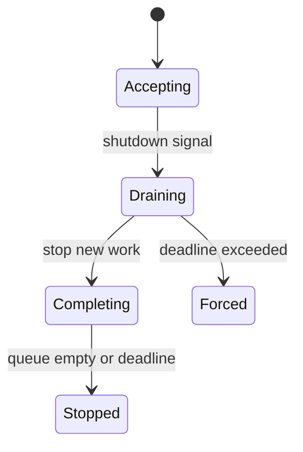

# Jobs and shutdown

---

## Operations · Jobs and shutdown

> **Operational objective** — Make background work finish, retry, pause, or fail with a known outcome when the process changes state.

Idempotent jobs, signal handling, draining, retry policy, and bounded shutdown.

### Key concepts

<Columns cols={3}>
  <Card title="Retry" icon="sparkles">
    Transient only
  </Card>
  <Card title="Drain" icon="shield-check">
    Finite window
  </Card>
  <Card title="Abandon" icon="gauge-high">
    Recorded
  </Card>
</Columns>

### Operational surface



### Evidence over assumption

| Signal | Healthy interpretation | Action when it degrades |
| --- | --- | --- |
| Retry | Transient only | Do not duplicate irreversible effects. |
| Drain | Finite window | Bound deploy and restart time. |
| Abandon | Recorded | Make recovery visible and actionable. |

### Operational context

A process exit is normal infrastructure behavior; work should not depend on a lucky timing window.

> **Operator's principle**
>
> Graceful shutdown is a correctness feature for any system that performs side effects.

### Implementation notes

| Engineering move | Guidance |
| --- | --- |
| **Classify work** | Separate safe retry, manual retry, and non-retryable failures. |
| **Persist intent** | Store enough state to resume or explain a job after restart. |
| **Stop intake** | Reject or defer new work when shutdown begins. |
| **Drain with a deadline** | Finish bounded work and record what was abandoned. |

### Decision lens

| Mode | Practical emphasis |
| --- | --- |
| **Short job** | May complete inside the request if cancellation is safe. |
| **Durable job** | Needs queue, status, retry, and idempotency. |
| **Shutdown** | Needs signal, drain, deadline, and forced-stop behavior. |

## Reference queue

`InMemoryJobQueue` is a reference implementation for local development and adapter conformance. It supports bounded concurrency, idempotency keys, retry attempts, configurable retry delay, and an inspectable dead-letter snapshot. It is intentionally process-local; use a durable provider for production or multiple instances.

```ts
const queue = new InMemoryJobQueue({
  concurrency: 4,
  handler: async (job) => processPayment(job.payload),
});

await queue.enqueue('payment', payload, {
  idempotencyKey: `payment:${paymentId}`,
  maxAttempts: 5,
});
```

## Related topics

<Columns cols={3}>
- [layer-group · **Choose job storage**](/platform/cache-jobs-storage) — Read the focused guide for this boundary.
- [stream · **Cancel request work**](/core/execution-and-streaming) — Read the focused guide for this boundary.
- [cloud-arrow-up · **Deploy with drain**](/operations/deployment) — Read the focused guide for this boundary.
</Columns>

### Why this matters

A process exit is normal infrastructure behavior; work should not depend on a lucky timing window.

## References

[1]: https://github.com/kvantjs/ryvax.js "Ryvax source repository"
[2]: https://www.npmjs.com/package/@kvantjs/ryvax.js "Ryvax package on npm"
[3]: https://nodejs.org/api/http.html "Node.js HTTP API"
[4]: https://developer.mozilla.org/en-US/docs/Web/API/AbortSignal "AbortSignal Web API"
[5]: https://react.dev/reference/react-dom/server "React server rendering APIs"
[6]: https://www.typescriptlang.org/docs/handbook/intro.html "TypeScript handbook"
