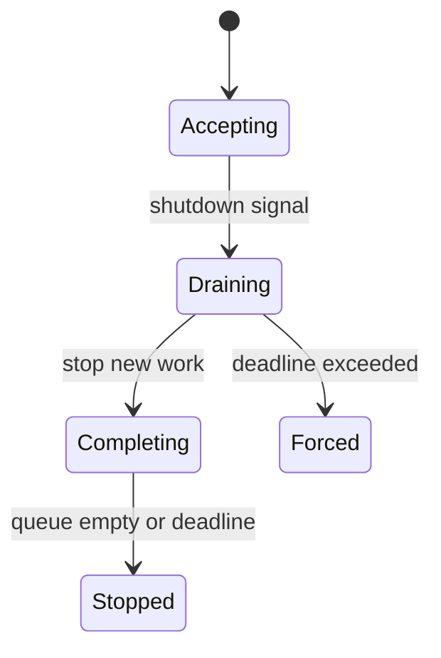

# Jobs and shutdown

<Accordion title="Detailed background for this page" icon="book-open">

Make background work finish, retry, pause, or fail with a known outcome when the process changes state.

**Expected outcome.** Idempotent jobs, signal handling, draining, retry policy, and bounded shutdown.

**Why this boundary matters.** A process exit is normal infrastructure behavior; work should not depend on a lucky timing window.

### Page-specific implementation notes

- **Classify work:** Separate safe retry, manual retry, and non-retryable failures.
- **Persist intent:** Store enough state to resume or explain a job after restart.
- **Stop intake:** Reject or defer new work when shutdown begins.
- **Drain with a deadline:** Finish bounded work and record what was abandoned.

### Page-specific failure questions

- **What does idempotent mean here?:** Repeating the same delivery produces one effective outcome.
- **When force stop?:** When the deadline is reached and continued work risks deploy or process health.
- **What should operators see?:** Active count, oldest age, retry count, failed count, and drain phase.

</Accordion>

---

## Operations · Jobs and shutdown

> **Page focus** — Make background work finish, retry, pause, or fail with a known outcome when the process changes state.

### At a glance

| Scope | Practical result |
| --- | --- |
| **Focus** | Make background work finish, retry, pause, or fail with a known outcome when the process changes state. |
| **Deliverable** | Idempotent jobs, signal handling, draining, retry policy, and bounded shutdown. |
| **Reason to care** | A process exit is normal infrastructure behavior; work should not depend on a lucky timing window. |

<Info>
This page is intentionally focused on one boundary. Use the decision table and implementation sequence below as a working review sheet, not as a generic framework overview.
</Info>

### System view

<Info>
This guide has its own decision surface. Use the visual blocks for orientation, then open the detailed background above when you need the longer explanation.
</Info>

---

## Implementation sequence

<Steps titleSize="h3">
  <Step title="Classify work" icon="crosshairs">
    Separate safe retry, manual retry, and non-retryable failures.
  </Step>
  <Step title="Persist intent" icon="layers-3">
    Store enough state to resume or explain a job after restart.
  </Step>
  <Step title="Stop intake" icon="triangle-exclamation">
    Reject or defer new work when shutdown begins.
  </Step>
  <Step title="Drain with a deadline" icon="flask-conical">
    Finish bounded work and record what was abandoned.
  </Step>
</Steps>

## Choose a working mode

<Tabs>
  <Tab title="Short job" icon="book-open">
    May complete inside the request if cancellation is safe.
  </Tab>
  <Tab title="Durable job" icon="hammer">
    Needs queue, status, retry, and idempotency.
  </Tab>
  <Tab title="Shutdown" icon="chart-line">
    Needs signal, drain, deadline, and forced-stop behavior.
  </Tab>
</Tabs>

---

## Decision table

| Concern | Default posture | Review question |
| --- | --- | --- |
| Retry | Transient only | Do not duplicate irreversible effects. |
| Drain | Finite window | Bound deploy and restart time. |
| Abandon | Recorded | Make recovery visible and actionable. |

> **Design note**
>
> Graceful shutdown is a correctness feature for any system that performs side effects.

<Note>
Do not acknowledge a job before its durable intent and retry identity are recorded.
</Note>

## Questions worth answering

<AccordionGroup>
  <Accordion title="What does idempotent mean here?" icon="circle-question">
    Repeating the same delivery produces one effective outcome.
  </Accordion>
  <Accordion title="When force stop?" icon="binoculars">
    When the deadline is reached and continued work risks deploy or process health.
  </Accordion>
  <Accordion title="What should operators see?" icon="arrow-right">
    Active count, oldest age, retry count, failed count, and drain phase.
  </Accordion>
</AccordionGroup>

---

## Continue with a related guide

<Columns cols={3}>
  <Card title="Choose job storage" icon="layer-group" href="/platform/cache-jobs-storage" horizontal>Open the related guide when this page leaves a boundary unresolved.</Card>
  <Card title="Cancel request work" icon="stream" href="/core/execution-and-streaming" horizontal>Open the related guide when this page leaves a boundary unresolved.</Card>
  <Card title="Deploy with drain" icon="cloud-arrow-up" href="/operations/deployment" horizontal>Open the related guide when this page leaves a boundary unresolved.</Card>
</Columns>

<Check>
This page is complete when its specific decision is documented, its failure behavior is tested, and its operational signal has an owner.
</Check>

## References

[1]: https://github.com/jeffersoncampos12p-dev/jeston "Jeston source repository"
[2]: https://www.npmjs.com/package/@hedronjs/jeston "Jeston package on npm"
[3]: https://nodejs.org/api/http.html "Node.js HTTP API"
[4]: https://developer.mozilla.org/en-US/docs/Web/API/AbortSignal "AbortSignal Web API"
[5]: https://react.dev/reference/react-dom/server "React server rendering APIs"
[6]: https://www.typescriptlang.org/docs/handbook/intro.html "TypeScript handbook"
