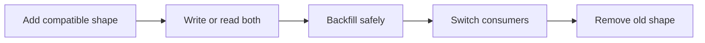

# Migrations

---

## Operations · Migrations

> **Operational objective** — Change persisted state while old and new application versions may coexist.

Expand-migrate-contract plans, backfills, compatibility windows, and rollback boundaries.

### Key concepts

<Columns cols={3}>
  <Card title="Compatibility" icon="sparkles">
    Old plus new
  </Card>
  <Card title="Backfill" icon="shield-check">
    Bounded batches
  </Card>
  <Card title="Rollback" icon="gauge-high">
    State-aware
  </Card>
</Columns>

### Operational surface

### Evidence over assumption

| Signal | Healthy interpretation | Action when it degrades |
| --- | --- | --- |
| Compatibility | Old plus new | Supports rolling deployment. |
| Backfill | Bounded batches | Protects production load. |
| Rollback | State-aware | May require a forward fix after contraction. |

<Warning>
Treat data deletion and irreversible transformations as high-impact operations with a separate recovery decision.
</Warning>

### Operational context

A schema change is deployed across time; code, workers, replicas, and operators do not switch versions simultaneously.

> **Operator's principle**
>
> The safest migration is a sequence of compatible states, not one clever statement.

### Implementation notes

| Engineering move | Guidance |
| --- | --- |
| **Expand** | Add nullable or additive structures that old code can ignore. |
| **Migrate** | Write new data and backfill in bounded, observable batches. |
| **Switch** | Move readers and writers after evidence, not after hope. |
| **Contract** | Remove old fields only when all consumers and rollback windows are closed. |

### Decision lens

| Mode | Practical emphasis |
| --- | --- |
| **Additive** | Columns, indexes, or tables that do not break old code. |
| **Backfill** | Chunked work with checkpoints and pause controls. |
| **Destructive** | Requires explicit approval, backup, and a recovery plan. |

## Related topics

<Columns cols={3}>
- [database · **Review database boundaries**](/platform/sql) — Read the focused guide for this boundary.
- [cloud-arrow-up · **Coordinate rollout**](/operations/deployment) — Read the focused guide for this boundary.
- [power-off · **Control backfills**](/operations/jobs-and-shutdown) — Read the focused guide for this boundary.
</Columns>

## References

[1]: https://github.com/jeffersoncampos12p-dev/jeston "Jeston source repository"
[2]: https://www.npmjs.com/package/@hedronjs/jeston "Jeston package on npm"
[3]: https://nodejs.org/api/http.html "Node.js HTTP API"
[4]: https://developer.mozilla.org/en-US/docs/Web/API/AbortSignal "AbortSignal Web API"
[5]: https://react.dev/reference/react-dom/server "React server rendering APIs"
[6]: https://www.typescriptlang.org/docs/handbook/intro.html "TypeScript handbook"
