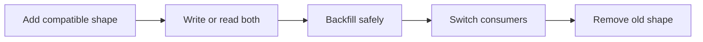

# Migrations

<Accordion title="Detailed background for this page" icon="book-open">

Change persisted state while old and new application versions may coexist.

**Expected outcome.** Expand-migrate-contract plans, backfills, compatibility windows, and rollback boundaries.

**Why this boundary matters.** A schema change is deployed across time; code, workers, replicas, and operators do not switch versions simultaneously.

### Page-specific implementation notes

- **Expand:** Add nullable or additive structures that old code can ignore.
- **Migrate:** Write new data and backfill in bounded, observable batches.
- **Switch:** Move readers and writers after evidence, not after hope.
- **Contract:** Remove old fields only when all consumers and rollback windows are closed.

### Page-specific failure questions

- **When dual writes help?:** When readers and writers transition at different times and consistency can be reconciled.
- **How should backfills run?:** With idempotent chunks, rate limits, checkpoints, and pause/resume.
- **What invalidates rollback?:** Dropping data or changing semantics without retaining a reversible representation.

</Accordion>

---

## Operations · Migrations

> **Page focus** — Change persisted state while old and new application versions may coexist.

### At a glance

| Scope | Practical result |
| --- | --- |
| **Focus** | Change persisted state while old and new application versions may coexist. |
| **Deliverable** | Expand-migrate-contract plans, backfills, compatibility windows, and rollback boundaries. |
| **Reason to care** | A schema change is deployed across time; code, workers, replicas, and operators do not switch versions simultaneously. |

<Info>
This page is intentionally focused on one boundary. Use the decision table and implementation sequence below as a working review sheet, not as a generic framework overview.
</Info>

### System view

<Info>
This guide has its own decision surface. Use the visual blocks for orientation, then open the detailed background above when you need the longer explanation.
</Info>

---

## Implementation sequence

<Steps titleSize="h3">
  <Step title="Expand" icon="crosshairs">
    Add nullable or additive structures that old code can ignore.
  </Step>
  <Step title="Migrate" icon="layers-3">
    Write new data and backfill in bounded, observable batches.
  </Step>
  <Step title="Switch" icon="triangle-exclamation">
    Move readers and writers after evidence, not after hope.
  </Step>
  <Step title="Contract" icon="flask-conical">
    Remove old fields only when all consumers and rollback windows are closed.
  </Step>
</Steps>

## Choose a working mode

<Tabs>
  <Tab title="Additive" icon="book-open">
    Columns, indexes, or tables that do not break old code.
  </Tab>
  <Tab title="Backfill" icon="hammer">
    Chunked work with checkpoints and pause controls.
  </Tab>
  <Tab title="Destructive" icon="chart-line">
    Requires explicit approval, backup, and a recovery plan.
  </Tab>
</Tabs>

---

## Decision table

| Concern | Default posture | Review question |
| --- | --- | --- |
| Compatibility | Old plus new | Supports rolling deployment. |
| Backfill | Bounded batches | Protects production load. |
| Rollback | State-aware | May require a forward fix after contraction. |

> **Design note**
>
> The safest migration is a sequence of compatible states, not one clever statement.

<Note>
Treat data deletion and irreversible transformations as high-impact operations with a separate recovery decision.
</Note>

## Questions worth answering

<AccordionGroup>
  <Accordion title="When dual writes help?" icon="circle-question">
    When readers and writers transition at different times and consistency can be reconciled.
  </Accordion>
  <Accordion title="How should backfills run?" icon="binoculars">
    With idempotent chunks, rate limits, checkpoints, and pause/resume.
  </Accordion>
  <Accordion title="What invalidates rollback?" icon="arrow-right">
    Dropping data or changing semantics without retaining a reversible representation.
  </Accordion>
</AccordionGroup>

---

## Continue with a related guide

<Columns cols={3}>
  <Card title="Review database boundaries" icon="database" href="/platform/sql" horizontal>Open the related guide when this page leaves a boundary unresolved.</Card>
  <Card title="Coordinate rollout" icon="cloud-arrow-up" href="/operations/deployment" horizontal>Open the related guide when this page leaves a boundary unresolved.</Card>
  <Card title="Control backfills" icon="power-off" href="/operations/jobs-and-shutdown" horizontal>Open the related guide when this page leaves a boundary unresolved.</Card>
</Columns>

<Check>
This page is complete when its specific decision is documented, its failure behavior is tested, and its operational signal has an owner.
</Check>

## References

[1]: https://github.com/jeffersoncampos12p-dev/jeston "Jeston source repository"
[2]: https://www.npmjs.com/package/@hedronjs/jeston "Jeston package on npm"
[3]: https://nodejs.org/api/http.html "Node.js HTTP API"
[4]: https://developer.mozilla.org/en-US/docs/Web/API/AbortSignal "AbortSignal Web API"
[5]: https://react.dev/reference/react-dom/server "React server rendering APIs"
[6]: https://www.typescriptlang.org/docs/handbook/intro.html "TypeScript handbook"
