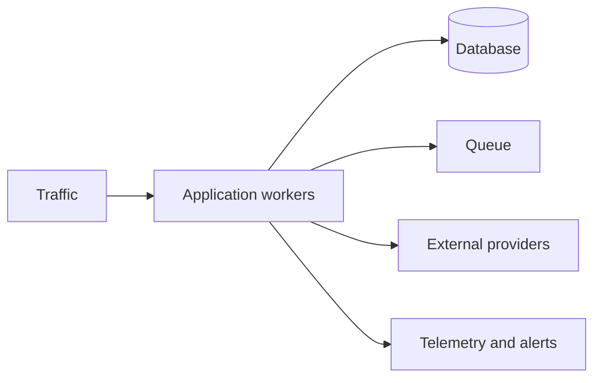

# Production operations

<Accordion title="Detailed background for this page" icon="book-open" defaultOpen={true}>

Operate Jeston as a workload with capacity, dependencies, incidents, and recovery—not as a static deployment.

**Expected outcome.** A production posture for scaling, alerting, security, cost, and incident response.

**Why this boundary matters.** Heavy systems fail at boundaries: queues fill, pools saturate, providers slow down, and tail latency grows before averages move.

### Page-specific implementation notes

- **Set the capacity model:** Estimate concurrency, pool size, memory, stream count, and provider quotas.
- **Define service objectives:** Choose latency, error, freshness, and availability signals that matter.
- **Write runbooks:** Give each alert an owner, diagnosis path, mitigation, and escalation.
- **Exercise failure:** Practice dependency loss, overload, deploy rollback, and shutdown.

### Page-specific failure questions

- **What should scale first?:** The bottleneck that limits the user-visible workload, often a dependency or pool.
- **What should be rate limited?:** Expensive, tenant-amplifiable, or externally quota-bound work.
- **What belongs in an incident record?:** Impact, timeline, signals, decisions, recovery, and prevention.

</Accordion>

---

## Operations · Production

> **Page focus** — Operate Jeston as a workload with capacity, dependencies, incidents, and recovery—not as a static deployment.

<Columns cols={2}>
  <Card title="What you will leave with" icon="server-stack" type="check">
    A production posture for scaling, alerting, security, cost, and incident response.
  </Card>

  <Card title="Why this deserves its own page" icon="circle-question" type="note">
    Heavy systems fail at boundaries: queues fill, pools saturate, providers slow down, and tail latency grows before averages move.
  </Card>
</Columns>

### System view

<Info>
This guide has its own decision surface. Use the visual blocks for orientation, then open the detailed background above when you need the longer explanation.
</Info>

---

## Implementation sequence

<Steps titleSize="h3">
  <Step title="Set the capacity model" icon="crosshairs">
    Estimate concurrency, pool size, memory, stream count, and provider quotas.
  </Step>
  <Step title="Define service objectives" icon="layers-3">
    Choose latency, error, freshness, and availability signals that matter.
  </Step>
  <Step title="Write runbooks" icon="triangle-exclamation">
    Give each alert an owner, diagnosis path, mitigation, and escalation.
  </Step>
  <Step title="Exercise failure" icon="flask-conical">
    Practice dependency loss, overload, deploy rollback, and shutdown.
  </Step>
</Steps>

## Choose a working mode

<Tabs>
  <Tab title="Normal day" icon="book-open">
    Dashboards, releases, capacity, and cost review.
  </Tab>
  <Tab title="Degraded day" icon="hammer">
    Rate limits, fallback, queue draining, and communication.
  </Tab>
  <Tab title="Incident" icon="chart-line">
    Contain, diagnose, recover, and record learning.
  </Tab>
</Tabs>

---

## Decision table

| Concern | Default posture | Review question |
| --- | --- | --- |
| Saturation | Queue, pool, CPU, memory | Predicts user-visible failure. |
| Tail latency | p95 and p99 | Shows the slow users. |
| Recovery | Time to restore | Measures operational readiness. |

> **Design note**
>
> Production maturity is the ability to recover predictably, not the absence of incidents.

<Note>
Optimize the bottleneck measured in the complete topology; do not optimize framework throughput in isolation.
</Note>

## Questions worth answering

<AccordionGroup>
  <Accordion title="What should scale first?" icon="circle-question">
    The bottleneck that limits the user-visible workload, often a dependency or pool.
  </Accordion>
  <Accordion title="What should be rate limited?" icon="binoculars">
    Expensive, tenant-amplifiable, or externally quota-bound work.
  </Accordion>
  <Accordion title="What belongs in an incident record?" icon="arrow-right">
    Impact, timeline, signals, decisions, recovery, and prevention.
  </Accordion>
</AccordionGroup>

---

## Continue with a related guide

<Columns cols={3}>
  <Card title="Measure load" icon="gauge-high" href="/operations/benchmark" horizontal>Open the related guide when this page leaves a boundary unresolved.</Card>
  <Card title="Build telemetry" icon="chart-line" href="/platform/health-observability" horizontal>Open the related guide when this page leaves a boundary unresolved.</Card>
  <Card title="Drain safely" icon="power-off" href="/operations/jobs-and-shutdown" horizontal>Open the related guide when this page leaves a boundary unresolved.</Card>
</Columns>

<Check>
This page is complete when its specific decision is documented, its failure behavior is tested, and its operational signal has an owner.
</Check>

## References

[1]: https://github.com/jeffersoncampos12p-dev/jeston "Jeston source repository"
[2]: https://www.npmjs.com/package/@hedronjs/jeston "Jeston package on npm"
[3]: https://nodejs.org/api/http.html "Node.js HTTP API"
[4]: https://developer.mozilla.org/en-US/docs/Web/API/AbortSignal "AbortSignal Web API"
[5]: https://react.dev/reference/react-dom/server "React server rendering APIs"
[6]: https://www.typescriptlang.org/docs/handbook/intro.html "TypeScript handbook"
