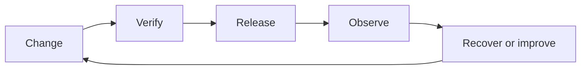

# Production operations

This page is part of the complete Jeston documentation. It explains capacity, scaling, database topology, caching, queues, observability, security, and incident response. The examples target `@hedronjs/jeston@1.2.0` and Node.js 20 or newer. The page distinguishes stable behavior from roadmap work so that readers can make safe production decisions.

<Accordion title="Background and detailed explanation" icon="book-open">

## Scope and mental model

Jeston is a React-first full-stack TypeScript framework. It combines a file-based compiler, a portable HTTP runtime, React rendering, API route contracts, and replaceable platform adapters. The important design choice is explicit ownership: the framework provides lifecycle and contracts, while applications choose databases, queues, storage providers, identity systems, model providers, and deployment platforms.

A production application should be treated as a system rather than a page renderer. A request can cross a router, middleware, authentication boundary, cache, database, queue, storage provider, and renderer. Each boundary must define timeout behavior, cancellation, retries, data validation, logging, and failure visibility. Jeston exposes these boundaries so they can be tested independently.

> A framework contract is useful only when its success path and failure path are both documented.

## Core workflow

Begin by defining the route and its input contract. Keep validation close to the boundary so malformed data is rejected before database or model work begins. Pass `RequestContext.signal` into every cancellable operation. Use an explicit status code and response shape. Add request IDs to logs and traces. Then write tests for normal input, malformed input, authentication failure, timeout, client disconnect, dependency failure, and shutdown.

```ts
import type { ApiHandler } from '@hedronjs/jeston';

export const POST: ApiHandler = async ({ body, signal, requestId }) => {
  const input = validateInput(body);
  const result = await saveDomainRecord(input, { signal, requestId });
  return {
    status: 201,
    json: { data: result, requestId }
  };
};
```

The example is intentionally provider-neutral. `validateInput` and `saveDomainRecord` belong to the application or an adapter. They should not silently create unbounded work, retry non-idempotent writes, or hide a dependency outage.

## Design decisions

| Decision | Recommended default | Reason |
| --- | --- | --- |
| Validation | Validate at every external boundary | Internal types cannot validate hostile network input |
| Cancellation | Propagate `AbortSignal` | Disconnected clients should not leave expensive work running |
| Retries | Retry only idempotent operations | Replaying a write can create duplicate side effects |
| Caching | Cache immutable or explicitly versioned data | Stale data must have a documented meaning |
| Logging | Structured logs with request IDs | Text-only logs are difficult to correlate |
| Scaling | Measure complete topology | Framework throughput alone does not represent user latency |
| Security | Deny by default | Missing authorization must fail closed |

## Failure handling

A robust handler distinguishes client errors, authentication errors, authorization errors, dependency errors, and internal programming errors. Client errors should be stable and actionable without exposing stack traces. Dependency errors should include enough metadata for operators to find the failing provider while avoiding credentials and personal data. Internal errors should be logged with a correlation identifier and returned as a generic response.

Use deadlines at the request boundary and shorter deadlines for individual dependencies. A database query, model call, and storage upload should not all consume the entire request budget independently. When work must continue after the response, enqueue it with an idempotency key and expose durable status instead of keeping the request open indefinitely.

## Security and operations

Store secrets in the deployment secret manager, not in source control or generated artifacts. Restrict cookies with `HttpOnly`, `Secure`, and an appropriate `SameSite` policy. Apply CSRF protection to cookie-authenticated state changes. Bound request bodies, stream sizes, queue payloads, cache entries, and concurrent work. Configure health and readiness separately: readiness should fail while a required dependency is unavailable, while liveness should answer whether the process can be restarted safely.

For production, publish a compatibility matrix, run the full test suite on supported Node versions, inspect `npm pack --dry-run`, scan dependencies, and retain a rollback path. A green build is necessary but not sufficient; operators also need dashboards, alerts, runbooks, and documented failure modes.

## Further reading

The most useful next step is to read the page that matches the boundary you are implementing. Start with routing and API routes for request behavior, then read the platform adapter and operations pages for persistence, scaling, and deployment. The official sources below define the underlying standards and runtime APIs.

</Accordion>

---

## Production operations

> **Reading lens** — Use this page to reason about capacity, scaling, incidents, security posture, cost controls, and operator runbooks. The goal is not to memorize APIs. The goal is to make a boundary explicit enough to implement, test, operate, and replace.

<Columns cols={2}>
  <Card title="What you will decide" icon="server-stack" type="check">
    Choose the ownership boundary, the smallest useful implementation, and the signal that proves it works.
  </Card>

  <Card title="Why it matters" icon="circle-question" type="note">
    Turn a working application into a system that can be measured, released, and recovered. Keep policy in the application and keep provider mechanics behind adapters.
  </Card>
</Columns>

### The shape of the system



<Info>
**Professional documentation is a decision aid.** Every example on this page should answer four questions: what enters the boundary, what leaves it, what can fail, and how an operator knows.
</Info>

---

## Implementation path

<Steps titleSize="h3">
  <Step title="Name the boundary" icon="crosshairs">
    Define the input, output, owner, authentication requirement, deadline, and side effects before writing the integration.
  </Step>
  <Step title="Build one vertical slice" icon="layers-3">
    Connect the route or command to real domain behavior, one stable response, and one structured signal. Keep the first slice intentionally small.
  </Step>
  <Step title="Add the uncomfortable paths" icon="triangle-exclamation">
    Specify malformed input, missing identity, timeout, dependency outage, duplicate delivery, client disconnect, and process shutdown.
  </Step>
  <Step title="Prove and operate it" icon="flask-conical">
    Add contract tests, latency measurements, limits, a dashboard signal, and a short recovery procedure.
  </Step>
</Steps>

## Choose your working mode

<Tabs>
  <Tab title="Learn" icon="book-open">
    Start with the smallest example and read the adjacent reference page when a symbol or contract becomes important. Keep the feedback loop short.
  </Tab>
  <Tab title="Build" icon="hammer">
    Implement a vertical slice. Prefer explicit contracts, bounded resources, and provider-neutral domain functions over clever abstractions.
  </Tab>
  <Tab title="Operate" icon="chart-line">
    Measure the complete path. Add request IDs, health semantics, useful percentiles, and a recovery path before optimizing.
  </Tab>
</Tabs>

---

## Practical reference

| Concern | Default posture | Review question |
| --- | --- | --- |
| Boundary | Explicit and narrow | Can a new contributor name the owner? |
| Input | Validated at the edge | What happens before side effects begin? |
| Time | Deadline plus dependency budgets | Can work stop when the client leaves? |
| Failure | Stable public shape | Can the operator find the cause without secrets? |
| Change | Tested and reversible | Is there a rollback or compatibility window? |

### A small, observable contract

```ts title="A Jeston handler with a clear boundary"
import type { ApiHandler } from '@hedronjs/jeston';

export const POST: ApiHandler = async ({ body, signal, requestId, deadline }) => {
  const input = validateInput(body);
  const result = await domainOperation(input, { signal, requestId, deadline });

  return {
    status: 201,
    json: { data: result, requestId },
  };
};
```

> **Jeston design principle**
>
> A framework contract is useful only when its success path and failure path are both documented.

<Note>
The code is intentionally provider-neutral. Replace `domainOperation` with an application-owned function or a tested adapter. Do not hide retries, credentials, unbounded work, or provider-specific errors inside the route.
</Note>

---

## Review notes

<AccordionGroup>
  <Accordion title="What should be visible to a reviewer?" icon="eye">
    The boundary, the input schema, the response shape, the deadline, the cancellation path, the side effects, and the test that proves the failure mode. If any of these are implicit, the design is harder to maintain than it needs to be.
  </Accordion>
  <Accordion title="What should be visible to an operator?" icon="binoculars">
    Request or job identifiers, latency percentiles, dependency labels, health state, error category, and the next recovery action. Avoid dashboards that show volume without showing saturation or failure.
  </Accordion>
  <Accordion title="What belongs in the next page?" icon="arrow-right">
    Follow the links below for the neighboring layer. Keep this page focused on its own boundary and use the reference pages for exact API details.
  </Accordion>
</AccordionGroup>

## Continue with the right tool

<Columns cols={3}>
  <Card title="Deployment" icon="cloud-arrow-up" href="/operations/deployment" horizontal>Open the guide and continue from here.</Card>
  <Card title="Benchmarking" icon="gauge-high" href="/operations/benchmark" horizontal>Open the guide and continue from here.</Card>
  <Card title="Release checks" icon="circle-check" href="/operations/release-checks" horizontal>Open the guide and continue from here.</Card>
</Columns>

<Check>
You are ready to continue when the page has produced one implementation decision, one executable example, one failure test, and one operational signal.
</Check>

## References

[1]: https://github.com/jeffersoncampos12p-dev/jeston "Jeston source repository"
[2]: https://www.npmjs.com/package/@hedronjs/jeston "Jeston package on npm"
[3]: https://nodejs.org/api/http.html "Node.js HTTP API"
[4]: https://developer.mozilla.org/en-US/docs/Web/API/AbortSignal "AbortSignal Web API"
[5]: https://react.dev/reference/react-dom/server "React server rendering APIs"
[6]: https://www.typescriptlang.org/docs/handbook/intro.html "TypeScript handbook"
