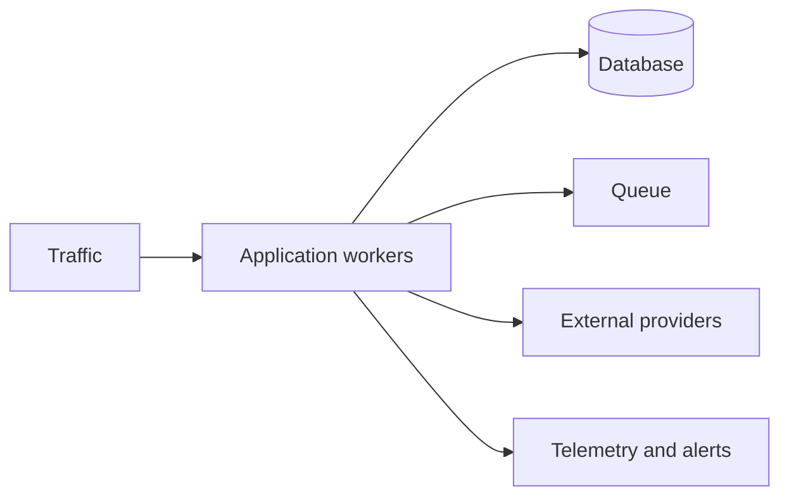

# Production operations

---

## Operations · Production

> **Operational objective** — Operate Ryvax as a workload with capacity, dependencies, incidents, and recovery—not as a static deployment.

A production posture for scaling, alerting, security, cost, and incident response.

### Key concepts

<Columns cols={3}>
  <Card title="Saturation" icon="sparkles">
    Queue, pool, CPU, memory
  </Card>
  <Card title="Tail latency" icon="shield-check">
    p95 and p99
  </Card>
  <Card title="Recovery" icon="gauge-high">
    Time to restore
  </Card>
</Columns>

### Runbook view

### Evidence over assumption

| Signal | Healthy interpretation | Action when it degrades |
| --- | --- | --- |
| Saturation | Queue, pool, CPU, memory | Predicts user-visible failure. |
| Tail latency | p95 and p99 | Shows the slow users. |
| Recovery | Time to restore | Measures operational readiness. |

<Warning>
Optimize the bottleneck measured in the complete topology; do not optimize framework throughput in isolation.
</Warning>

### Operational context

Heavy systems fail at boundaries: queues fill, pools saturate, providers slow down, and tail latency grows before averages move.

> **Operator's principle**
>
> Production maturity is the ability to recover predictably, not the absence of incidents.

### Implementation notes

| Engineering move | Guidance |
| --- | --- |
| **Set the capacity model** | Estimate concurrency, pool size, memory, stream count, and provider quotas. |
| **Define service objectives** | Choose latency, error, freshness, and availability signals that matter. |
| **Write runbooks** | Give each alert an owner, diagnosis path, mitigation, and escalation. |
| **Exercise failure** | Practice dependency loss, overload, deploy rollback, and shutdown. |

### Decision lens

| Mode | Practical emphasis |
| --- | --- |
| **Normal day** | Dashboards, releases, capacity, and cost review. |
| **Degraded day** | Rate limits, fallback, queue draining, and communication. |
| **Incident** | Contain, diagnose, recover, and record learning. |

## Related topics

<Columns cols={3}>
- [gauge-high · **Measure load**](/operations/benchmark) — Read the focused guide for this boundary.
- [chart-line · **Build telemetry**](/platform/health-observability) — Read the focused guide for this boundary.
- [power-off · **Drain safely**](/operations/jobs-and-shutdown) — Read the focused guide for this boundary.
</Columns>

### Why this matters

Heavy systems fail at boundaries: queues fill, pools saturate, providers slow down, and tail latency grows before averages move.

## References

[1]: https://github.com/kvantjs/ryvax.js "Ryvax source repository"
[2]: https://www.npmjs.com/package/@kvantjs/ryvax.js "Ryvax package on npm"
[3]: https://nodejs.org/api/http.html "Node.js HTTP API"
[4]: https://developer.mozilla.org/en-US/docs/Web/API/AbortSignal "AbortSignal Web API"
[5]: https://react.dev/reference/react-dom/server "React server rendering APIs"
[6]: https://www.typescriptlang.org/docs/handbook/intro.html "TypeScript handbook"
