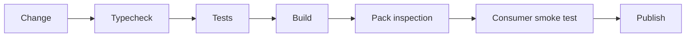

# Release checks

<Accordion title="Detailed background for this page" icon="book-open" defaultOpen={true}>

Turn a source change into a release only after code, artifacts, compatibility, and provenance agree.

**Expected outcome.** A release gate that protects users from broken types, missing files, and unsupported runtime behavior.

**Why this boundary matters.** Publishing is the last step of a chain; it should not be the first place a package is tested as a consumer would use it.

### Page-specific implementation notes

- **Check source:** Run formatting, typecheck, tests, and security checks.
- **Check artifact:** Inspect files, exports, declarations, and package metadata.
- **Check consumer use:** Install the tarball into a clean project and import public APIs.
- **Check provenance:** Use the intended Node version, OIDC workflow, and release tag or trigger.

### Page-specific failure questions

- **Why inspect npm pack?:** Build output and repository files are not the same package surface.
- **What does a smoke import catch?:** Broken exports, missing declarations, and runtime module errors.
- **When publish?:** Only after all matrix checks and the protected release workflow agree.

</Accordion>

---

## Operations · Release checks

> **Page focus** — Turn a source change into a release only after code, artifacts, compatibility, and provenance agree.

<Columns cols={2}>
  <Card title="What you will leave with" icon="circle-check" type="check">
    A release gate that protects users from broken types, missing files, and unsupported runtime behavior.
  </Card>

  <Card title="Why this deserves its own page" icon="circle-question" type="note">
    Publishing is the last step of a chain; it should not be the first place a package is tested as a consumer would use it.
  </Card>
</Columns>

### System view

<Info>
This guide has its own decision surface. Use the visual blocks for orientation, then open the detailed background above when you need the longer explanation.
</Info>

---

## Implementation sequence

<Steps titleSize="h3">
  <Step title="Check source" icon="crosshairs">
    Run formatting, typecheck, tests, and security checks.
  </Step>
  <Step title="Check artifact" icon="layers-3">
    Inspect files, exports, declarations, and package metadata.
  </Step>
  <Step title="Check consumer use" icon="triangle-exclamation">
    Install the tarball into a clean project and import public APIs.
  </Step>
  <Step title="Check provenance" icon="flask-conical">
    Use the intended Node version, OIDC workflow, and release tag or trigger.
  </Step>
</Steps>

## Choose a working mode

<Tabs>
  <Tab title="Pull request" icon="book-open">
    Fast feedback and no publication.
  </Tab>
  <Tab title="Release candidate" icon="hammer">
    Full matrix and package consumer test.
  </Tab>
  <Tab title="Production publish" icon="chart-line">
    Protected environment and auditable workflow.
  </Tab>
</Tabs>

---

## Decision table

| Concern | Default posture | Review question |
| --- | --- | --- |
| Source | Tests green | Behavior is acceptable. |
| Artifact | Files present | Package is usable. |
| Consumer | Import works | Public surface is real. |
| Publish | Trusted workflow | Provenance is controlled. |

> **Design note**
>
> A release is ready when a clean consumer can use the artifact, not when the repository can build itself.

<Note>
Keep publication credentials and trusted publishing policy outside application source.
</Note>

## Questions worth answering

<AccordionGroup>
  <Accordion title="Why inspect npm pack?" icon="circle-question">
    Build output and repository files are not the same package surface.
  </Accordion>
  <Accordion title="What does a smoke import catch?" icon="binoculars">
    Broken exports, missing declarations, and runtime module errors.
  </Accordion>
  <Accordion title="When publish?" icon="arrow-right">
    Only after all matrix checks and the protected release workflow agree.
  </Accordion>
</AccordionGroup>

---

## Continue with a related guide

<Columns cols={3}>
  <Card title="Review support matrix" icon="scale-balanced" href="/reference/compatibility" horizontal>Open the related guide when this page leaves a boundary unresolved.</Card>
  <Card title="Automate checks" icon="terminal" href="/reference/cli" horizontal>Open the related guide when this page leaves a boundary unresolved.</Card>
  <Card title="Deploy the artifact" icon="cloud-arrow-up" href="/operations/deployment" horizontal>Open the related guide when this page leaves a boundary unresolved.</Card>
</Columns>

<Check>
This page is complete when its specific decision is documented, its failure behavior is tested, and its operational signal has an owner.
</Check>

## References

[1]: https://github.com/jeffersoncampos12p-dev/jeston "Jeston source repository"
[2]: https://www.npmjs.com/package/@hedronjs/jeston "Jeston package on npm"
[3]: https://nodejs.org/api/http.html "Node.js HTTP API"
[4]: https://developer.mozilla.org/en-US/docs/Web/API/AbortSignal "AbortSignal Web API"
[5]: https://react.dev/reference/react-dom/server "React server rendering APIs"
[6]: https://www.typescriptlang.org/docs/handbook/intro.html "TypeScript handbook"
