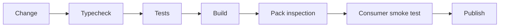

# Release checks

---

## Operations · Release checks

> **Operational objective** — Turn a source change into a release only after code, artifacts, compatibility, and provenance agree.

A release gate that protects users from broken types, missing files, and unsupported runtime behavior.

### Runbook view

### Evidence over assumption

| Signal | Healthy interpretation | Action when it degrades |
| --- | --- | --- |
| Source | Tests green | Behavior is acceptable. |
| Artifact | Files present | Package is usable. |
| Consumer | Import works | Public surface is real. |
| Publish | Trusted workflow | Provenance is controlled. |

### Operational context

Publishing is the last step of a chain; it should not be the first place a package is tested as a consumer would use it.

> **Operator's principle**
>
> A release is ready when a clean consumer can use the artifact, not when the repository can build itself.

## Related material

<Columns cols={3}>
  <Card title="Review support matrix" icon="scale-balanced" href="/reference/compatibility" horizontal>Read the focused guide for this boundary.</Card>
  <Card title="Automate checks" icon="terminal" href="/reference/cli" horizontal>Read the focused guide for this boundary.</Card>
  <Card title="Deploy the artifact" icon="cloud-arrow-up" href="/operations/deployment" horizontal>Read the focused guide for this boundary.</Card>
</Columns>

## References

[1]: https://github.com/jeffersoncampos12p-dev/jeston "Jeston source repository"
[2]: https://www.npmjs.com/package/@hedronjs/jeston "Jeston package on npm"
[3]: https://nodejs.org/api/http.html "Node.js HTTP API"
[4]: https://developer.mozilla.org/en-US/docs/Web/API/AbortSignal "AbortSignal Web API"
[5]: https://react.dev/reference/react-dom/server "React server rendering APIs"
[6]: https://www.typescriptlang.org/docs/handbook/intro.html "TypeScript handbook"
