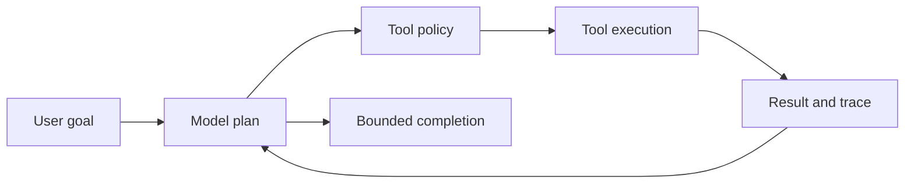

# AI agents and model integrations

<Accordion title="Detailed background for this page" icon="book-open" defaultOpen={true}>

Build agent execution as a controlled workflow with tools, budgets, traces, and evaluation—not as an unbounded chat loop.

**Expected outcome.** Model adapters, permissioned tools, durable state, streaming, and measurable quality.

**Why this boundary matters.** Agent workloads combine nondeterministic model output with deterministic application side effects.

### Page-specific implementation notes

- **Define the capability:** State what the agent may decide and what it may never do.
- **Permission every tool:** Validate arguments, identity, tenant scope, and side effects.
- **Bound the loop:** Set token, time, tool-call, and spend budgets.
- **Evaluate behavior:** Test groundedness, tool correctness, refusal, latency, and cost.

### Page-specific failure questions

- **What belongs in memory?:** Only information with a retention, tenant, privacy, and deletion policy.
- **What should be traced?:** Prompt version, model, tool calls, latency, token usage, outcomes, and safe error categories.
- **When use a queue?:** When agent work must survive disconnects or may exceed request deadlines.

</Accordion>

---

## Platform · AI agents

> **Page focus** — Build agent execution as a controlled workflow with tools, budgets, traces, and evaluation—not as an unbounded chat loop.

<Columns cols={2}>
  <Card title="What you will leave with" icon="brain" type="check">
    Model adapters, permissioned tools, durable state, streaming, and measurable quality.
  </Card>

  <Card title="Why this deserves its own page" icon="circle-question" type="note">
    Agent workloads combine nondeterministic model output with deterministic application side effects.
  </Card>
</Columns>

### System view

<Info>
This guide has its own decision surface. Use the visual blocks for orientation, then open the detailed background above when you need the longer explanation.
</Info>

---

## Implementation sequence

<Steps titleSize="h3">
  <Step title="Define the capability" icon="crosshairs">
    State what the agent may decide and what it may never do.
  </Step>
  <Step title="Permission every tool" icon="layers-3">
    Validate arguments, identity, tenant scope, and side effects.
  </Step>
  <Step title="Bound the loop" icon="triangle-exclamation">
    Set token, time, tool-call, and spend budgets.
  </Step>
  <Step title="Evaluate behavior" icon="flask-conical">
    Test groundedness, tool correctness, refusal, latency, and cost.
  </Step>
</Steps>

## Choose a working mode

<Tabs>
  <Tab title="Interactive" icon="book-open">
    Stream plan and progress while keeping side effects explicit.
  </Tab>
  <Tab title="Background" icon="hammer">
    Persist intent and status so work survives disconnects.
  </Tab>
  <Tab title="Training" icon="chart-line">
    Version datasets, prompts, evaluators, and model settings.
  </Tab>
</Tabs>

---

## Decision table

| Concern | Default posture | Review question |
| --- | --- | --- |
| Model | Probabilistic | Treat output as untrusted input. |
| Tool | Deterministic effect | Validate and authorize every call. |
| Evaluation | Quality signal | Keep a regression set and trace failures. |

> **Design note**
>
> An agent should be powerful inside a policy envelope, not powerful because the envelope is absent.

<Note>
Never let model text directly become a database query, shell command, permission decision, or external message.
</Note>

## Questions worth answering

<AccordionGroup>
  <Accordion title="What belongs in memory?" icon="circle-question">
    Only information with a retention, tenant, privacy, and deletion policy.
  </Accordion>
  <Accordion title="What should be traced?" icon="binoculars">
    Prompt version, model, tool calls, latency, token usage, outcomes, and safe error categories.
  </Accordion>
  <Accordion title="When use a queue?" icon="arrow-right">
    When agent work must survive disconnects or may exceed request deadlines.
  </Accordion>
</AccordionGroup>

---

## Continue with a related guide

<Columns cols={3}>
  <Card title="Stream agent work" icon="stream" href="/core/execution-and-streaming" horizontal>Open the related guide when this page leaves a boundary unresolved.</Card>
  <Card title="Protect tools" icon="shield-halved" href="/platform/security" horizontal>Open the related guide when this page leaves a boundary unresolved.</Card>
  <Card title="Benchmark agents" icon="gauge-high" href="/operations/benchmark" horizontal>Open the related guide when this page leaves a boundary unresolved.</Card>
</Columns>

<Check>
This page is complete when its specific decision is documented, its failure behavior is tested, and its operational signal has an owner.
</Check>

## References

[1]: https://github.com/jeffersoncampos12p-dev/jeston "Jeston source repository"
[2]: https://www.npmjs.com/package/@hedronjs/jeston "Jeston package on npm"
[3]: https://nodejs.org/api/http.html "Node.js HTTP API"
[4]: https://developer.mozilla.org/en-US/docs/Web/API/AbortSignal "AbortSignal Web API"
[5]: https://react.dev/reference/react-dom/server "React server rendering APIs"
[6]: https://www.typescriptlang.org/docs/handbook/intro.html "TypeScript handbook"
