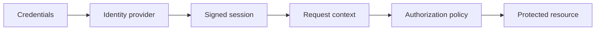

# Authentication

<Accordion title="Detailed background for this page" icon="book-open" defaultOpen={true}>

Separate proving who someone is from deciding what that person may do.

**Expected outcome.** Signed sessions, secure cookies, authorization checks, rotation, and revocation behavior.

**Why this boundary matters.** Authentication bugs become data-boundary bugs when identity and tenant scope are implicit.

### Page-specific implementation notes

- **Choose the identity source:** Define credentials, external provider, or service identity.
- **Issue a bounded session:** Set expiry, cookie flags, rotation, and revocation expectations.
- **Authorize every resource:** Check ownership or capability at the domain boundary.
- **Exercise recovery:** Test expiry, logout, key rotation, replay, and missing identity.

### Page-specific failure questions

- **Where should authorization run?:** Near the resource access, not only in the route or UI.
- **When rotate keys?:** Before expiry or compromise forces an emergency change; support overlap where necessary.
- **What is logout?:** A client action plus server-side invalidation strategy when immediate revocation is required.

</Accordion>

---

## Platform · Authentication

> **Page focus** — Separate proving who someone is from deciding what that person may do.

<Columns cols={2}>
  <Card title="What you will leave with" icon="user-lock" type="check">
    Signed sessions, secure cookies, authorization checks, rotation, and revocation behavior.
  </Card>

  <Card title="Why this deserves its own page" icon="circle-question" type="note">
    Authentication bugs become data-boundary bugs when identity and tenant scope are implicit.
  </Card>
</Columns>

### System view

<Info>
This guide has its own decision surface. Use the visual blocks for orientation, then open the detailed background above when you need the longer explanation.
</Info>

---

## Implementation sequence

<Steps titleSize="h3">
  <Step title="Choose the identity source" icon="crosshairs">
    Define credentials, external provider, or service identity.
  </Step>
  <Step title="Issue a bounded session" icon="layers-3">
    Set expiry, cookie flags, rotation, and revocation expectations.
  </Step>
  <Step title="Authorize every resource" icon="triangle-exclamation">
    Check ownership or capability at the domain boundary.
  </Step>
  <Step title="Exercise recovery" icon="flask-conical">
    Test expiry, logout, key rotation, replay, and missing identity.
  </Step>
</Steps>

## Choose a working mode

<Tabs>
  <Tab title="Browser" icon="book-open">
    HttpOnly, Secure, SameSite, and CSRF posture.
  </Tab>
  <Tab title="API" icon="hammer">
    Bearer or service credentials with explicit scopes.
  </Tab>
  <Tab title="Internal job" icon="chart-line">
    Carry actor and tenant context without pretending it is a browser session.
  </Tab>
</Tabs>

---

## Decision table

| Concern | Default posture | Review question |
| --- | --- | --- |
| Authentication | 401 | Identity absent or invalid. |
| Authorization | 403 | Identity present but policy denies. |
| Revocation | Immediate or bounded | Document the security tradeoff. |

> **Design note**
>
> A session identifies an actor; it never grants permission by itself.

<Note>
Do not log raw tokens, credentials, or complete session payloads.
</Note>

## Questions worth answering

<AccordionGroup>
  <Accordion title="Where should authorization run?" icon="circle-question">
    Near the resource access, not only in the route or UI.
  </Accordion>
  <Accordion title="When rotate keys?" icon="binoculars">
    Before expiry or compromise forces an emergency change; support overlap where necessary.
  </Accordion>
  <Accordion title="What is logout?" icon="arrow-right">
    A client action plus server-side invalidation strategy when immediate revocation is required.
  </Accordion>
</AccordionGroup>

---

## Continue with a related guide

<Columns cols={3}>
  <Card title="Harden identity" icon="shield-halved" href="/platform/security" horizontal>Open the related guide when this page leaves a boundary unresolved.</Card>
  <Card title="Apply tenancy" icon="building" href="/start/saas-starter" horizontal>Open the related guide when this page leaves a boundary unresolved.</Card>
  <Card title="Return auth errors" icon="globe" href="/reference/http-contracts" horizontal>Open the related guide when this page leaves a boundary unresolved.</Card>
</Columns>

<Check>
This page is complete when its specific decision is documented, its failure behavior is tested, and its operational signal has an owner.
</Check>

## References

[1]: https://github.com/jeffersoncampos12p-dev/jeston "Jeston source repository"
[2]: https://www.npmjs.com/package/@hedronjs/jeston "Jeston package on npm"
[3]: https://nodejs.org/api/http.html "Node.js HTTP API"
[4]: https://developer.mozilla.org/en-US/docs/Web/API/AbortSignal "AbortSignal Web API"
[5]: https://react.dev/reference/react-dom/server "React server rendering APIs"
[6]: https://www.typescriptlang.org/docs/handbook/intro.html "TypeScript handbook"
