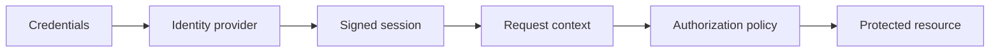

# Authentication

---

## Platform · Authentication

> **Platform concern** — Separate proving who someone is from deciding what that person may do.

Signed sessions, secure cookies, authorization checks, rotation, and revocation behavior.

### Key concepts

<Columns cols={3}>
  <Card title="Authentication" icon="sparkles">
    401
  </Card>
  <Card title="Authorization" icon="shield-check">
    403
  </Card>
  <Card title="Revocation" icon="gauge-high">
    Immediate or bounded
  </Card>
</Columns>

### Operating model

### Decisions to make before production

| Decision | Recommended posture | Failure it prevents |
| --- | --- | --- |
| Authentication | 401 | Identity absent or invalid. |
| Authorization | 403 | Identity present but policy denies. |
| Revocation | Immediate or bounded | Document the security tradeoff. |

### Boundary and failure behavior

Authentication bugs become data-boundary bugs when identity and tenant scope are implicit.

### Questions for review

| Question | Answer to document |
| --- | --- |
| Where should authorization run? | Near the resource access, not only in the route or UI. |
| When rotate keys? | Before expiry or compromise forces an emergency change; support overlap where necessary. |
| What is logout? | A client action plus server-side invalidation strategy when immediate revocation is required. |

### Implementation notes

| Engineering move | Guidance |
| --- | --- |
| **Choose the identity source** | Define credentials, external provider, or service identity. |
| **Issue a bounded session** | Set expiry, cookie flags, rotation, and revocation expectations. |
| **Authorize every resource** | Check ownership or capability at the domain boundary. |
| **Exercise recovery** | Test expiry, logout, key rotation, replay, and missing identity. |

### Decision lens

| Mode | Practical emphasis |
| --- | --- |
| **Browser** | HttpOnly, Secure, SameSite, and CSRF posture. |
| **API** | Bearer or service credentials with explicit scopes. |
| **Internal job** | Carry actor and tenant context without pretending it is a browser session. |

## Related topics

<Columns cols={3}>
- [shield-halved · **Harden identity**](/platform/security) — Read the focused guide for this boundary.
- [building · **Apply tenancy**](/start/saas-starter) — Read the focused guide for this boundary.
- [globe · **Return auth errors**](/reference/http-contracts) — Read the focused guide for this boundary.
</Columns>

## References

[1]: https://github.com/kvantjs/ryvax.js "Ryvax source repository"
[2]: https://www.npmjs.com/package/@kvantjs/ryvax.js "Ryvax package on npm"
[3]: https://nodejs.org/api/http.html "Node.js HTTP API"
[4]: https://developer.mozilla.org/en-US/docs/Web/API/AbortSignal "AbortSignal Web API"
[5]: https://react.dev/reference/react-dom/server "React server rendering APIs"
[6]: https://www.typescriptlang.org/docs/handbook/intro.html "TypeScript handbook"
