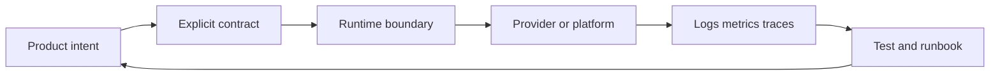

# Authentication

This page is part of the complete Jeston documentation. It explains signed sessions, rotation, OIDC, MFA, recovery, cookie policy, tenant identity, and audits. The examples target `@hedronjs/jeston@1.2.0` and Node.js 20 or newer. The page distinguishes stable behavior from roadmap work so that readers can make safe production decisions.

## Session lifecycle

Authentication proves identity; authorization decides whether that identity may perform an action. Keep those decisions separate. A session should have an expiry, rotation policy, revocation path, and a server-side audit trail for sensitive operations. Cookies should not carry mutable authorization state that cannot be revoked.

For OIDC, validate issuer, audience, signature, nonce, state, redirect URI, and token expiry. For password recovery, issue single-use, short-lived tokens and never reveal whether an account exists. MFA enrollment and recovery codes require explicit re-authentication and audit events.


## Scope and mental model

Jeston is a React-first full-stack TypeScript framework. It combines a file-based compiler, a portable HTTP runtime, React rendering, API route contracts, and replaceable platform adapters. The important design choice is explicit ownership: the framework provides lifecycle and contracts, while applications choose databases, queues, storage providers, identity systems, model providers, and deployment platforms.

A production application should be treated as a system rather than a page renderer. A request can cross a router, middleware, authentication boundary, cache, database, queue, storage provider, and renderer. Each boundary must define timeout behavior, cancellation, retries, data validation, logging, and failure visibility. Jeston exposes these boundaries so they can be tested independently.

> A framework contract is useful only when its success path and failure path are both documented.

## Core workflow

Begin by defining the route and its input contract. Keep validation close to the boundary so malformed data is rejected before database or model work begins. Pass `RequestContext.signal` into every cancellable operation. Use an explicit status code and response shape. Add request IDs to logs and traces. Then write tests for normal input, malformed input, authentication failure, timeout, client disconnect, dependency failure, and shutdown.

```ts
import type { ApiHandler } from '@hedronjs/jeston';

export const POST: ApiHandler = async ({ body, signal, requestId }) => {
  const input = validateInput(body);
  const result = await saveDomainRecord(input, { signal, requestId });
  return {
    status: 201,
    json: { data: result, requestId }
  };
};
```

The example is intentionally provider-neutral. `validateInput` and `saveDomainRecord` belong to the application or an adapter. They should not silently create unbounded work, retry non-idempotent writes, or hide a dependency outage.

## Design decisions

| Decision | Recommended default | Reason |
| --- | --- | --- |
| Validation | Validate at every external boundary | Internal types cannot validate hostile network input |
| Cancellation | Propagate `AbortSignal` | Disconnected clients should not leave expensive work running |
| Retries | Retry only idempotent operations | Replaying a write can create duplicate side effects |
| Caching | Cache immutable or explicitly versioned data | Stale data must have a documented meaning |
| Logging | Structured logs with request IDs | Text-only logs are difficult to correlate |
| Scaling | Measure complete topology | Framework throughput alone does not represent user latency |
| Security | Deny by default | Missing authorization must fail closed |

## Failure handling

A robust handler distinguishes client errors, authentication errors, authorization errors, dependency errors, and internal programming errors. Client errors should be stable and actionable without exposing stack traces. Dependency errors should include enough metadata for operators to find the failing provider while avoiding credentials and personal data. Internal errors should be logged with a correlation identifier and returned as a generic response.

Use deadlines at the request boundary and shorter deadlines for individual dependencies. A database query, model call, and storage upload should not all consume the entire request budget independently. When work must continue after the response, enqueue it with an idempotency key and expose durable status instead of keeping the request open indefinitely.

## Security and operations

Store secrets in the deployment secret manager, not in source control or generated artifacts. Restrict cookies with `HttpOnly`, `Secure`, and an appropriate `SameSite` policy. Apply CSRF protection to cookie-authenticated state changes. Bound request bodies, stream sizes, queue payloads, cache entries, and concurrent work. Configure health and readiness separately: readiness should fail while a required dependency is unavailable, while liveness should answer whether the process can be restarted safely.

For production, publish a compatibility matrix, run the full test suite on supported Node versions, inspect `npm pack --dry-run`, scan dependencies, and retain a rollback path. A green build is necessary but not sufficient; operators also need dashboards, alerts, runbooks, and documented failure modes.

## Further reading

The most useful next step is to read the page that matches the boundary you are implementing. Start with routing and API routes for request behavior, then read the platform adapter and operations pages for persistence, scaling, and deployment. The official sources below define the underlying standards and runtime APIs.

<Info>
**This page is a working surface, not a glossary.** It explains login boundaries, signed sessions, cookies, authorization, rotation, and revocation. Use the examples as a review checklist: every boundary should have an owner, a failure mode, a measurable signal, and a rollback or recovery story.
</Info>

<Columns cols={2}>
  <Card title="Primary outcome" icon="user-lock" type="check">
    Leave this page with a concrete implementation decision, a small testable slice, and an operator-visible signal that tells you whether the decision is working.
  </Card>
  <Card title="Scope boundary" icon="compass" type="note">
    Jeston owns the runtime contract and lifecycle. Your application owns domain policy; adapters own provider-specific behavior. Keep those responsibilities explicit.
  </Card>
</Columns>

## The decision surface

The most useful way to read this guide is to connect **intent**, **runtime behavior**, **external dependencies**, and **proof**. A feature is not complete when its happy path renders; it is complete when the system can reject invalid input, stop expensive work, expose a useful signal, and recover from a dependency failure.



<Warning>
Do not infer production readiness from a successful local request. Local success proves only that one topology works under one timing profile. Validate timeouts, client cancellation, malformed input, dependency saturation, restart behavior, and the operator experience separately.
</Warning>

## A repeatable implementation path

<Steps titleSize="h3">
  <Step title="Define the boundary" icon="square-pen">
    Write down the input, output, authentication requirement, deadline, and side effects. If a dependency is involved, name the adapter and the failure it can produce.
  </Step>
  <Step title="Implement the smallest vertical slice" icon="layers-3">
    Connect route, validation, domain operation, response, and one structured log. Avoid building a provider abstraction before the first real behavior is testable.
  </Step>
  <Step title="Add cancellation and limits" icon="ban">
    Propagate `RequestContext.signal`, bound payloads and concurrency, and give each external call a budget shorter than the request deadline.
  </Step>
  <Step title="Prove both paths" icon="flask-conical">
    Test success, malformed input, unauthorized access, timeout, dependency failure, duplicate delivery, and shutdown. Record expected status codes and stable error shapes.
  </Step>
  <Step title="Make it operable" icon="chart-no-axes-combined">
    Add request IDs, latency percentiles, dependency health, and a short runbook. The person on call should know what to inspect before reading application code.
  </Step>
</Steps>

## Choose an operating posture

<Tabs>
  <Tab title="Local development" icon="laptop">
    Prefer fast feedback, deterministic fixtures, verbose structured logs, and a single command that starts the smallest useful topology. Keep secrets in environment variables even locally so configuration drift is visible early.
  </Tab>
  <Tab title="Continuous integration" icon="gears">
    Run formatting, type checking, unit tests, contract tests, build verification, and package inspection against every supported Node version. Treat warnings from generated artifacts as release work, not as noise.
  </Tab>
  <Tab title="Production" icon="server">
    Prefer bounded resources, explicit readiness, graceful draining, secret-manager injection, dashboards, alert thresholds, and a tested rollback. Optimize only after measuring the complete request path.
  </Tab>
</Tabs>

## Contract example

The following shape is intentionally small. It demonstrates the habits that scale: input validation at the boundary, cancellation propagation, correlation metadata, and an explicit response. Replace the domain function with an application-owned implementation or a tested adapter.

```ts title="A bounded, observable handler"
import type { ApiHandler } from '@hedronjs/jeston';

export const POST: ApiHandler = async ({ body, signal, requestId, deadline }) => {
  const input = validateInput(body);
  const result = await domainOperation(input, {
    signal,
    requestId,
    deadline,
  });

  return {
    status: 201,
    json: { data: result, requestId },
  };
};
```

<Tip>
A useful review question is: **what happens if the client disconnects immediately after this handler starts?** If the answer is unclear, the operation probably needs signal propagation, an idempotency key, or a durable job boundary.
</Tip>

## Failure matrix

| Situation | Boundary behavior | Observable signal | Recovery posture |
| --- | --- | --- | --- |
| Invalid input | Reject before side effects | Structured client-error log | Fix caller or contract |
| Missing identity | Return stable unauthorized response | Auth failure counter | Re-authenticate or deny |
| Dependency timeout | Stop work at the dependency budget | Timeout metric with provider label | Retry only when safe |
| Client disconnect | Abort cancellable work | Cancellation counter | Release resources promptly |
| Duplicate delivery | Reuse idempotency result | Duplicate-hit metric | Return the original outcome |
| Process shutdown | Stop accepting and drain bounded work | Shutdown phase log | Restart after deadline |

## Deep-dive questions

<AccordionGroup>
  <Accordion title="What belongs in the framework boundary?" icon="landmark">
    Stable lifecycle behavior, request context, routing, HTTP semantics, rendering orchestration, and extension contracts belong in the framework. Domain rules, provider credentials, business authorization, and vendor-specific query details belong outside it. This separation keeps the core portable and makes replacement possible without rewriting every route.
  </Accordion>
  <Accordion title="How should a team review this design?" icon="users">
    Ask whether every input is validated, every external call is bounded, every write is idempotent where it can be repeated, every error has a safe public shape, and every important state transition has a signal. Review the design under overload, not just at nominal traffic.
  </Accordion>
  <Accordion title="What should be deferred?" icon="hourglass-half">
    Defer abstractions that have no second implementation, speculative retries, unbounded background work, and claims based on a single benchmark. First establish a clear contract and a proving test; generalize only when a real integration needs the seam.
  </Accordion>
</AccordionGroup>

## Completion checklist

<Columns cols={2}>
  <Card title="Implementation" icon="code-branch">
    - [ ] Boundary and ownership are documented\n    - [ ] Success and failure responses are stable\n    - [ ] Cancellation and deadlines are propagated\n    - [ ] Limits exist for payloads, memory, and concurrency
  </Card>
  <Card title="Operations" icon="binoculars">
    - [ ] Request IDs appear in logs\n    - [ ] Latency is measured with p50, p95, and p99\n    - [ ] Dependency health is visible\n    - [ ] Rollback or recovery steps are written down
  </Card>
</Columns>

<Check>
The page is complete when a new contributor can implement the smallest safe slice, a reviewer can challenge its boundaries, and an operator can diagnose its failure without guessing.
</Check>

## Continue the journey

<Card title="Read the reference and operations layers" icon="book-open" href="/reference/http-contracts" arrow={true} cta="Open the reference">
  Pair conceptual guidance with the HTTP contracts, adapter boundaries, benchmark methodology, and release checks before treating a feature as production-ready.
</Card>

## References

[1]: https://github.com/jeffersoncampos12p-dev/jeston "Jeston source repository"
[2]: https://www.npmjs.com/package/@hedronjs/jeston "Jeston package on npm"
[3]: https://nodejs.org/api/http.html "Node.js HTTP API"
[4]: https://developer.mozilla.org/en-US/docs/Web/API/AbortSignal "AbortSignal Web API"
[5]: https://react.dev/reference/react-dom/server "React server rendering APIs"
[6]: https://www.typescriptlang.org/docs/handbook/intro.html "TypeScript handbook"
