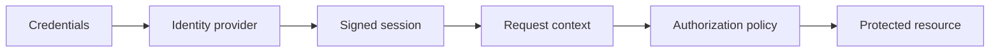

# Authentication

---

## Platform · Authentication

> **Platform concern** — Separate proving who someone is from deciding what that person may do.

Signed sessions, secure cookies, authorization checks, rotation, and revocation behavior.

### Operating model

### Decisions to make before production

| Decision | Recommended posture | Failure it prevents |
| --- | --- | --- |
| Authentication | 401 | Identity absent or invalid. |
| Authorization | 403 | Identity present but policy denies. |
| Revocation | Immediate or bounded | Document the security tradeoff. |

### Boundary and failure behavior

Authentication bugs become data-boundary bugs when identity and tenant scope are implicit.

### Questions for review

| Question | Answer to document |
| --- | --- |
| Where should authorization run? | Near the resource access, not only in the route or UI. |
| When rotate keys? | Before expiry or compromise forces an emergency change; support overlap where necessary. |
| What is logout? | A client action plus server-side invalidation strategy when immediate revocation is required. |

## Related material

<Columns cols={3}>
  <Card title="Harden identity" icon="shield-halved" href="/platform/security" horizontal>Read the focused guide for this boundary.</Card>
  <Card title="Apply tenancy" icon="building" href="/start/saas-starter" horizontal>Read the focused guide for this boundary.</Card>
  <Card title="Return auth errors" icon="globe" href="/reference/http-contracts" horizontal>Read the focused guide for this boundary.</Card>
</Columns>

## References

[1]: https://github.com/jeffersoncampos12p-dev/jeston "Jeston source repository"
[2]: https://www.npmjs.com/package/@hedronjs/jeston "Jeston package on npm"
[3]: https://nodejs.org/api/http.html "Node.js HTTP API"
[4]: https://developer.mozilla.org/en-US/docs/Web/API/AbortSignal "AbortSignal Web API"
[5]: https://react.dev/reference/react-dom/server "React server rendering APIs"
[6]: https://www.typescriptlang.org/docs/handbook/intro.html "TypeScript handbook"
