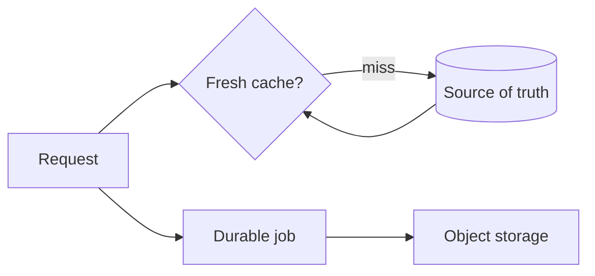

# Cache, jobs, and storage

<Accordion title="Detailed background for this page" icon="book-open" defaultOpen={true}>

Coordinate ephemeral speed, durable work, and object lifecycle without confusing their guarantees.

**Expected outcome.** Explicit freshness, retry, durability, ownership, and cleanup semantics.

**Why this boundary matters.** Cache, queues, and storage solve different problems; combining their names does not combine their guarantees.

### Page-specific implementation notes

- **Name the guarantee:** State whether data is fresh, eventually consistent, durable, or disposable.
- **Choose the key:** Include tenant, version, locale, and authorization dimensions where needed.
- **Make jobs repeatable:** Use idempotency, retry classification, and durable status.
- **Close the lifecycle:** Expire cache, delete objects, and drain workers intentionally.

### Page-specific failure questions

- **When stale-while-revalidate helps?:** When a bounded amount of staleness is acceptable and the refresh can be deduplicated.
- **What makes a job safe?:** Idempotent effects, explicit retry classes, and durable status.
- **Who owns deletion?:** The domain or retention policy must name the cleanup owner.

</Accordion>

---

## Platform · Cache, jobs, and storage

> **Page focus** — Coordinate ephemeral speed, durable work, and object lifecycle without confusing their guarantees.

<Columns cols={2}>
  <Card title="What you will leave with" icon="layer-group" type="check">
    Explicit freshness, retry, durability, ownership, and cleanup semantics.
  </Card>

  <Card title="Why this deserves its own page" icon="circle-question" type="note">
    Cache, queues, and storage solve different problems; combining their names does not combine their guarantees.
  </Card>
</Columns>

### System view

<Info>
This guide has its own decision surface. Use the visual blocks for orientation, then open the detailed background above when you need the longer explanation.
</Info>

---

## Implementation sequence

<Steps titleSize="h3">
  <Step title="Name the guarantee" icon="crosshairs">
    State whether data is fresh, eventually consistent, durable, or disposable.
  </Step>
  <Step title="Choose the key" icon="layers-3">
    Include tenant, version, locale, and authorization dimensions where needed.
  </Step>
  <Step title="Make jobs repeatable" icon="triangle-exclamation">
    Use idempotency, retry classification, and durable status.
  </Step>
  <Step title="Close the lifecycle" icon="flask-conical">
    Expire cache, delete objects, and drain workers intentionally.
  </Step>
</Steps>

## Choose a working mode

<Tabs>
  <Tab title="Cache" icon="book-open">
    Optimize reads with documented staleness.
  </Tab>
  <Tab title="Job" icon="hammer">
    Move work past request lifetime with status and retries.
  </Tab>
  <Tab title="Storage" icon="chart-line">
    Track content type, ownership, retention, and deletion.
  </Tab>
</Tabs>

---

## Decision table

| Concern | Default posture | Review question |
| --- | --- | --- |
| Cache | Fast and disposable | Never the only source for critical state. |
| Job | Durable intent | Must survive a request ending. |
| Object | Large payload | Needs access and retention policy. |

> **Design note**
>
> The right storage primitive is defined by its failure and lifecycle semantics.

<Note>
A stale cache, a duplicate job, and an orphaned object are different operational problems.
</Note>

## Questions worth answering

<AccordionGroup>
  <Accordion title="When stale-while-revalidate helps?" icon="circle-question">
    When a bounded amount of staleness is acceptable and the refresh can be deduplicated.
  </Accordion>
  <Accordion title="What makes a job safe?" icon="binoculars">
    Idempotent effects, explicit retry classes, and durable status.
  </Accordion>
  <Accordion title="Who owns deletion?" icon="arrow-right">
    The domain or retention policy must name the cleanup owner.
  </Accordion>
</AccordionGroup>

---

## Continue with a related guide

<Columns cols={3}>
  <Card title="Choose a source of truth" icon="database" href="/platform/sql" horizontal>Open the related guide when this page leaves a boundary unresolved.</Card>
  <Card title="Drain workers" icon="power-off" href="/operations/jobs-and-shutdown" horizontal>Open the related guide when this page leaves a boundary unresolved.</Card>
  <Card title="Expose queue health" icon="chart-line" href="/platform/health-observability" horizontal>Open the related guide when this page leaves a boundary unresolved.</Card>
</Columns>

<Check>
This page is complete when its specific decision is documented, its failure behavior is tested, and its operational signal has an owner.
</Check>

## References

[1]: https://github.com/jeffersoncampos12p-dev/jeston "Jeston source repository"
[2]: https://www.npmjs.com/package/@hedronjs/jeston "Jeston package on npm"
[3]: https://nodejs.org/api/http.html "Node.js HTTP API"
[4]: https://developer.mozilla.org/en-US/docs/Web/API/AbortSignal "AbortSignal Web API"
[5]: https://react.dev/reference/react-dom/server "React server rendering APIs"
[6]: https://www.typescriptlang.org/docs/handbook/intro.html "TypeScript handbook"
