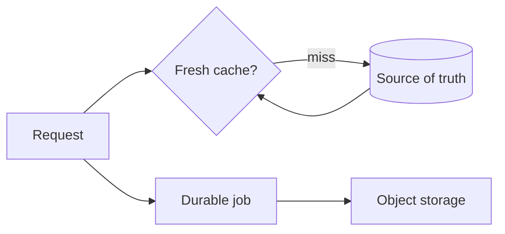

# Cache, jobs, and storage

---

## Platform · Cache, jobs, and storage

> **Platform concern** — Coordinate ephemeral speed, durable work, and object lifecycle without confusing their guarantees.

Explicit freshness, retry, durability, ownership, and cleanup semantics.

### Operating model

### Decisions to make before production

| Decision | Recommended posture | Failure it prevents |
| --- | --- | --- |
| Cache | Fast and disposable | Never the only source for critical state. |
| Job | Durable intent | Must survive a request ending. |
| Object | Large payload | Needs access and retention policy. |

### Boundary and failure behavior

Cache, queues, and storage solve different problems; combining their names does not combine their guarantees.

### Questions for review

| Question | Answer to document |
| --- | --- |
| When stale-while-revalidate helps? | When a bounded amount of staleness is acceptable and the refresh can be deduplicated. |
| What makes a job safe? | Idempotent effects, explicit retry classes, and durable status. |
| Who owns deletion? | The domain or retention policy must name the cleanup owner. |

## Related material

<Columns cols={3}>
  <Card title="Choose a source of truth" icon="database" href="/platform/sql" horizontal>Read the focused guide for this boundary.</Card>
  <Card title="Drain workers" icon="power-off" href="/operations/jobs-and-shutdown" horizontal>Read the focused guide for this boundary.</Card>
  <Card title="Expose queue health" icon="chart-line" href="/platform/health-observability" horizontal>Read the focused guide for this boundary.</Card>
</Columns>

## References

[1]: https://github.com/jeffersoncampos12p-dev/jeston "Jeston source repository"
[2]: https://www.npmjs.com/package/@hedronjs/jeston "Jeston package on npm"
[3]: https://nodejs.org/api/http.html "Node.js HTTP API"
[4]: https://developer.mozilla.org/en-US/docs/Web/API/AbortSignal "AbortSignal Web API"
[5]: https://react.dev/reference/react-dom/server "React server rendering APIs"
[6]: https://www.typescriptlang.org/docs/handbook/intro.html "TypeScript handbook"
