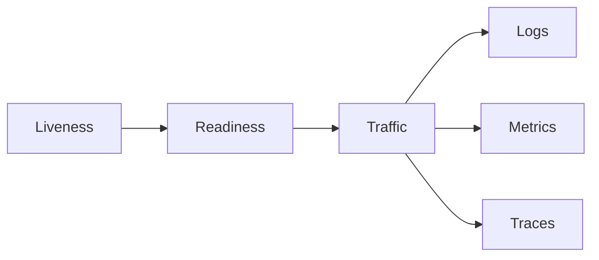

# Health and observability

<Accordion title="Detailed background for this page" icon="book-open">

Give operators enough signal to distinguish a healthy process from a useful service.

**Expected outcome.** Liveness, readiness, structured logs, metrics, traces, and alertable dependency state.

**Why this boundary matters.** Without health semantics, an overloaded or disconnected service can look alive while causing user-visible failure.

### Page-specific implementation notes

- **Define liveness:** Answer whether the process can continue or should be restarted.
- **Define readiness:** Answer whether required dependencies and capacity permit traffic.
- **Correlate work:** Carry request IDs, job IDs, provider labels, and tenant-safe context.
- **Alert on symptoms:** Use latency, errors, saturation, and freshness rather than log volume alone.

### Page-specific failure questions

- **What belongs in readiness?:** Dependencies required for safe traffic, not every optional integration.
- **Which percentile matters?:** p95 and p99 expose tail behavior hidden by averages.
- **What makes an alert useful?:** A threshold, an owner, a runbook, and a reason the user is affected.

</Accordion>

---

## Platform · Health and observability

> **Page focus** — Give operators enough signal to distinguish a healthy process from a useful service.

### At a glance

| Scope | Practical result |
| --- | --- |
| **Focus** | Give operators enough signal to distinguish a healthy process from a useful service. |
| **Deliverable** | Liveness, readiness, structured logs, metrics, traces, and alertable dependency state. |
| **Reason to care** | Without health semantics, an overloaded or disconnected service can look alive while causing user-visible failure. |

<Info>
This page is intentionally focused on one boundary. Use the decision table and implementation sequence below as a working review sheet, not as a generic framework overview.
</Info>

### System view

<Info>
This guide has its own decision surface. Use the visual blocks for orientation, then open the detailed background above when you need the longer explanation.
</Info>

---

## Implementation sequence

<Steps titleSize="h3">
  <Step title="Define liveness" icon="crosshairs">
    Answer whether the process can continue or should be restarted.
  </Step>
  <Step title="Define readiness" icon="layers-3">
    Answer whether required dependencies and capacity permit traffic.
  </Step>
  <Step title="Correlate work" icon="triangle-exclamation">
    Carry request IDs, job IDs, provider labels, and tenant-safe context.
  </Step>
  <Step title="Alert on symptoms" icon="flask-conical">
    Use latency, errors, saturation, and freshness rather than log volume alone.
  </Step>
</Steps>

## Choose a working mode

<Tabs>
  <Tab title="Logs" icon="book-open">
    Explain one event with structured fields.
  </Tab>
  <Tab title="Metrics" icon="hammer">
    Show rates, errors, duration, and saturation over time.
  </Tab>
  <Tab title="Traces" icon="chart-line">
    Follow a request across database, network, model, and queue boundaries.
  </Tab>
</Tabs>

---

## Decision table

| Concern | Default posture | Review question |
| --- | --- | --- |
| Liveness | Process state | Should restart if broken. |
| Readiness | Dependency state | Should stop receiving traffic if unsafe. |
| Saturation | Capacity state | Predicts failure before error rate rises. |

> **Design note**
>
> Observability is the interface between a running system and the person responsible for it.

<Note>
Never put raw personal data or secrets into a correlation field merely because it makes debugging convenient.
</Note>

## Questions worth answering

<AccordionGroup>
  <Accordion title="What belongs in readiness?" icon="circle-question">
    Dependencies required for safe traffic, not every optional integration.
  </Accordion>
  <Accordion title="Which percentile matters?" icon="binoculars">
    p95 and p99 expose tail behavior hidden by averages.
  </Accordion>
  <Accordion title="What makes an alert useful?" icon="arrow-right">
    A threshold, an owner, a runbook, and a reason the user is affected.
  </Accordion>
</AccordionGroup>

---

## Continue with a related guide

<Columns cols={3}>
  <Card title="Build runbooks" icon="server-stack" href="/operations/production" horizontal>Open the related guide when this page leaves a boundary unresolved.</Card>
  <Card title="Measure saturation" icon="gauge-high" href="/operations/benchmark" horizontal>Open the related guide when this page leaves a boundary unresolved.</Card>
  <Card title="Observe streams" icon="stream" href="/core/execution-and-streaming" horizontal>Open the related guide when this page leaves a boundary unresolved.</Card>
</Columns>

<Check>
This page is complete when its specific decision is documented, its failure behavior is tested, and its operational signal has an owner.
</Check>

## References

[1]: https://github.com/jeffersoncampos12p-dev/jeston "Jeston source repository"
[2]: https://www.npmjs.com/package/@hedronjs/jeston "Jeston package on npm"
[3]: https://nodejs.org/api/http.html "Node.js HTTP API"
[4]: https://developer.mozilla.org/en-US/docs/Web/API/AbortSignal "AbortSignal Web API"
[5]: https://react.dev/reference/react-dom/server "React server rendering APIs"
[6]: https://www.typescriptlang.org/docs/handbook/intro.html "TypeScript handbook"
