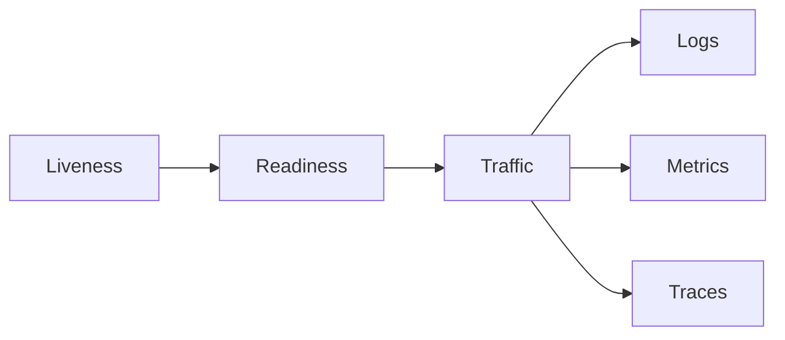

# Health and observability

---

## Platform · Health and observability

> **Platform concern** — Give operators enough signal to distinguish a healthy process from a useful service.

Liveness, readiness, structured logs, metrics, traces, and alertable dependency state.

### Operating model

### Decisions to make before production

| Decision | Recommended posture | Failure it prevents |
| --- | --- | --- |
| Liveness | Process state | Should restart if broken. |
| Readiness | Dependency state | Should stop receiving traffic if unsafe. |
| Saturation | Capacity state | Predicts failure before error rate rises. |

### Boundary and failure behavior

Without health semantics, an overloaded or disconnected service can look alive while causing user-visible failure.

### Questions for review

| Question | Answer to document |
| --- | --- |
| What belongs in readiness? | Dependencies required for safe traffic, not every optional integration. |
| Which percentile matters? | p95 and p99 expose tail behavior hidden by averages. |
| What makes an alert useful? | A threshold, an owner, a runbook, and a reason the user is affected. |

## Related material

<Columns cols={3}>
  <Card title="Build runbooks" icon="server-stack" href="/operations/production" horizontal>Read the focused guide for this boundary.</Card>
  <Card title="Measure saturation" icon="gauge-high" href="/operations/benchmark" horizontal>Read the focused guide for this boundary.</Card>
  <Card title="Observe streams" icon="stream" href="/core/execution-and-streaming" horizontal>Read the focused guide for this boundary.</Card>
</Columns>

## References

[1]: https://github.com/jeffersoncampos12p-dev/jeston "Jeston source repository"
[2]: https://www.npmjs.com/package/@hedronjs/jeston "Jeston package on npm"
[3]: https://nodejs.org/api/http.html "Node.js HTTP API"
[4]: https://developer.mozilla.org/en-US/docs/Web/API/AbortSignal "AbortSignal Web API"
[5]: https://react.dev/reference/react-dom/server "React server rendering APIs"
[6]: https://www.typescriptlang.org/docs/handbook/intro.html "TypeScript handbook"
